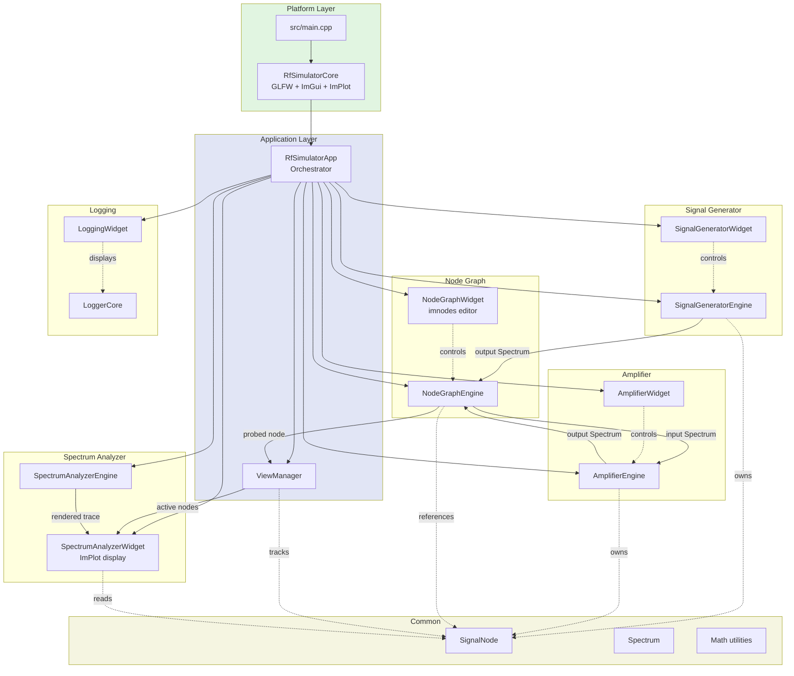

# RF Simulator Architecture

## Overview

RF Simulator is a C++20 desktop application for RF signal chain simulation and visualization. It uses a modular **engine + widget** architecture where each functional component exposes a pure DSP "engine" library and an ImGui-based "widget" for user interaction. The application is built with CMake and uses FetchContent to automatically acquire dependencies (ImGui docking branch, ImPlot, GLFW, Catch2, imnodes, and imgui_test_engine).

The design enforces a strict separation between signal processing and UI: only widget translation units include `<imgui.h>` or `<implot.h>`. Engines communicate through a shared `SignalNode` structure carrying `Spectrum` data, while a `NodeGraphEngine` manages the topology of the signal chain.

---

## Functional Areas

### 1. Platform Core (`core/`)
- **`RfSimulatorCore`** — Owns the GLFW window, OpenGL2 renderer, and the main ImGui/ImPlot context lifecycle.
- Provides a single entry point `Run(std::function<void()> onGui)` which executes the frame loop, calling back into the application for UI and DSP updates.
- Enables docking and multi-viewport ImGui features.

### 2. Application Orchestrator (`app/`)
- **`RfSimulatorApp`** — Central coordinator instantiated by `main.cpp`.
- Owns all engines, all widgets, the `NodeGraphEngine`, the `ViewManager`, and the logging widget.
- Exposes two methods called each frame:
  - `draw_ui()` — Renders all ImGui windows.
  - `update_dsp()` — Propagates signal data through the chain.
- Manages dynamic component lifecycle: `addGenerator()`, `addAmplifier()`, `removeComponent()`.

### 3. Signal Generator (`signal_generator/`)
- **`SignalGeneratorEngine`** — Produces a discrete set of tones (frequency + power). Rebuilds an internal frequency grid and output `Spectrum` on changes.
- **`SignalGeneratorWidget`** — ImGui panel for adding/removing/editing tones, and a "Measure" checkbox that toggles `view_enabled` on the engine's `SignalNode`.

### 4. Amplifier (`amplifier/`)
- **`AmplifierEngine`** — Applies configurable gain (dB) and noise figure (dB) to its input `Spectrum`, producing an output `Spectrum`.
- Computes added noise density using the standard `k * Te * gain_linear` model.
- **`AmplifierWidget`** — ImGui panel for adjusting gain, noise figure, and frequency step.

### 5. Spectrum Analyzer (`spectrum_analyzer/`)
- **`SpectrumAnalyzerEngine`** — Renders one or more `Spectrum` objects into a power trace suitable for plotting.
- Supports configurable span, reference level, resolution bandwidth (RBW), and video bandwidth (VBW).
- Can apply noise jitter for realism.
- **`SpectrumAnalyzerWidget`** — ImPlot-based spectrum display. Shows the combined output of all `view_enabled` nodes, plus the currently probed node label.

### 6. Node Graph (`node_graph/`)
- **`NodeGraphEngine`** — Maintains a graph of `GraphNode` and `GraphLink` structures.
- Maps abstract node/pin/link IDs to underlying `SignalNode` pointers.
- Supports probing: one output pin can be marked as the "active probe", and the engine can resolve which `SignalNode` is currently probed.
- **`NodeGraphWidget`** — imnodes-based node editor. Users can add/remove components, wire links, and click pins/nodes to set the active probe.

### 6.1. Subcircuit Groups

The node editor supports user-defined **subcircuit groups**: a named set of `GraphNode`s that can be expanded to show internals or collapsed to display as a single block with synthesized input/output pins. The DSP graph is unchanged — groups are a visual layer only.

**Data model** lives in `common/include/group.h`:

- `Group` — `{id, name, member_node_ids, boundary_pins, collapsed}`. `member_node_ids` is frozen after creation (snapshot editing model).
- `GroupBoundaryPin` — synthesized pin on a collapsed group block, representing one cross-boundary link. `{id (>= 100000), internal_node_id, internal_pin_id, is_output, label}`.

**Engine API** in `NodeGraphEngine`:

- `addGroup(name, member_node_ids)` / `removeGroup(group_id)` / `renameGroup(...)` — snapshot lifecycle.
- `setGroupCollapsed(...)` / `isGroupCollapsed(...)` — view state.
- `rebuildGroupBoundaryPins(group_id)` — recomputes the `boundary_pins` vector based on cross-boundary links in `m_links`.
- `selectedGroupId()` / `setSelectedGroupId(id)` — group-level selection (separate from imnodes' node selection).
- `groupIdForNode(node_id)` / `groupsContainingNode(node_id)` — membership lookups.

`removeNode` cascades: if the removed node is a member of a group, or if removing it drops the group below 2 members, the group is auto-removed.

**Widget rendering** in `NodeGraphWidget`:

- Expanded: a subtle background rectangle drawn via `GetWindowDrawList()` behind the internals, with a `▼ Collapse` button in the title bar.
- Collapsed: a single imnodes-rendered node (id = `group.id` in the `50000+` range) with synthesized boundary pins (`100000+` range) drawn via `BeginInputAttribute` / `BeginOutputAttribute`. Internals are skipped from the `BeginNode/EndNode` cycle. Internal links are skipped. Cross-boundary links are drawn from the real internal pin id (imnodes positions the endpoint from the owning node — if a "phantom node" workaround is needed for the imnodes version pinned in the project, it is documented in the imnodes spike report).
- Rubber-band selection: Shift + left-click drag on empty editor space, with a "Create Subcircuit" popup for naming.
- Probing: synthesized boundary pin ids are translated to real internal pin ids before calling `m_engine.addProbePin` / `removeProbePin`. Probes on internal pins continue to drive the spectrum analyzer when the group is collapsed; the boundary pin shows the corresponding probe color.

**ID space allocation** to keep the four integer ID spaces disjoint:

| Concept | Range |
|---|---|
| `GraphNode::node_id` | `1..49999` |
| `Group::id` | `50000..99999` |
| `GroupBoundaryPin::id` | `100000+` |
| Phantom node ids (if used) | `200000+` |

### 7. Common (`common/`)
- **`Spectrum`** — Core data structure: frequency grid, discrete tones, and noise power spectral density vectors (`noise_W`, `noise_added_W`, `noise_total_W`).
- **`SignalNode`** — `{ Spectrum input, Spectrum output, bool view_enabled }`. The universal interface between engines.
- **`ViewManager`** — Registry of all `SignalNode*` instances; tracks which nodes are marked `view_enabled` for the spectrum analyzer.
- **`common.h`** — Shared constants (`MIN_FREQ`, `MAX_FREQ`, `NUM_BINS`, etc.) and utility math functions (`dbToLinear`, `addedNoiseDensity_W_per_Hz`).

### 8. Logging (`logging/`)
- **`LoggerCore`** — Singleton logger accessed via `LoggerCore::instance()`.
- **`LOG_INFO` / `LOG_WARN` / `LOG_ERROR`** macros for instrumentation.
- **`LoggingWidget`** — ImGui window displaying the in-application log stream.

### 9. Tests (`tests/`, `test_engine/`)
- Catch2 v3.4.0 unit tests for core engine behavior (e.g., `NodeGraphEngine` topology and probe management).
- `test_engine/` contains ImGui test engine based UI tests.

---

## Key Execution Flows

### Flow 1: Application Bootstrap
```
main.cpp
  ├─ Creates RfSimulatorCore
  ├─ Creates ImNodes context
  ├─ Creates RfSimulatorApp
  │     ├─ Constructs NodeGraphWidget
  │     ├─ Adds default Generator + Amplifier
  │     └─ Constructs SpectrumAnalyzerWidget
  └─ core.Run(lambda)
        └─ Each frame: app.draw_ui() + app.update_dsp()
```

### Flow 2: DSP Update (Per Frame)
```
RfSimulatorApp::update_dsp()
  ├─ For each generator: gen->update(dt)
  │     └─ Rebuilds output Spectrum from tone list
  ├─ For each amplifier:
  │     ├─ Queries NodeGraphEngine for source SignalNode
  │     ├─ Copies source->output into amp->node().input
  │     └─ amp->update(dt) → produces amp->node().output
  ├─ Reads NodeGraphEngine active probe
  ├─ Updates SpectrumAnalyzerWidget probe label
  └─ Syncs view_enabled flags on all registered SignalNodes
```

### Flow 3: Signal Chain Routing
```
[GeneratorEngine] → SignalNode::output
         │
         │ (NodeGraphEngine link)
         ▼
[AmplifierEngine] → SignalNode::input → process → SignalNode::output
         │
         │ (probe click in NodeGraphWidget)
         ▼
[ViewManager] → marks node view_enabled
         │
         ▼
[SpectrumAnalyzerWidget] → rendersCombinedSpectrum()
```

### Flow 4: UI Render (Per Frame)
```
RfSimulatorApp::draw_ui()
  ├─ NodeGraphWidget::draw("Node Editor")
  ├─ SpectrumAnalyzerWidget::draw("Spectrum Analyzer")
  ├─ SignalGeneratorWidget::draw("Generator N")
  ├─ AmplifierWidget::draw("Amplifier N")
  └─ LoggingWidget::draw("Log")
```

### Flow 5: User Interaction — Probe Selection
```
User clicks output pin in NodeGraphWidget
  └─ NodeGraphWidget::handleProbeClick()
        └─ NodeGraphEngine::setActiveProbePin(pin_id)
              └─ Next frame: update_dsp() syncs view_enabled
                    └─ SpectrumAnalyzerWidget shows probed node spectrum
```

---

## Architecture Diagram



---

## Build & Module Dependencies

Each module is a separate CMake target with `simulator::*` aliases:

- `core` → PUBLIC: `imgui`, `implot`, `glfw`, `OpenGL::GL`
- `app` → PUBLIC: `core`, all `*_engine`, all `*_widget`, `common`
- `signal_generator_engine` → PUBLIC: `common`, `node_graph_engine`
- `signal_generator_widget` → PUBLIC: `signal_generator_engine`, `core`, `logging_widget`
- `amplifier_engine` → PUBLIC: `common`, `node_graph_engine`
- `amplifier_widget` → PUBLIC: `amplifier_engine`, `core`, `logging_widget`
- `spectrum_analyzer_engine` → PUBLIC: `common`
- `spectrum_analyzer_widget` → PUBLIC: `spectrum_analyzer_engine`, `core`, `logging_widget`
- `node_graph_engine` → PUBLIC: `common`
- `node_graph_widget` → PUBLIC: `node_graph_engine`, `core`
- `common` → INTERFACE (header-only)
- `logging_core` / `logging_widget` → used by widgets for instrumentation

---

## Conventions

- **C++20** standard.
- Engines are pure DSP and must not depend on ImGui.
- Widgets are the only files that include `<imgui.h>` / `<implot.h>`.
- `utils::inputDouble()` and `utils::inputFrequency()` are the standard ImGui input helpers.
- `view_enabled` on `SignalNode` controls spectrum analyzer visibility.
- Signal chain wiring is explicit: the app queries `NodeGraphEngine` to route `Spectrum` data between engines each frame.
