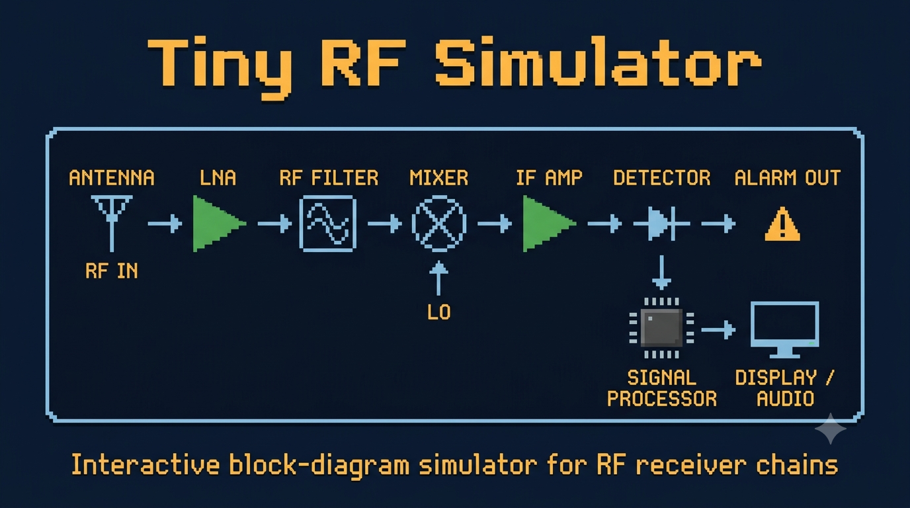

# RF Simulator

<p align="center">
  <strong>Modular RF signal chain simulator with real-time spectrum display</strong><br>
  <em>Design a cascade of RF components and probe any node to see the spectrum.</em>
</p>

<p align="center">
  
</p>

<p align="center">
  <a href="https://github.com/striderZA/Tiny-RF-Simulator/actions/workflows/build.yml"></a>
  
  
</p>

---

## ✨ Features

- 🔧 **Modular components** — Amplifiers, attenuators, mixers, filters, splitters, combiners, and more
- 📊 **Real-time spectrum display** — Probe any node in the signal chain with ImPlot
- 📐 **S-parameter support** — Touchstone file import for accurate component modeling
- 🧮 **DSP pipeline** — Polyphase filter bank channelizer, noise PSD analysis
- 🏗️ **Dirty-flag caching** — Efficient recomputation only when parameters change
- 🧩 **Extensible architecture** — Clean engine+widget pattern for adding new components


## 🚀 Quick Start

```bash
# Clone and build
cmake -B build -G Ninja -DCMAKE_CXX_COMPILER=g++ -DCMAKE_C_COMPILER=gcc
cmake --build build

# Run
build/bin/tiny-rf-simulator.exe
```

> 💡 **First build** takes 60-90s (FetchContent downloads all dependencies).
> For detailed setup, prerequisites, and per-platform instructions see the [Quickstart Guide](openwiki/quickstart.md).

---


## 📖 Documentation

| Topic | Link |
| :--- | :--- |
| 🚀 Quickstart & Build | [Quickstart Guide](openwiki/quickstart.md) |
| 🏛️ Architecture | [Architecture Overview](openwiki/architecture/overview.md) |
| 📡 RF Components | [Components Reference](openwiki/domains/rf-components.md) |
| 📐 S-Parameter System | [S-Parameter System](openwiki/integrations/s-param-system.md) |
| 🧪 Testing | [Testing Guide](openwiki/testing/guidance.md) |
| ⚙️ Operations | [Build & Operations](openwiki/operations/build-runbook.md) |
| 📈 DSP Pipeline | [DSP Pipeline & Workflows](openwiki/workflows/dsp-pipeline.md) |
| 📚 Engineering Refs | [Amplifier model](docs/resources/amplifier_nonlinear_model.md) · [PFB channelizer](docs/resources/pfb_channelizer_info.md) · [RF ADC](docs/resources/rf_adc_info.md) · [Touchstone parser](docs/resources/touchstone_v2_parser_spec.md) |
| 🗺️ Roadmap | [ROADMAP.md](ROADMAP.md) |


## 🤝 Contributing

Contributions welcome! See [CONTRIBUTING.md](CONTRIBUTING.md) for guidelines.

Additional resources:
- [OpenWiki](openwiki/) — Generated documentation
- [AGENTS.md](AGENTS.md) — AI agent conventions

---

## 📄 License

This project is licensed under the [Apache-2.0 License](LICENSE).

