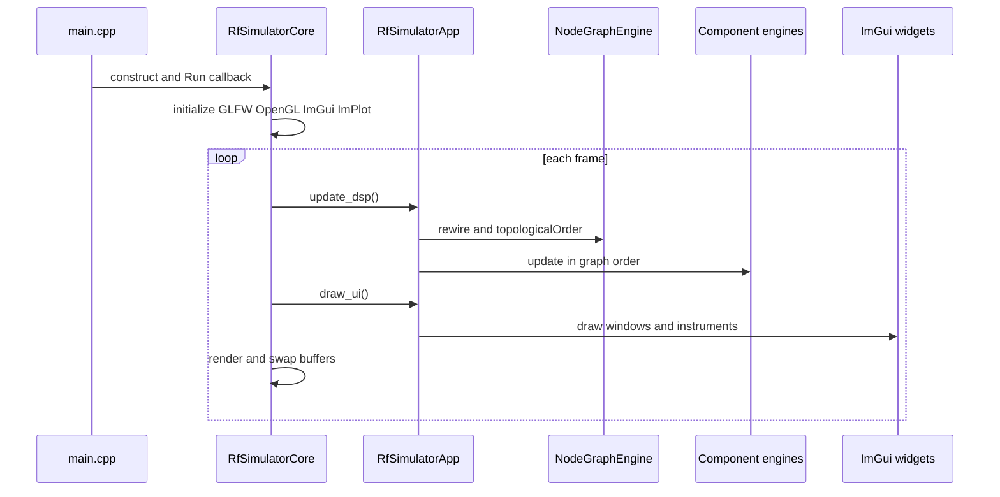
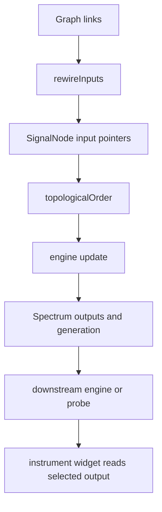
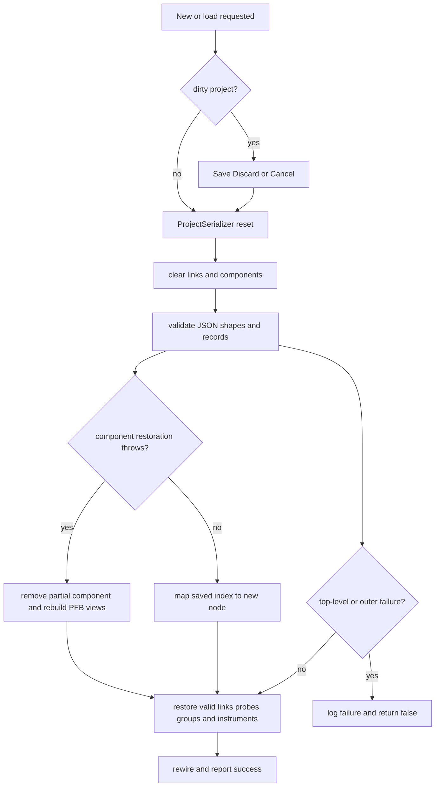
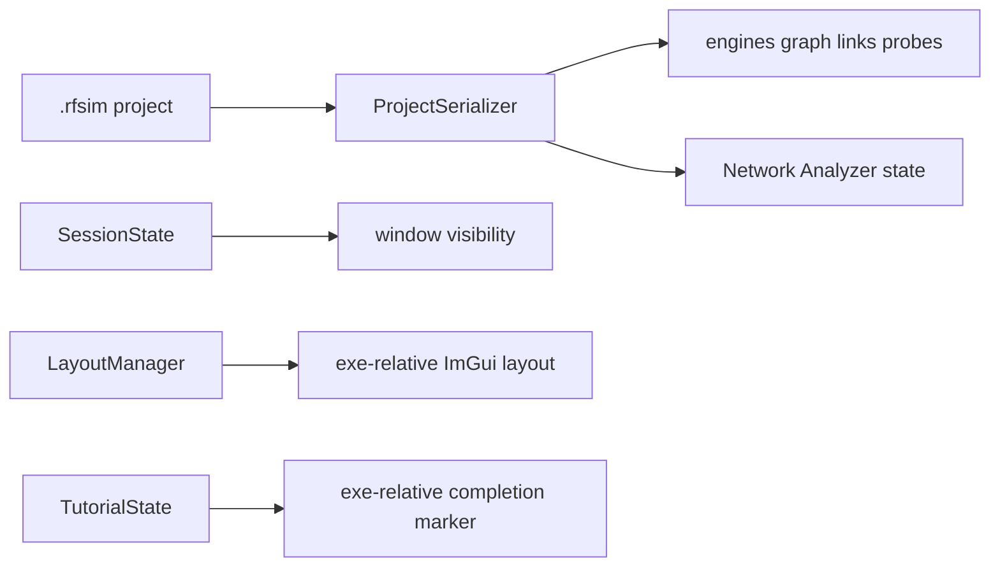
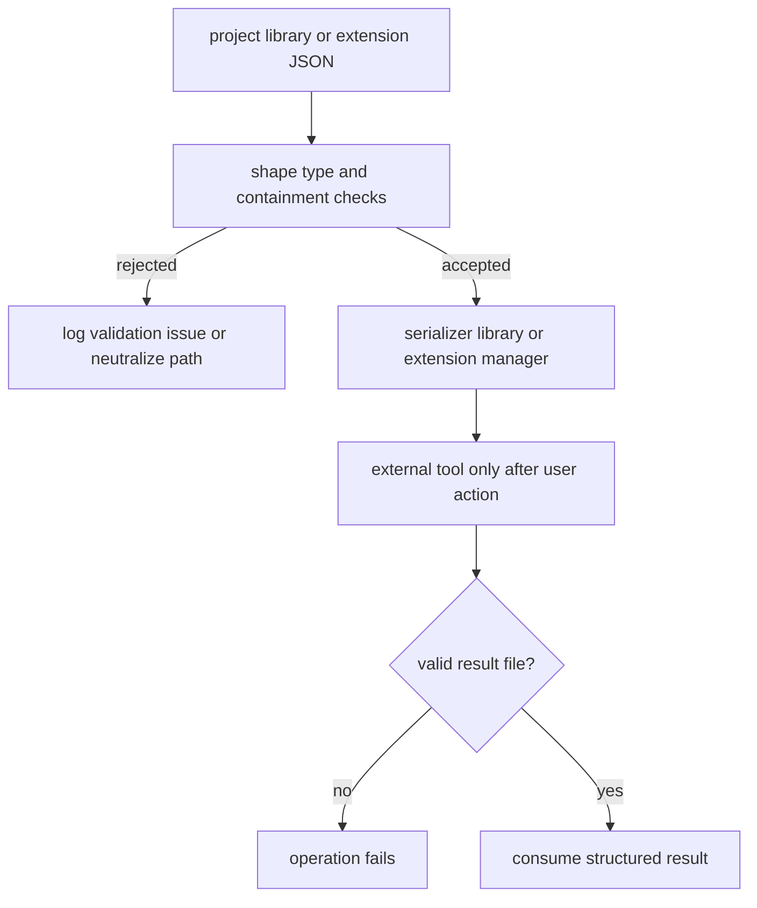

# Architecture Overview

The simulator has a deliberately narrow dependency direction: platform code owns the window and frame lifetime; common code defines signal contracts; engines perform DSP without UI; the node graph owns topology; and `RfSimulatorApp` composes those pieces and owns application policy. Persistence, libraries, instruments, and extensions are application services rather than alternate DSP paths.

## Runtime ownership



*Bootstrap and frame ownership: `main.cpp` supplies the callback, the core owns the platform loop, and the app owns simulation and UI work.*

`src/main.cpp` constructs `RfSimulatorCore`, creates the ImNodes context, constructs `RfSimulatorApp`, and passes a callback that calls `update_dsp()` before `draw_ui()`. `RfSimulatorCore::Run()` initializes GLFW, the OpenGL2 and ImGui backends, the ImPlot context, docking, multi-viewport support, and the exe-relative ImGui layout file. It polls events, starts each frame, invokes the callback, renders, restores the main context after platform-view rendering, swaps buffers, and shuts everything down. A failed platform initialization returns without entering the loop.

`RfSimulatorApp` is the composition root. It owns the `ComponentRegistry`, `NodeGraphEngine`, `ViewManager`, graph widget, project serializer, component library, extension manager, and application instruments. It also owns the UI widgets and the state that connects them. `update_dsp()` rewires raw signal pointers, evaluates the graph's topological order, updates each engine, and resolves probes as `(SignalNode*, output_index)` pairs. `draw_ui()` is presentation and interaction; it may update a standalone instrument while that instrument is visible, but widgets do not become component engines merely by rendering.

## Engine/widget separation and signal flow

A component is normally split into a pure C++ engine and an optional ImGui widget:

```text
component/
  include/*_engine.h       DSP and serialization contract
  src/*_engine.cpp         no UI dependency
  include/*_widget.h       optional UI API
  src/*_widget.cpp         ImGui rendering and controls
```

Engines implement `IComponentEngine`, own a `SignalNode`, and read `node().inputs[k]` while writing `node().outputs[k]`. `SignalNode::inputs` contains `const Spectrum*` pointers; outputs are owned `Spectrum` values. The pointers are intentionally wired by the app from graph topology, not copied signal buffers. Consequently, removing a component must immediately rewire surviving inputs before any same-frame widget can dereference them. `NodeGraphEngine` owns graph nodes, links, pins, probes, and the DAG; groups are visual-only and do not alter DSP topology.

`Spectrum` carries frequency bins, tones, noise PSD, phase, sample rate, complex-baseband state, and a `generation` counter. Producers increment the generation when their output changes. Engines use dirty caching keyed by `(input pointer, input generation)` plus an explicit parameter dirty flag; an unchanged input skips recomputation. Multi-output components use indexed pins and outputs. The graph therefore resolves the source output port rather than assuming `outputs[0]`, which is essential for splitters, PFB channelizers, and probes.



*Per-frame ownership: topology selects raw `Spectrum` pointers, engines produce generation-tagged outputs, and widgets consume selected outputs without owning the DSP graph.*

The Network Analyzer is a deliberate exception to ordinary graph execution: it is a singleton instrument, not an `IComponentEngine`, has no node or registry row, and measures through an injected app host. It finds a unique path between two real output pins, clones that chain into a throwaway scratch graph, and measures a synthetic tone sweep. The scratch pass is RAII-scoped and never mutates the real registry or graph. Its signature cache uses serialized chain state, sweep parameters, and probe points because it has no wired input generation to compare.

## Registry and type dispatch

`ComponentRegistry` is the ownership container for live engines. `add<T>()` constructs an engine, registers its `SignalNode` with `ViewManager`, indexes it by `std::type_index` and graph-node ID, and rolls those registrations back if any step throws. `remove()` removes the engine and associated indexes; `find()` addresses a graph node; `byType<T>()` supports services such as PFB view management; `all()` exposes the stable engine view used by orchestration and serialization.

`ComponentTypeRegistry` is a different responsibility: it is the canonical dispatch/schema table. A descriptor supplies the canonical type and legacy project key, labels, `NodeKind`, factory, inspector drawer, and parameter metadata. Canvas add and duplicate, save/load reconstruction, inspector dispatch, library validation/instantiation, authoring forms, and label-to-kind mapping all use this table. Adding a component type should be a registry descriptor plus its engine and node symbol, not scattered edits to `RfSimulatorApp`. The registry owns *what type means*; `ComponentRegistry` owns *which instances exist*.

`ComponentLibrary` is file-backed authoring data, not a third registry of live engines. It scans built-in, global, and project-local roots, validates component JSON, resolves optional data files relative to the definition, and asks the type registry and component registry to instantiate a configured engine. Malformed files and inaccessible subtrees are isolated so later valid definitions remain discoverable.

## Persistence, reset, and rollback

`ProjectSerializer` owns `.rfsim` save, load, and New behavior; the app methods are thin policy wrappers. Save records component type and serialized parameters, node positions, links by component index and port, probes, groups, window state, and instrument state. Raw pin IDs are not the portable address: load reconstructs components first, maps saved component indexes to new node IDs, then restores links and probes. Network Analyzer Point A/B are stored as component, port, and direction records.



*Persistence lifecycle: reset happens before restoration, per-record failures roll back locally, and malformed top-level input fails without leaving a half-restored project.*

New and load use the unsaved-changes guard. A successful save clears the dirty flag; edits to parameters, node positions, links, component membership, and Network Analyzer sweep or probe state mark it dirty. A failed load is reported and the serializer's reset/exception boundary determines whether the app is left empty rather than partly trusted. JSON integer fields use representability checks instead of unchecked `get<int>()`; malformed sibling records are skipped with an index mapping of `-1`, so they cannot shift later links or probes onto another component.

Project data is distinct from session and layout data. `SessionState` persists window visibility (and is a no-op off Windows), while `LayoutManager` gives ImGui an exe-relative `rf_simulator_layout.ini` and manages named presets below the executable directory. Tutorial completion likewise uses an exe-relative marker. This makes running from another working directory predictable, but tests that share exe-relative state require isolation.



*Persistence boundaries: circuit state, window visibility, layout geometry, and tutorial completion have separate owners and storage.*

## Paths and trust boundaries

Paths read from projects and library definitions are not trusted. Project S-parameter paths are accepted only when their canonical form remains under the project directory; save rewrites in-project absolute paths relative to that directory. Library `data_files` remain under the library JSON's directory. A missing, invalid, or rejected data file falls back to the component's non-file model rather than escaping the root.

Extensions are also untrusted input and are not loaded as in-process code. `ExtensionManager` discovers `plugin.json` manifests in built-in, global, and project-local roots with later priority shadowing earlier IDs. Invalid or incompatible manifests remain visible with validation issues. Manifest IDs are safe path segments; declared library/data paths must canonicalize inside the extension root; duplicate menu identifiers are rejected. `ExternalToolRunner` runs only an explicit user action through a JSON request/result exchange. Missing or invalid results are failures, not partially accepted output. Extension actions therefore cross a process and filesystem boundary, not the engine interface.



*Failure boundaries: untrusted files are validated at their owning boundary, while external tools remain explicit, result-checked process integrations.*

## Focused change and test surfaces

For DSP changes, start with the engine and its tests, then verify `SignalNode` pointer routing, generation invalidation, multi-output pin selection, and the widget only through its binding contract. For topology changes, inspect `NodeGraphEngine`, link policy, rewire behavior, cycle rejection, and graph tests. For persistence, use project round-trip and malformed-JSON tests, including partial-component rollback, stale probe clearing, checked integers, and S-parameter containment. Extension work belongs in manifest, discovery, path-containment, and external-tool tests; do not make a plugin a back door into the registry.

The current Test Flow panel follows the same boundary: `test_flow/` owns flow validation, serialization-key resolution, execution, and snapshot/restore; the panel presents that contract and marks the project state dirty only for authored changes. A flow run snapshots engine state, restores it independently, rewires inputs, and latches restoration failure until circuit reload. This is an example of the architecture's central rule: orchestration may coordinate subsystems, but each subsystem owns its invariant and failure semantics.

## Source map

| Area | Primary sources |
|---|---|
| Bootstrap and frame lifecycle | `src/main.cpp`, `core/include/core.h`, `core/src/core.cpp` |
| App orchestration and ownership | `app/include/app.h`, `app/src/app.cpp` |
| Registry and dispatch | `app/include/component_registry.h`, `app/include/component_type_registry.h` |
| Persistence and path containment | `app/include/project_serializer.h`, `app/src/project_serializer.cpp` |
| Common signal contracts | `common/component_interface.h`, `common/spectrum.h`, `common/signal_node.h` |
| Topology and rendering | `node_graph/include/node_graph_engine.h`, `node_graph/src` |
| Libraries and data | `app/include/component_library.h`, `app/src/component_library.cpp`, `component_data/` |
| Extensions | `app/include/extension_manifest.h`, `app/src/extension_manifest.cpp`, `app/src/extension_manager.cpp`, `app/src/external_tool_runner.cpp` |
| Instruments and UI | `network_analyzer/`, `spectrum_analyzer/`, `iq_plot/`, `power_meter/`, `test_flow/` |
| Session and layout | `common/session_state.h`, `layout/include/layout_manager.h`, `tutorial/` |
