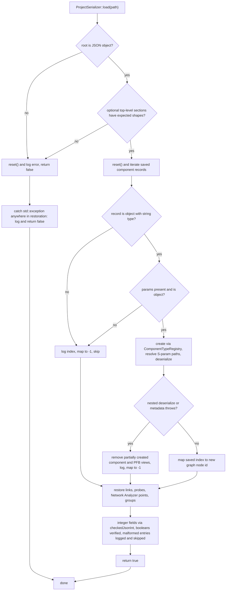

# Architecture Overview

## Layered Design

The RF Simulator is structured in four layers, each with strict dependency direction:

```
┌─────────────────────────────────────────┐
│  Application Orchestrator (app/)        │
│  RfSimulatorApp, InspectorPanel,        │
│  ComponentRegistry, ComponentLibrary,   │
│  LibraryBrowserWidget, SessionState     │
├─────────────────────────────────────────┤
│  Node Graph (node_graph/)               │
│  NodeGraphEngine + NodeGraphWidget      │
├──────────┬──────────────────────────────┤
│  Widgets │  DSP Engines                 │
│  (ImGui) │  (pure C++, no UI)           │
│          │                              │
│  signal_generator/  amplifier/  attenuator/│
│  mixer/  splitter/  combiner/  coax/     │
│  adc/  ideal_filter/  equalizer/         │
│  pfb_channelizer/  spectrum_analyzer/    │
│  iq_plot/  touchstone/                   │
│  logging/  help/  layout/  tutorial/     │
│  network_analyzer/                       │
├──────────┴──────────────────────────────┤
│  Common Data Model (common/)            │
│  IComponentEngine, SignalNode,          │
│  Spectrum, ViewManager, Group           │
├─────────────────────────────────────────┤
│  Platform Core (core/)                  │
│  GLFW window, OpenGL2 renderer,         │
│  ImGui/ImPlot context lifecycle         │
└─────────────────────────────────────────┘
```

## Platform Core (`core/`)

**`RfSimulatorCore`** (declared in `core/include/core.h`, implemented in `core/src/core.cpp`) owns the GLFW window, OpenGL2 backend, and the main ImGui/ImPlot context. It provides:

```cpp
void Run(const std::function<void()>& onGui);
```

This executes the frame loop — polling events, starting a new ImGui frame, calling `onGui()` (which runs `RfSimulatorApp::draw_ui()`), then rendering ImGui with the OpenGL2 backend. Docking and multi-viewport are enabled.

The core uses a PIMPL pattern (`struct Impl`) to hide GLFW/OpenGL types from all includers.

**Default layout** (via `ImGui::DockBuilder`):
- Left: Node Editor (root)
- Right: Spectrum Analyzer
- Bottom-right: IQ Plot
- Bottom: Log
- Bottom-left: Properties

## Application Orchestrator (`app/`)

**`RfSimulatorApp`** is the central coordinator, instantiated by `main.cpp`. It owns:

- **All DSP engines** — stored in a `ComponentRegistry` (type-erased, indexable by `std::type_index`)
- **All widgets** — `NodeGraphWidget`, `SpectrumAnalyzerWidget`, `InspectorPanel`, `IQPlotWidget`s, `PFBChannelizerWidget`s, `LoggingWidget`, `SignalGeneratorWidget`s, `HelpWidget` (data-driven "How to Use" panel, toggled via F1 or menu bar), `TutorialWidget` (guided first-run walkthrough, see below), `NetworkAnalyzerWidget` (instrument panel, see below)
- **`NodeGraphEngine`** — the topology manager
- **`ViewManager`** — registry of all `SignalNode*` instances
- **`PFBViewManager`** — owns the per-PFB IQ Plot / Channelizer Grid widget lifecycle (extracted from `RfSimulatorApp` in v0.16.0, issue #51; fixes issue #37 where four lockstep vectors were rebuilt by hand at six call sites)
- **`ProjectSerializer`** — owns `.rfsim` save/load/new JSON logic (extracted from `RfSimulatorApp` in v0.16.0, issue #51)
- **`ExtensionManager` / `ExternalToolRunner`** — plugin discovery and external-tool execution (see [Extension System](#extension-system))
- **`TutorialState` / `TutorialWidget`** — first-run guided walkthrough (v0.17.0): a one-time "Welcome" modal offers a data-driven 6-step tour; each step highlights its target panel via `ImGui::GetForegroundDrawList()` and a floating "Tutorial Guide" window. Completion persists to an exe-relative `.tutorial_completed` marker (mirroring `LayoutManager`, since `SessionState` is a Windows-only no-op). `Help > Tutorial` re-runs it via the same unsaved-changes guard as New/Open/Exit (`PendingAction::Tutorial`).

Two methods are called every frame:

| Method | When | What it does |
|---|---|---|
| `update_dsp()` | Before `draw_ui()` each frame | Wires inputs from graph topology, computes topological sort, calls each engine's `update()`, updates probe labels and view states |
| `draw_ui()` | Inside the ImGui frame | Renders all ImGui windows: node editor, spectrum analyzer, network analyzer (engine update + widget draw while visible), IQ plots, PFB grids, properties panel, log, help window |

### ComponentRegistry

Defined in `app/include/component_registry.h`. A type-erased polymorphic container:

- **`add<T>(args...)`** — Creates a `T` engine, registers its `SignalNode` with `ViewManager`, indexes it by `std::type_index`, returns `T&`
- **`remove(graphNodeId)`** — Removes by graph node ID, cleans up view and type index
- **`byType<T>()`** — Returns `std::vector<T*>` for all engines of type `T`
- **`all()`** — Returns a `std::span<IComponentEngine*>` over all engines
- **`find(graphNodeId)`** — Find by graph node ID

### ComponentLibrary

Added in v0.9.0. Defined in `app/include/component_library.h`. A file-based component definition manager:

- **Three scan roots**: built-in examples (`component_data/library/`), global (`~/.rf-sim/libraries/`), per-project (`./rf-sim-libraries/`)
- **JSON component definitions** with datasheet parameters (gain, NF, OIP3, P1dB) organized by type → manufacturer
- **LibraryBrowserWidget** (`app/include/library_browser_widget.h`) provides a tree-view panel with text filter
- **One-click insert** creates a fully configured component in the node graph, sets `part_number` on the graph node for subtitle display (v0.9.1)
- Supports 8 component categories: amplifiers, attenuators, splitters, filters, mixers, equalizers, combiners, ADCs
- **Data file support** (v0.10.0): JSON schema version 2 adds `data_files` array for referencing external data files (S-parameters, etc.). Relative paths resolved against the JSON file's directory. When a library amplifier with S-param data files is instantiated, the engine auto-loads the Touchstone file via `setSParamFilepath()` for frequency-dependent simulation. Falls back to single-point parameters if the file is missing or invalid. Library browser shows `[DATA]` indicator on components with data files.
- **ComponentTypeRegistry** (v0.11.0 → unified in v0.16.0, `app/include/component_type_registry.h`): a single 11-row dispatch table — each row carries the canonical `type` + legacy `.rfsim` `project_type` keys, `menu_label`/`label_prefix`, `NodeKind`, a `create()` factory, and a `draw_inspector` callback. Canvas menu add, duplicate, save/load, and inspector drawing all dispatch through it (issue #51), it drives `ComponentLibrary::instantiate()`/`validate()` and the New/Edit Component form, and the node graph widget maps label → `NodeKind` from it. Adding a component type is one registry row plus a `NodeKind`/symbol entry — no `RfSimulatorApp` edits.
- **Malformed library JSON isolation** (v0.19.2, issue #48): `ComponentLibrary::loadFile()` treats every file as untrusted input. Required fields are validated explicitly (`type`, `part_number`, `parameters` must be strings/object), `schema_version` is range-checked against `int` before `get<int>()` (an out-of-range integer defaults to 1 with a warning instead of throwing), non-string optional metadata (`manufacturer`, `description`, `notes`) defaults to `""`, malformed `data_files` entries are logged and skipped individually so valid siblings are kept, and `scan()` uses `std::error_code` filesystem overloads with `skip_permission_denied` so an unreadable root or subtree never aborts discovery of later files. A broad `std::exception` catch keeps every failure inside the file boundary. See [JSON loader hardening](#json-loader-hardening-issue-48) below.

### Extension System

Added in v0.16.0 (`app/include/extension_manager.h`, `extension_manifest.h`, `external_tool_runner.h`). Extensions are directories containing a `plugin.json` manifest, categorized by `ExtensionKind` (DataPack, ExternalTool) with capabilities (Generator, Importer).

- **`ExtensionManager`** — discovers manifests across three roots (in priority order, later roots shadow earlier IDs): built-in `<source_dir>/extensions/`, global `~/.rf-sim/extensions/`, and project-local `<project>/rf-sim-extensions/`. Invalid or incompatible manifests remain visible in `ExtensionManager::all()` with status + validation issues rather than being silently dropped.
- **`ExtensionManifest`** — schema-versioned; declares `menus[]` actions, `library_roots`, `data_roots`, and `min_app_version`. Paths are confined to the extension root on parse.
- **`ExternalToolRunner`** — executes an external tool on explicit user action: writes a JSON request file, waits for the tool, and reads a result file; a missing/invalid result is treated as failure. `externalToolActions()` is the single policy for launchable actions (declared `menus[]` pass through; tools without menus get one synthetic `"tools"` action).
- **UI** — a Tools menu renders actions with `location == "tools"`; an Extensions panel shows every declared action (or a fallback Run button). The repo ships no built-in extension payload (the built-in `<source>/extensions/` root is scanned only if present); extension tests use fixtures in `tests/fixtures/extensions/`.

### Network Analyzer Instrument

Added v0.19.x (`network_analyzer/`, `NetworkAnalyzerEngine` + `NetworkAnalyzerWidget`). A singleton floating instrument panel modeled on the Spectrum Analyzer, **not** an `IComponentEngine`: no graph node, no pins, no `ComponentRegistry` row. `View > Network Analyzer` toggles `m_show_na` (persisted in `SessionState` as `WindowState.NetworkAnalyzer`), and while visible the app calls `m_na_engine.update()` then `m_na_widget->draw(...)` each frame (see [DSP pipeline](../workflows/dsp-pipeline.md)).

The v3 engine replaces earlier v1/v2 wired-pin prototypes entirely. Measurement semantics:

- **Probe points** — Point A (reference/upstream) and Point B (measured/downstream) are real output pin ids in the same identifier space `NodeGraphEngine`'s probe mechanism uses; the widget rebuilds the picker list from `graph.nodes()` each frame.
- **Unique-path requirement** — `findUniquePath()` runs a DFS over the real graph's links from A's owning node to B's owning node, enumerating simple paths and bailing out as soon as a second distinct path is found. It returns no measurement for zero or multiple paths, for `A == B`, or for any path crossing a Combiner's combined signal input (the start node is exempt — its output is the injection point). A 100 000-step DFS cap degrades pathological topologies to "no data" rather than exponential search.
- **"Cheat" measurement** — the discovered chain is cloned onto a **private, throwaway scratch graph** (`INetworkAnalyzerScratch::createClone`), fed a synthetic tone-comb stimulus at the configured power, and cascaded via direct `SignalNode*` wiring that follows the *actual output port* each node used on the real graph (`out_index`), so multi-output components like the PFB Channelizer measure the right signal. The real graph/registry and every real component's state are never read for signal purposes and never written to (RAII-scoped per pass; `RfSimulatorApp::NaHost`/`NaScratch` implement the interfaces).
- **Signature-gated dirty check** — since the instrument has no wired input to compare a cached `(input*, generation)` against, `computeMeasurement()` builds a signature from each chain node's live `serialize()` dump (%.17g-exact doubles) plus the sweep params and probe pins, and skips the expensive clone-and-cascade when it matches the last recompute. v0.19.1 additionally replaced the O(N*M) tone-matching loop with 1 Hz cell bucketing (`unordered_multimap`), fixing a ~22 ms/frame regression at 2001 points.
- **Results** — per-point gain (dB) and noise figure (dB) arrays; NaN at an index means no path, ambiguous path, or no matching tone at the chain's end. Gain below −100 dB is treated as indistinguishable from the noise floor.
- **Persistence** — not an engine, so `ProjectSerializer` carries the state directly under `root["network_analyzer"]`: the four sweep params plus Point A/B as `{comp, port, is_output}` pairs (raw pin ids are not portable across graph rebuilds on load). Loading a project without points clears stale pins. See the [project save/load](#project-saveload) section.

Focused tests live in the `test_network_analyzer` standalone executable (`tests/test_network_analyzer.cpp`, 12 cases) and the Network Analyzer round-trip cases in `tests/test_project_file.cpp`.

### Project Save/Load

Save/load (v0.8.0) provides full circuit persistence to `.rfsim` JSON files:

- **File menu** — New (Ctrl+N), Open (Ctrl+O), Save (Ctrl+S), Save As
- **Unsaved-changes dialog** — prompts Save/Discard/Cancel when closing or opening a new project with unsaved changes
- **Dirty tracking** — `RfSimulatorApp::markDirty()` called on parameter edits, node moves, link changes, component add/remove. Dirty flag cleared on save.
- **Serialization** — Every engine implements `serialize()`/`deserialize()` via `nlohmann::json`. Since v0.16.0 the `.rfsim` save/load/new logic lives in **`ProjectSerializer`** (`app/include/project_serializer.h`, extracted from the ~1320-line `RfSimulatorApp` god-object, issue #51); `RfSimulatorApp::saveProject()`/`loadProject()`/`newProject()` are thin wrappers. It orchestrates engine state, graph topology (node positions, links, probes), and component registry reconstruction, using `setNextIds()`/`removeAllLinks()` for clean project init and link restoration.

Test coverage: 17 round-trip/regression tests in `tests/test_project_file.cpp` (including S-param mode reload on deserialize, issue #44/#56, Network Analyzer sweep params + probe points round-trip, and stale-probe-point clearing on load).

### JSON Loader Hardening (issue #48)

Since v0.19.2 the project and component-library loaders treat JSON as untrusted input and validate at their boundaries instead of relying on typed access to throw. See [Testing Guide](../testing/guidance.md) for the focused `test_issue48_json_loader` coverage.

**`ProjectSerializer::load()`** (`app/src/project_serializer.cpp`) — the load flow now:



*Project load flow after issue #48: shape checks, per-record validation, integer-representability guards, and skip/rollback keep a single malformed entry from aborting restoration of valid siblings.*

- **Top-level shape checks** — before any state is reset, each optional section must be an array (`components`, `links`, `probe_pins`, `groups`) or object (`network_analyzer`, `window_state`, `graph_state`); a wrong shape (e.g. `"components": 5`) resets to the empty state and fails cleanly instead of throwing mid-restore (missing fields and explicit nulls keep defaults).
- **Per-record validation** — each component record must be an object with a string `type` and, if present, object `params`; malformed records are logged with their saved index and skipped, with `-1` recorded in the saved-index → node-ID mapping so later links/probes/groups stay in step (a skipped earlier record never shifts a later valid probe onto the wrong component — regression-covered by `test_issue48_json_loader.cpp`).
- **`checkedJsonInt`** — a representability guard around `get<int>()`: `is_number_unsigned()`/`is_number_integer()` are checked against `INT_MIN`/`INT_MAX` before conversion, so a `2^32` value cannot wrap/truncate into a bogus link or probe port and a fractional `points` value cannot truncate. Used for every integer field in links, probes, Network Analyzer points, and group members.
- **Exception-safe rollback** — if a component's nested `params` makes `deserialize()` (or metadata restoration) throw, the partially created component is removed from the registry (and PFB widget state rebuilt) so it is neither counted nor linked; the saved-index mapping still records exactly one `-1` so later sibling records resolve.
- **Broadened catch** — the outer restoration catch is now `catch (const std::exception &)` (converting non-JSON engine/container errors into a logged `false` result too); deliberately not `catch (...)`.

**`ComponentLibrary::loadFile()` / `scan()`** (`app/src/component_library.cpp`) — required-field validation (`type`, `part_number`, `parameters`), `schema_version` range check (out-of-range integers default to 1), non-string optional metadata defaulted to empty, malformed `data_files` entries skipped individually, and error-code-based traversal so bad files/subtrees never abort discovery of valid siblings. See [ComponentLibrary](#componentlibrary) above.

### SessionState

**`SessionState`** (Windows-only; no-op on other platforms) persists window visibility toggles to INI files via `save()`/`load()`. Not used for project data (use `.rfsim` files for that) or for window docking/layout geometry (that's `LayoutManager`, see below).

### LayoutManager

**`LayoutManager`** (cross-platform) manages ImGui's own window-layout persistence: an exe-relative default layout file (`rf_simulator_layout.ini`, wired into `ImGuiIO::IniFilename` in `core/src/core.cpp` and auto-saved by ImGui itself) plus named presets under `<exe_dir>/layouts/`, explicitly saved/loaded/renamed/deleted via the `View > Layouts` menu in `app/`.

### Component Data Files

S-parameter data files live in `component_data/` at the repository root, organized by type: `amplifiers/`, `filters/`, `equalizers/`, `fixed_attenuators/`, `splitters/`, `step_attenuators/`. Each directory contains `.s2p`/`.sNp` Touchstone-formatted files that feed the per-component S-param modes.

Paths into these files are confined at every load boundary (S1 containment, 2026-08-09 review): `ProjectSerializer::resolveSparamPath()` keeps `.rfsim` S-param paths inside the project dir and `relativizeSparamParams()` re-writes in-project absolute paths as relative on save; `ComponentLibrary::resolveDataFilePath()` keeps library `data_files` inside the JSON's directory. See [S-Parameter System](../integrations/s-param-system.md).

`common/session_state.h` — Persists window state (open/closed) to `app.ini` using Win32 `WritePrivateProfileStringA`/`GetPrivateProfileStringA`. On non-Windows platforms the load/save methods are no-ops.

### Vector Node Icons

Node icons are drawn with per-name ImGui draw-list vector symbols (`node_graph/src/schematic_symbols.cpp`, one-shot `static` helpers per component kind: generator sine, amplifier triangle, mixer circle, splitter/combiner branches, etc.). The earlier `icon_registry/` PNG → OpenGL texture module was removed from the repository — there is no icon texture loading path anymore, so node rendering depends only on `schematic_symbols.cpp` (plus the ranged `NodeKind` label mapping in the widget).

## Engine/Widget Pattern

Every RF component follows this pattern:

```
<component>/
├── include/<component>_engine.h    # Pure DSP, no UI deps
├── src/<component>_engine.cpp      # DSP logic
├── include/<component>_widget.h    # ImGui UI (optional)
└── src/<component>_widget.cpp      # Widget rendering
```

**Engine rules:**
- Inherits from `IComponentEngine` (defined in `common/component_interface.h`)
- Owns a `SignalNode m_node` with input and output `Spectrum` vectors (multi-port components use vectors)
- Implements `update(double dt)` — reads from `node().inputs[k]`, processes, writes to `node().outputs[k]`
- Uses dirty-flag caching: cached input pointer + generation counter

**Widget rules:**
- Free function or class that renders ImGui controls
- Binds to an engine by reference
- Only widget `.cpp` files may `#include <imgui.h>` or `<implot.h>`

## Signal Data Model

### Spectrum (`common/spectrum.h`)

Core data structure carrying frequency-domain signal representation:

```cpp
struct Spectrum {
    struct Tone { double freq_Hz, power_dBm, phase_deg; };

    std::vector<double> frequencies;        // Bin center frequencies (Hz)
    std::vector<Tone> tones;                // Discrete tones
    std::vector<double> noise_W;            // Input noise PSD (W/Hz)
    std::vector<double> noise_added_W;      // Added noise PSD (W/Hz)
    std::vector<double> noise_total_W;      // Total noise PSD (W/Hz)
    std::vector<double> phase_deg;          // Phase per bin (degrees)
    double fs_Hz = 0.0;                     // Sample rate (set by ADCs)
    bool is_complex_baseband = false;       // True downstream of an ADC DDC (see below)
    uint64_t generation = 0;                // Dirty-flag counter
};
```

**Design decisions:**
- Noise stored as **power spectral density** in W/Hz (grid-independent for RBW processing).
- `generation` incremented by producers; consumers cache `(input*, generation)` for O(1) skip.
- `fs_Hz` propagated through components, consumed by PFB channelizer.
- `phase_deg` per bin (added recently for phase-aware processing).
- `is_complex_baseband` set only by `AdcEngine` (DDC output) and propagated downstream by every pass-through engine; it decides whether the spectrum-analyzer render path applies `conjugateSymmetricExpand()`.

### SignalNode (`common/signal_node.h`)

```cpp
struct SignalNode {
    std::vector<const Spectrum*> inputs;
    std::vector<Spectrum> outputs;
    bool view_enabled = false;
};
```

The universal interface between engines. Multi-port components use vector-based inputs/outputs (e.g., `SplitterEngine` has 1 input, 2 outputs; `PFBChannelizerEngine` has 1 input, 2 outputs).

### IComponentEngine (`common/component_interface.h`)

Abstract base for all DSP engines:

```cpp
class IComponentEngine {
    virtual int id() const = 0;
    virtual int graphNodeId() const = 0;
    virtual SignalNode& node() = 0;
    virtual void update(double dt) = 0;
    virtual std::string hoverSummary() const = 0;
    virtual int numInputPins() const { return 1; }
    virtual int numOutputPins() const { return 1; }
    virtual int inputPinId(int port) const;
    virtual int outputPinId(int port) const;

    // Serialization (default no-op)
    virtual nlohmann::json serialize() const;
    virtual void deserialize(const nlohmann::json&);
};
```

**Multi-pin support:** The base interface provides `numInputPins()`/`numOutputPins()` and indexed pin accessors (`inputPinId(int port)`, `outputPinId(int port)`). Default implementations return -1 for ports > 0, preserving backward compatibility with single-pin engines. `SignalNode` supports `std::vector`-based inputs/outputs for multi-port components like Splitter (1 input, 2 outputs) and PFB channelizer (2 outputs).

## Node Graph Topology

**`NodeGraphEngine`** (in `node_graph/include/node_graph_engine.h`) manages the signal flow DAG:

- **Nodes** — `GraphNode{node_id, input_pin_ids, output_pin_ids, signal_node*, label}`
- **Links** — `GraphLink{link_id, start_pin_id, end_pin_id}`
- **`SignalSource`** (v0.16.1) — pin lookups (`getSourceForInput()`, `probedSignalNodes()`) return `{node, output_index}` pairs instead of bare `SignalNode*`, so multi-output components (Splitter, PFB) route and probe the correct output port (`outputs[1]`, not always `outputs[0]`); probe labels get an `OUT2` suffix (issue #42)
- **Probes** — Up to 4 output pins can be probed for spectrum display with distinct colors (teal, orange, purple, blue)

### ID Space Partitioning

| Concept | Range |
|---|---|
| `GraphNode::node_id` | 1..49999 |
| `Group::id` | 50000..99999 |
| `GroupBoundaryPin::id` | 100000+ |

### Topological Sort

`topologicalOrder()` uses **Kahn's algorithm** to produce a linear evaluation order for the signal DAG. Cycles are handled gracefully (remaining nodes appended unsorted).

## Subcircuit Groups

Defined in `common/include/group.h`. A **visual-only** grouping mechanism:

- **`Group`** — `{id, name, member_node_ids, boundary_pins, collapsed}`
- **`GroupBoundaryPin`** — Synthesized pin on a collapsed group representing a cross-boundary link
- **Snapshot model** — `member_node_ids` is frozen at creation
- **DSP graph stays flat** — groups affect rendering only, not signal processing
- Auto-removed when a member node is removed or group drops below 2 members

## Dirty-Flag Caching Pattern

Used consistently across all engines to avoid redundant recomputation:

```cpp
if (!m_dirty && m_cached_input_ptr == &input &&
    m_cached_input_generation == input.generation) {
    return; // No change — skip
}
m_cached_input_ptr = &input;
m_cached_input_generation = input.generation;
// ... recompute ...
m_dirty = false;
```

This adds ~5 ns overhead for the cached skip path. Additional caches include:
- **RBW convolution cache** in spectrum analyzer (expensive Gaussian filter cached, only jitter+VBW runs per frame)
- **PFB channel cache** (bin indices recomputed only when grid/Fs changes)

## Key Source Files

| File | Role |
|---|---|
| `core/src/core.cpp` | GLFW window, ImGui/ImPlot init, default dock layout |
| `app/include/app.h` | `RfSimulatorApp` — orchestrator |
| `app/src/app.cpp` | update_dsp, draw_ui, component lifecycle wiring (~1040 lines; save/load and PFB view management extracted to `ProjectSerializer`/`PFBViewManager` in v0.16.0; network analyzer host adapter `NaHost`/`NaScratch` defined here) |
| `app/include/component_registry.h` | Type-erased engine container |
| `app/include/component_library.h` | File-based component library manager |
| `app/include/component_type_registry.h` | Component type schema table — field lists + factory per type |
| `app/include/library_browser_widget.h` | Library browser tree-view widget |
| `app/include/inspector_panel.h` | Properties panel header |
| `app/src/inspector_panel.cpp` | Per-component property editors (28KB) |
| `app/include/component_form_model.h` | Pure-logic form state for New/Edit Component |
| `app/include/component_form_widget.h` | ImGui renderer for New/Edit Component form |
| `app/src/extension_manifest.cpp` | Extension manifest parsing + validation (root confinement) |
| `app/src/extension_manager.cpp` | Extension discovery across built-in/global/project-local roots |
| `app/src/external_tool_runner.cpp` | Structured request/result external-tool execution |
| `app/include/project_serializer.h` | `.rfsim` save/load/new JSON logic (extracted from `RfSimulatorApp`); S-param path containment (`resolveSparamPath`/`relativizeSparamParams`) + Network Analyzer state + issue #48 malformed-JSON isolation |
| `app/src/component_library.cpp` | Library scanning + instantiation; data-file path containment (`resolveDataFilePath`); issue #48 required-field/`data_files` validation |
| `app/include/pfb_view_manager.h` | Per-PFB IQ Plot / Channelizer Grid widget lifecycle |
| `app/include/extension_manifest.h` | Extension manifest schema + validation (root confinement) |
| `network_analyzer/include/network_analyzer_engine.h` | `NetworkAnalyzerEngine` + `INetworkAnalyzerHost`/`INetworkAnalyzerScratch` (injected lookups, layering note) |
| `network_analyzer/src/network_analyzer_engine.cpp` | DFS path finding, signature dirty-check, clone-chain measurement (401 lines) |
| `network_analyzer/include/network_analyzer_widget.h` | `NetworkAnalyzerWidget` — Point A/B pickers + sweep fields + gain/NF plot |
| `tutorial/include/tutorial_state.h` | `TutorialState` — walkthrough navigation + `.tutorial_completed` marker (pure logic, unit-testable) |
| `tutorial/include/tutorial_steps.h` | Data-driven step catalog (`TutorialStep`, `TutorialTarget`) |
| `tutorial/src/tutorial_widget.cpp` | Foreground-drawlist panel highlight + "Tutorial Guide" window |
| `common/component_interface.h` | `IComponentEngine` abstract base |
| `common/spectrum.h` | `Spectrum` data structure |
| `common/signal_node.h` | `SignalNode` structure |
| `common/include/group.h` | `Group` + `GroupBoundaryPin` |
| `common/nonlinear_model.h` | `NonlinearModel` (OIP2/OIP3) |
| `common/view_manager.h` | `ViewManager` — node visibility tracking |
| `common/session_state.h` | `SessionState` — window state persistence |
| `layout/include/layout_manager.h` | `LayoutManager` — window layout persistence (default + named presets) |
| `node_graph/include/node_graph_engine.h` | `NodeGraphEngine` + `GraphNode`/`GraphLink` |
| `node_graph/src/node_graph_widget.cpp` | imnodes rendering; split across `node_graph_widget_groups.cpp` (group/boundary pins), `node_graph_widget_tooltips.cpp`, `schematic_symbols.cpp` (per-name vector node icons) |
| `src/main.cpp` | Entry point (15 lines) |
