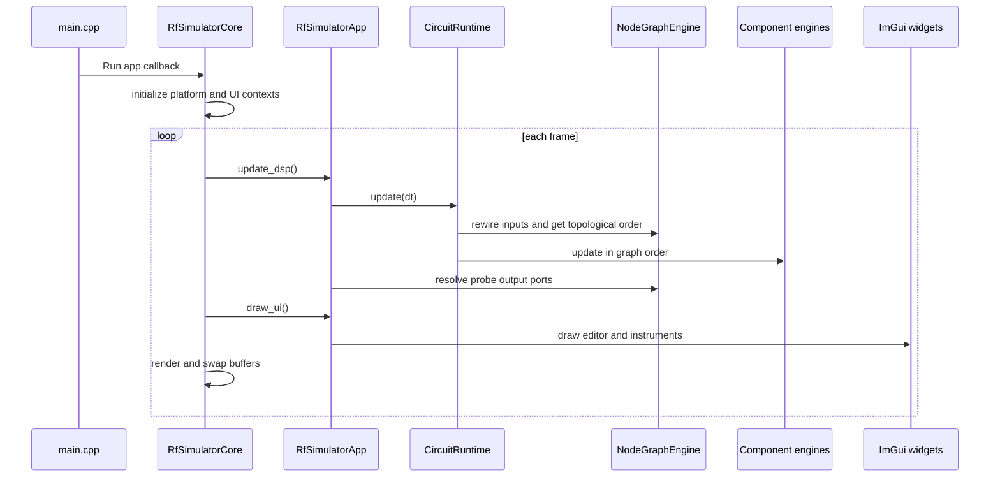
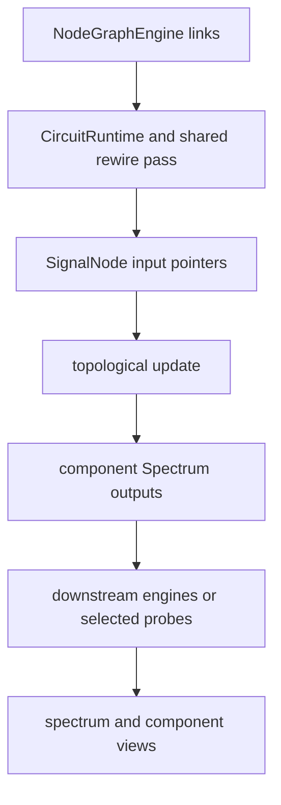
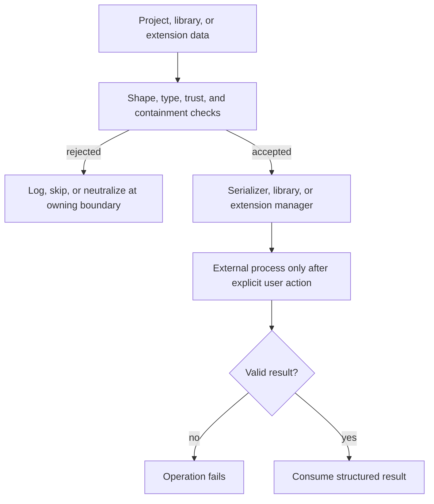

# Architecture Overview

RF Simulator separates platform lifetime, circuit topology, DSP execution, editor policy, and user-facing tools. The executable and core own the window/frame loop; `CircuitRuntime` owns the live graph and components; common headers define signal contracts; and `RfSimulatorApp` composes UI, project persistence, libraries, instruments, and extensions.

## Runtime ownership


```mermaid
sequenceDiagram
    participant Main as main.cpp
    participant Core as RfSimulatorCore
    participant App as RfSimulatorApp
    participant Runtime as CircuitRuntime
    participant Graph as NodeGraphEngine
    participant Engines as Component engines
    participant UI as ImGui widgets
    Main->>Core: Run app callback
    Core->>Core: initialize platform and UI contexts
    loop each frame
        Core->>App: update_dsp()
        App->>Runtime: update(dt)
        Runtime->>Graph: rewire inputs and get topological order
        Runtime->>Engines: update in graph order
        App->>Graph: resolve probe output ports
        Core->>App: draw_ui()
        App->>UI: draw editor and instruments
        Core->>Core: render and swap buffers
    end
```

*The app delegates circuit evaluation to the UI-independent runtime before drawing views.*

`src/main.cpp` creates `RfSimulatorCore`, the ImNodes context, and `RfSimulatorApp`, then supplies a callback that runs `update_dsp()` before `draw_ui()`. The core initializes GLFW, OpenGL, ImGui, and ImPlot, owns event polling and rendering, and shuts down the platform resources after the loop.

`CircuitRuntime` owns `NodeGraphEngine`, `ViewManager`, `ComponentRegistry`, and the component-ID counter. It creates/removes engines, validates connections, rewires inputs after topology changes, and updates live engines in graph order. It has no ImGui dependency, so runtime lifecycle and link-policy behavior can be tested without constructing the application UI.

`RfSimulatorApp` is the composition root for `CircuitRuntime`, `GraphEditorActions`, `EditorCommands`, project serialization, component libraries, view widgets, and instruments. `GraphEditorActions` adapts probe/group/selection mutations to the graph. `NodeGraphWidget` reads a const graph and sends edit requests through its action callbacks; it does not own graph mutation policy.

`EditorCommands` is the single user-level edit boundary. An accepted component/topology/group edit performs its required app side effects—such as refreshing group boundaries and component-bound views—then advances the project revision. A rejected edit changes neither the project revision nor the project state. Dirty state is derived by comparing that revision with the last clean revision. Parameter edits, node moves, and instrument-state edits that do not pass through a command explicitly mark the project modified; probe changes and group selection retain their non-revision semantics.

## Engine/widget separation and signal flow

A component normally has a pure C++ engine and an optional ImGui widget:

```text
component/
  include/*_engine.h       DSP and serialization contract
  src/*_engine.cpp         no UI dependency
  include/*_widget.h       optional UI API
  src/*_widget.cpp         ImGui rendering and controls
```

Engines implement `IComponentEngine`, own a `SignalNode`, and read `node().inputs[k]` while writing owned `node().outputs[k]` spectra. `SignalNode::inputs` contains `const Spectrum*` pointers, so removing an engine must synchronously rewire surviving inputs before the runtime returns to code that may update or render consumers.

`NodeGraphEngine` stores nodes, links, pins, probes, groups, and graph IDs. It does not own RF link policy: `CircuitRuntime::connect()` resolves both pins, applies `graphLinkAllowed()` and the graph's duplicate-input/cycle checks, then commits and rewires. The shared `rewireComponentInputs()` pass resolves each component input to the connected source node and output port, applies the same physical policy, and stores either the matching output pointer or `nullptr`. Removal, disconnection, and every frame's runtime update use that pass.

`Spectrum` carries a frequency grid, discrete tones, input and added noise-density vectors, phase, sample rate, complex-baseband state, and a generation counter. Engine dirty caches use the input pointer and generation together with an explicit parameter-dirty flag. Multi-output nodes keep output-port identity through links and probes; a selected probe is resolved as a `(SignalNode*, output_index)` pair rather than assumed to be output 0.


```mermaid
flowchart TD
    A["NodeGraphEngine links"] --> B["CircuitRuntime and shared rewire pass"]
    B --> C["SignalNode input pointers"]
    C --> D["topological update"]
    D --> E["component Spectrum outputs"]
    E --> F["downstream engines or selected probes"]
    F --> G["spectrum and component views"]
```

*Topology chooses signal pointers; engines compute generation-tagged spectra; views consume selected outputs.*

## Component ownership and dispatch

`ComponentRegistry` owns live engine instances and registers their signal nodes with `ViewManager`. It indexes engines by graph-node ID and C++ type, exposes a stable component view for orchestration, and rolls back graph/view/index registration if construction fails. `CircuitRuntime` delegates component lifetime to this registry and rewires surviving engines after removal.

`ComponentTypeRegistry` is separate from the instance registry. Its descriptors provide canonical type keys, project-file names, labels, node kinds, factories, inspector drawers, parameter metadata, and S-parameter capability. Canvas insertion, duplication, persistence reconstruction, inspector dispatch, component-library validation/instantiation, and node-label mapping use this shared table. The type registry defines what a component type means; `ComponentRegistry` owns which instances currently exist.

`ComponentLibrary` stores reusable definitions rather than live engines. It scans built-in, global, and project-local roots, validates definition data, resolves referenced assets relative to each definition, and asks the runtime/type registry to instantiate a selected definition. A successful insertion is adopted by `EditorCommands` so it participates in normal view synchronization and dirty tracking.

## Instruments and measurement integrations

The Network Analyzer is a singleton instrument, not an `IComponentEngine` or graph node. It follows the unique path between two selected output pins and preserves the exact input/output ports. A private scratch graph clones the downstream chain and runs a synthetic tone-comb sweep, leaving the live circuit untouched. The path policy permits an RF SPDT 2:1 switch when only one throw is linked; combiner paths, dual-fed switches, ambiguous paths, and cycles do not produce a measurement. A signature cache avoids rerunning an unchanged path and sweep.

The Receiver Requirements panel is also an app-level tool rather than a graph component. While visible, the app updates its performance-measurement service from the Network Analyzer endpoints and sweep, evaluates gain, noise figure, output-power, and IIP3 requirements, and sends the result to the panel. Requirement state is saved in the project file; the measurements are derived from the selected live chain and sweep.

## Project persistence and lifecycle

`ProjectSerializer` owns `.rfsim` save, load, and reset behavior. The project stores component types and serialized parameters, editor positions, links and probes as component-index/port references, groups, a subset of window state, graph counters, Network Analyzer settings, and Receiver Requirements state. Raw pin IDs are not the persistent link address: loading rebuilds components in file order and resolves saved component indexes to their new graph nodes and pins.

<!-- openwiki: mermaid parse failed and this diagram was converted to a text fence so it does not break rendering. Fix the diagram source and restore the mermaid fence. Parser error: Heuristic: a semicolon inside a label breaks rendering; rephrase the label. -->
```text
flowchart TD
    A["Open project"] --> B["Read, size, and section-shape checks"]
    B -->|invalid section shape| C["Reset to empty state and report failure"]
    B -->|valid project| D["Reset existing circuit and views"]
    D --> E["Create components in saved order"]
    E --> F["Keep saved-index mapping; roll back malformed records"]
    F --> G["Restore links through CircuitRuntime"]
    G --> H["Restore probes, instruments, and groups"]
    H --> I["Rebuild derived group boundaries"]
```

The loader rejects files larger than 64 MiB and validates top-level structure before restoration. A wrong-shaped top-level section resets the circuit and reports failure, while invalid guarded fields such as project window flags or `graph_state.next_component_id` are rejected before reset so they cannot destroy an already-open project. Malformed component records are skipped without compacting the saved-index map; if deserialization fails after an engine was created, that engine is removed and the corresponding index remains invalid so later links and probes cannot drift onto a different component.

Saving serializes into a sibling `.tmp` file, checks write/flush/close, and renames it over the target only after success. S-parameter paths in projects are confined to the project directory and saved relatively when contained; component-library data files are confined to their definition directory. Missing or rejected RF data does not escape these roots.

Editor revision state distinguishes project edits from UI interaction. A successful save, load, or New records the clean revision. `.rfsim` stores four project window flags, while `SessionState` separately stores broader window visibility preferences in `app.ini` on Windows and is a no-op elsewhere. `LayoutManager` owns the exe-relative ImGui layout and named layouts; `TutorialState` owns its exe-relative completion marker. These are distinct from circuit and project state.

## Paths and extension trust boundaries

Paths read from projects and library definitions are untrusted. Project S-parameter references must remain under the project directory; library `data_files` must remain under the library JSON's directory. Component-authoring copies also derive safe data-file names from sanitized metadata. These checks are enforced at the boundary that interprets each path.

Extensions are external integrations, not in-process component plugins. `ExtensionManager` discovers manifests in built-in, global, and project-local roots; invalid or incompatible manifests remain visible with validation issues. Manifest IDs and declared data paths are constrained to safe segments and the owning extension root. `ExternalToolRunner` executes a tool only after an explicit user action through a JSON request/result exchange; missing, oversized, or invalid results are failures rather than partial output.


```mermaid
flowchart TD
    Input["Project, library, or extension data"] --> Validate["Shape, type, trust, and containment checks"]
    Validate -->|rejected| Report["Log, skip, or neutralize at owning boundary"]
    Validate -->|accepted| Owner["Serializer, library, or extension manager"]
    Owner --> Tool["External process only after explicit user action"]
    Tool --> Result{"Valid result?"}
    Result -->|no| Fail["Operation fails"]
    Result -->|yes| Consume["Consume structured result"]
```

## Recent architectural progression

The release history explains why circuit ownership and tools have separate seams. Version 0.26.0 extracted `CircuitRuntime` and `GraphEditorActions` from the application-facing workflow; version 0.27.0 extended the Receiver Requirements integration with output-power and IIP3 measurement criteria. `EditorCommands` now centralizes user-level edit side effects and revision-based dirty tracking.

## Focused change and test surfaces

For DSP changes, start with the engine and its tests, then verify signal pointer routing, generation invalidation, multi-output pin selection, and the widget's binding contract. For topology changes, inspect `NodeGraphEngine`, `graphLinkAllowed()`, the shared rewire pass, cycle/input checks, and the UI-free `CircuitRuntime` tests. Editor edit-state work belongs in `EditorCommands` tests, including rejected edits, view synchronization, and revision behavior.

For persistence changes, use save/load round trips and malformed-project tests, including component rollback and saved-index mappings, path containment, checked integer fields, and atomic-save failure. Network Analyzer changes belong with exact-path and isolated-clone tests; Receiver Requirements changes span the UI-free measurement/evaluation tests and project-persistence tests. Extension changes should use manifest, discovery, trust, containment, and external-tool tests; do not make a plugin a back door into the engine registry.

The Test Flow panel is another example of app orchestration around a subsystem contract. `test_flow/` owns flow parsing, validation, parameter addressing, metrics, and execution; the panel provides authoring, preflight, row limits, export, and an outer snapshot/restore boundary around runs. It rewires after restoration and latches restoration failure until circuit reload. Its focused tests verify that successful and ordinary failed runs leave circuit state and project revision unchanged.

## Source map

| Area | Primary sources |
|---|---|
| Bootstrap and frame lifecycle | `src/main.cpp`, `core/include/core.h`, `core/src/core.cpp` |
| Circuit topology and DSP runtime | `app/include/circuit_runtime.h`, `app/src/circuit_runtime.cpp`, `node_graph/include/node_graph_engine.h`, `node_graph/src/rewire.cpp` |
| Editor commands and graph actions | `app/include/editor_commands.h`, `app/src/editor_commands.cpp`, `app/src/graph_editor_actions.cpp` |
| App orchestration and UI | `app/include/app.h`, `app/src/app.cpp` |
| Component registry and dispatch | `app/include/component_registry.h`, `app/include/component_type_registry.h` |
| Persistence and path containment | `app/include/project_serializer.h`, `app/src/project_serializer.cpp` |
| Common signal contracts | `common/component_interface.h`, `common/spectrum.h`, `common/signal_node.h` |
| Libraries and data | `app/include/component_library.h`, `app/src/component_library.cpp`, `component_data/` |
| Extensions | `app/include/extension_manifest.h`, `app/src/extension_manifest.cpp`, `app/src/extension_manager.cpp`, `app/src/external_tool_runner.cpp` |
| Instruments and measurement tools | `network_analyzer/`, `app/src/receiver_requirements.cpp`, `app/src/receiver_performance_measurement.cpp`, `spectrum_analyzer/`, `power_meter/`, `test_flow/` |
| Session, layout, and tutorial state | `common/session_state.h`, `layout/include/layout_manager.h`, `tutorial/` |
