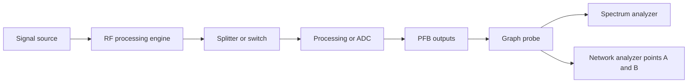

# RF Components — DSP Engine Modules

RF simulation is a graph of component engines. Graph-attached engines derive from `ComponentEngineBase` and own a `SignalNode`; each implements `type_name()`, `update()`, `serialize()`, and `deserialize()`. The base class owns the component/graph IDs and the single-input dirty-check cache. Two-input engines must track both input pointers and generations themselves: using the single-input `beginUpdate()` would allow a change on input 1 to leave the output stale.

*The normal path is graph computation and probing; analyzers observe it, while the network analyzer evaluates an isolated clone rather than mutating the live path.*

## Authoring and lifecycle

`ComponentTypeRegistry` is the application’s authoring boundary. The current authorable types are `adc`, `amplifier`, `attenuator`, `coax`, `combiner`, `equalizer`, `filter`, `generator`, `mixer`, `pfb`, `rf_switch_spdt`, `rf_switch_spdt_2to1`, and `splitter`. Descriptors define the canonical type, project type, fields, ranges/enums, S-parameter support, and a factory that inserts the engine into `ComponentRegistry`. `SpectrumAnalyzerEngine` and `NetworkAnalyzerEngine` are instruments, not registry components.

A component is dirty after construction and after a parameter setter or deserialization changes its state. On update, a single-input engine compares the input `Spectrum*` and its generation; unchanged clean inputs skip recomputation. Multi-output engines expose an output-pin lookup by index, so consumers must preserve the selected output port rather than assuming output 0. `SignalNode` carries the tone list, frequency grid, noise PSD, and generation used by downstream dirty checks.

The component-library authoring flow validates required fields, ranges, and enum values before insertion. Library JSON uses canonical descriptor keys (for example `attenuation_dB`, not the old `atten_dB` spelling); invalid definitions are rejected at `loadFile()`. Project persistence calls each engine’s `serialize()`/`deserialize()` and separately persists instrument state.

## Signal sources

### Signal Generator (`signal_generator/`)

A one-output source creates the input `Spectrum` from editable tones (`freq_Hz`, `power_dBm`, `phase_deg`) and `Fs_Hz`. It has no input pin. Its baseline noise is the thermal floor `kT` (about `4.00e-21 W/Hz` at 290 K). The widget owns tone-table editing and the optional measurement/probe control; source parameters are serialized with the engine.

### RF ADC (`adc/`)

`AdcEngine` is a one-input, one-output sampling boundary. Its current controls are `fs_Hz`, `nsd_dBm_per_Hz`, `decimation`, and `nco_fs_fraction`. `fs_Hz` is clamped to at least 1 Hz; decimation is normalized to one of 1, 2, 4, or 8; NCO fraction is clamped to `[-0.5, 0.5]`. The update aliases tones into the sampled band, applies the NCO shift, injects NSD noise, and produces the corresponding decimated output grid. Earlier `bits` and `v_fs` parameters are not part of the current engine contract.

## RF processing

### Amplifier (`amplifier/`)

`AmplifierEngine` applies `gain_dB` and `nf_dB`, optionally loads a Touchstone file (`sparam_mode`, `sparam_filepath`, forward-index state), and can enable the reusable `NonlinearModel`. Nonlinear controls are `oip2_dBm`, `oip3_dBm`, and `p1db_dBm`; project JSON also records `enable_nonlinear`. In ideal mode gain is flat. In S-parameter mode complex S21 supplies frequency-dependent magnitude and phase, while the noise figure remains applied. The nonlinear model operates on tones, including harmonic/intermodulation products and compression. Library `data_files` can auto-load the referenced S-parameter file; a missing or invalid file falls back to ordinary parameters.

### Mixer (`mixer/`)

The one-input, one-output mixer uses `lo_freq_Hz`, `conversion_gain_dB`, and `nf_dB`. Each input tone creates lower and upper sidebands at `abs(f - LO)` and `f + LO`; this is an idealized model without LO harmonics, image rejection, or intermodulation. Noise is propagated and increased according to the noise figure. Check the canonical key `conversion_gain_dB` when writing library definitions; older prose or files using `conv_gain_dB` are not the registry contract.

### Ideal Filter (`ideal_filter/`)

The filter has `filter_type` (`LPF`, `HPF`, `BPF`, or `BSF`), `fc_low_Hz`, and `fc_high_Hz`, plus optional S-parameter mode and filepath. Ideal mode applies a binary passband decision to tones and noise; S21 interpolation replaces that decision. Cutoff boundary behavior is intentionally asymmetric and test-defined: an exact edge passes for LPF and is blocked for HPF. Do not change edge comparisons without updating `test_ideal_filter.cpp`.

### Equalizer (`equalizer/`)

The equalizer’s ideal model is `ref_gain_dB + slope_dB_per_decade * log10(f / ref_freq_Hz)`, with `ref_freq_Hz` protected from non-positive values. Its S-parameter mode applies complex S21 to tones and magnitude-squared S21 to noise. The implementation protects logarithm and zero-frequency paths from NaN; `test_equalizer.cpp` is the focused regression suite.

### Attenuator (`attenuator/`)

The passive one-input, one-output attenuator serializes `attenuation_dB`, S-parameter mode, and filepath. Manual attenuation is clamped to the supported range and applies `Pout = Pin - attenuation_dB`. Its passive noise equation is `noise_out = G * noise_in + kT * (1 - G)`, so a high-loss attenuator approaches the thermal floor rather than producing negative or vanishing physical noise. S21 mode applies complex magnitude/phase to tones and `|S21|²` to noise. `test_attenuator.cpp` covers pass-through, loss, noise, clamping, S-parameters, dirty skipping, and summaries.

### Coaxial cable (`coax/`)

`CoaxCableEngine` uses `preset_index`, `length_m`, and `connectors_loss_dB`. Loss is `(K1 * sqrt(f) + K2 * f) * length + connector_loss`; phase is a frequency-dependent propagation delay. Length is bounded, and frequencies above a preset’s maximum are clamped with a one-time warning. The preset table currently contains fully populated MT 340 data; other MilTech entries are explicitly uncalibrated. Cable tests cover the engine and preset table.

## Multi-port and topology

### Splitter and combiner

`SplitterEngine` is one input to two outputs. Each branch applies the fixed 3.0103 dB split loss without phase change or added noise, dividing tone power and noise equally. `CombinerEngine` is two inputs to one output. Manual mode applies the same 3.0103 dB path loss, concatenates tones from both inputs, and sums noise incoherently before scaling. Its S-parameter mode reads a three-port Touchstone device: S21 maps input 0 to output and S31 maps input 1 to output, with passive thermal noise. Because both inputs matter, the combiner has a two-input generation cache and must recompute when either input changes.

### RF switches (`rf_switch/`, `rf_switch_2to1/`)

Both switches are authorable and persist `active_throw`, `insertion_loss_dB`, and `isolation_dB`. The defaults are 0.5 dB insertion loss and 40 dB isolation; setters clamp insertion loss to 0–60 dB and isolation to 0–120 dB. `active_throw` is authored as the enum name `T1` or `T2`; project deserialization also accepts its integer representation. Neither switch has S-parameter mode.

- `rf_switch/` is COM input to T1/T2 outputs. The selected output uses insertion loss and the unselected output still emits leakage at the isolation loss. Each output has its own generation and passive noise calculation.
- `rf_switch_2to1/` is T1/T2 inputs to COM. The selected input uses insertion loss and the other leaks through isolation. Tones are concatenated, not coherently vector-summed; noise combines both paths and adds bounded passive thermal noise. Its update path uses `beginUpdate2()`-style tracking for both inputs.

The important topology invariant is that a multi-output consumer must select the actual output pin, and a two-input engine must observe both generations. The switch, project round-trip, dispatch, and authoring tests exercise these boundaries.

## Digital DSP

### PFB Channelizer (`pfb_channelizer/`)

`PFBChannelizerEngine` accepts one input and exposes two structurally different outputs. `PFBConfig` contains `M`, `K`, `Fs_Hz`, `beta`, and `sampling_ratio`; setters rebuild the shared Kaiser-window/sinc prototype when design parameters change. Input sample rate can be adopted automatically (`Fs_Hz` from the input), while explicit configuration disables that mode.

Output 0 is the selected active-channel view; output 1 is the reconstructed full spectrum. `activeChannel`, center frequency, and bandwidth are derived from the channel set. Output sample rate is `Fs * sampling_ratio / M`. The engine caches channel frequencies, overlap counts, and tone-index data, and exposes `outputPinId(index)`. `test_pfb.cpp` is the focused test for channelization and output behavior. Consumers such as the network analyzer must carry the chosen `out_index` through cloning or they can silently measure the wrong spectrum.

### IQ Plot (`iq_plot/`)

IQ Plot is a display-side DSP tool rather than a graph engine. `build_iq_spectrum()` constructs a complex frequency vector from noise PSD and tones, and `runIDFT()` uses `kiss_fft` for the inverse transform. A 4096-sample ring buffer retains recent samples; EMA Y-axis smoothing and zoom/autoscale controls affect presentation only. `test_iq_plot.cpp` covers the pure DSP helper and widget-facing behavior.

## Analyzer and instrument roles

### Spectrum Analyzer (`spectrum_analyzer/`)

The spectrum analyzer consumes probed `Spectrum` objects and renders dBm traces. It exposes start/stop span, min/max power, RBW, VBW, noise-jitter enable/sigma, trace mode, and video-average count. Rendering separates noise and tone power, applies cached RBW convolution, then applies VBW and optional noise-only jitter. RBW cache validity depends on the spectrum generation, RBW, and bin width; jitter and VBW still run per frame.

Trace modes are `ClearWrite`, `MaxHold`, `MinHold`, and `VideoAverage` (EWMA). Histories are keyed by `Spectrum*`, pruned when probes change, and reset on mode changes. Peak search, navigation, combined-spectrum rendering, and strongest-tone SNR are analyzer operations; they do not alter the engine signal. The analyzer’s current behavior is specified by `spectrum_analyzer_engine.h` and its focused tests/benchmarks.

### Network Analyzer (`network_analyzer/`)

Network Analyzer is a singleton floating instrument, not an `IComponentEngine`: it has no node, pins, or `ComponentRegistry` row. Point A and Point B are real graph output-pin IDs. The instrument requires exactly one distinct simple path between them; no path, an ambiguous fan-out, a merge/selecting multi-input node, an unregistered node, or A equal to B yields NaN results. Duplicate links must not manufacture a second path.

For a valid path, the host creates a private RAII scratch graph and clones each component using its canonical type and serialized parameters. A synthetic tone-comb stimulus is injected into the clone chain; the live graph is neither used as the measurement signal nor written. The path records the actual output port used at every step, which is required for PFB output 1 and other multi-output components. Gain is measured against stimulus power, and noise figure is derived from output noise, gain, and `kT`; unmatched tones or below-floor responses are represented as NaN.

The sweep controls are `start_freq`, `stop_freq`, `points` (clamped to 2–2001), and `stimulus_power_dBm`. A signature over sweep settings and each chain engine’s serialized state gates expensive recomputation. Instrument project state is stored under `root["network_analyzer"]`; window visibility belongs to `SessionState`. `test_network_analyzer.cpp` covers stimulus delivery, attenuator gain, amplifier NF, non-perturbation, invalid paths, mixer translation, clamping, serialization, and widget drawing; project round-trip coverage is in `test_project_file.cpp`.

## Shared signal and noise invariants

`Spectrum` carries noise as power spectral density in W/Hz throughout the chain. Engines must preserve the distinction between tone power and noise density: passive stages scale noise by power gain and add thermal noise where their physical model requires it. Amplifier and mixer NF models add noise; attenuator, cable, switch, and S-parameter passive paths use loss-based thermal behavior; ADC injects configured NSD. The deprecated per-bin helper `addedNoisePerBin_W()` should not be used for new engine code.

## Focused change checklist

1. Confirm canonical registry keys and serialization keys in both engine implementation and `ComponentTypeRegistry`; do not infer names from UI labels.
2. For any topology change, verify input/output counts, output-pin indexing, both-input generation tracking, and the network analyzer’s unique-path rules.
3. For model changes, test zero/high-loss limits, cutoff boundaries, NaN guards, noise units (W/Hz), and S-parameter fallback behavior.
4. For persistence changes, run the component project round-trip and authoring/library validation tests, including named RF-switch throws and library `data_files`.
5. For analyzer changes, distinguish cached RBW data from per-frame jitter/VBW and ensure analyzer probes do not mutate live graph state.
