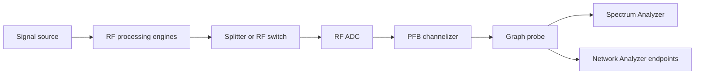

# RF Components — DSP Engines, Channelizers, and Instruments

RF signal chains are graphs of component engines. Graph-attached engines implement `IComponentEngine`, own a `SignalNode`, and normally derive from `ComponentEngineBase`. The base class owns engine/graph identity and a single-input dirty check keyed by input pointer and spectrum generation. Two-input engines must compare both pointers and generations themselves; otherwise an update on the second input can leave their output stale.

```mermaid
flowchart LR
    SRC["Signal source"] --> RF["RF processing engines"]
    RF --> TOPO["Splitter or RF switch"]
    TOPO --> ADC["RF ADC"]
    ADC --> PFB["PFB channelizer"]
    PFB --> PROBE["Graph probe"]
    PROBE --> SA["Spectrum Analyzer"]
    PROBE --> NA["Network Analyzer endpoints"]
```

*The Spectrum Analyzer observes probed live outputs; the Network Analyzer runs the selected chain on private clones.*

## Component dispatch and lifecycle

`ComponentTypeRegistry` describes the 13 graph-attached component engine types: `generator`, `amplifier`, `attenuator`, `coax`, `combiner`, `equalizer`, `filter`, `mixer`, `pfb`, `rf_switch_spdt`, `rf_switch_spdt_2to1`, `splitter`, and `adc`. A descriptor supplies canonical and project-file keys, labels, a node kind, a factory, inspector metadata, S-parameter capability, and an `authorable` flag. That flag selects the subset shown in the New Component authoring form; registered graph components are not all authorable. Spectrum and Network Analyzers are instruments, not entries in the graph component registry.

Each engine serializes its own parameters through `serialize()` and `deserialize()`. The app persists graph topology separately, and `ProjectSerializer` reconstructs engine types through the shared type registry. Descriptor fields carry requiredness, numeric bounds, and enum values; `ComponentLibrary` validates definitions against them before instantiation. Library JSON uses canonical descriptor keys (for example `attenuation_dB` and `conversion_gain_dB`) rather than UI labels or legacy aliases.

## Signal sources and sampling

### Signal Generator (`signal_generator/`)

The signal generator has no input pin and emits a `Spectrum` with editable tones (`freq_Hz`, `power_dBm`, `phase_deg`) and sample rate. As a source without an RF input, its thermal floor is represented as added noise density. Tone and noise components remain separate in the common `Spectrum` representation.

### RF ADC (`adc/`)

`AdcEngine` is a one-input/one-output real-RF sampling and DDC boundary. It configures input sample rate `fs_Hz`, noise spectral density `nsd_dBm_per_Hz`, decimation, and an NCO as a normalized fraction of the ADC input sample rate. Decimation snaps to `{1, 2, 4, 8}` (nearest, with ties downward); the NCO fraction is clamped to `[-0.5, 0.5]`; sample rate is clamped to at least 1 Hz. Output `fs_Hz` is input `Fs / decimation`, and its complex-baseband frequency grid spans `[-Fs/(2D), Fs/(2D))`.

Tone conversion aliases `f_in - f_NCO` modulo the input sample rate, drops tones outside the decimated complex passband, and coherently combines coincident images. Real-domain input tones are conjugate-expanded before conversion; already-complex input stays unexpanded. The ADC maps input noise onto the output grid and adds its configured NSD. The serialized legacy defaults are decimation 2 and NCO `+0.25 × Fs`; the ADC also accepts the older `fs_Hz` field when `sample_rate_Hz` is absent.

### PFB input constraint

The PFB channelizer is physically downstream of an RF ADC only. The runtime link policy rejects a direct RF-chain-to-PFB connection and accepts the ADC's output 0 to the PFB's input 0. This is enforced at connection time and when persisted links are restored, not by a cosmetic widget restriction.

## RF processing

### Amplifier (`amplifier/`)

`AmplifierEngine` applies `gain_dB` and `nf_dB`, optionally loads Touchstone data, and can enable the reusable nonlinear model with `oip2_dBm`, `oip3_dBm`, and `p1db_dBm`. Ideal mode uses flat gain; S-parameter mode applies complex S21 magnitude and phase to tones while carrying the noise-figure model. Nonlinear processing adds harmonic/intermodulation tones and compression. Missing or invalid RF data falls back to the ordinary parameter model.

### Mixer (`mixer/`)

The one-input/one-output mixer uses `lo_freq_Hz`, `conversion_gain_dB`, and `nf_dB`. Its idealized model creates lower and upper sidebands at `abs(f - LO)` and `f + LO`, propagates complex-baseband/sample-rate metadata, and adds noise according to noise figure. It does not model LO harmonics, image rejection, or intermodulation.

### Ideal Filter (`ideal_filter/`)

The filter selects `LPF`, `HPF`, `BPF`, or `BSF`, with `fc_low_Hz` and `fc_high_Hz`; optional S-parameter mode applies interpolated S21 instead of the ideal decision. Exact cutoff comparisons are test-defined: an edge tone passes for LPF and is rejected for HPF.

### Equalizer (`equalizer/`)

The ideal gain profile is `ref_gain_dB + slope_dB_per_decade * log10(f / ref_freq_Hz)`, with non-positive reference frequencies guarded. S-parameter mode applies complex S21 to tones and magnitude-squared S21 to noise. Logarithm and zero-frequency cases are guarded against NaN.

### Attenuator (`attenuator/`)

The passive one-input/one-output attenuator applies `Pout = Pin - attenuation_dB`, with bounded manual loss or optional S21 data. Its thermal-noise equation is `noise_out = G * noise_in + kT * (1 - G)`, so a high-loss stage approaches the thermal floor rather than dropping to zero or producing negative noise.

### Coaxial cable (`coax/`)

`CoaxCableEngine` combines a cable preset, `length_m`, and connector loss. Its loss is frequency dependent, `(K1 * sqrt(f) + K2 * f) * length + connector_loss`, and phase models propagation delay. Length is bounded; frequencies above a preset's maximum are clamped with a warning. The preset table contains fully populated MT 340 data; other MilTech entries are explicitly uncalibrated.

## Multi-port and topology components

### Splitter and combiner

`SplitterEngine` is one input to two outputs. Each output applies the fixed 3.0103 dB power split to tones and noise, preserves phase and signal metadata, and adds no noise. Its two indexed outputs are distinct signals; links and probes must retain the selected port.

`CombinerEngine` is two inputs to one output. Manual mode appends each input's tones with 3.0103 dB loss per path, sums noise powers incoherently, and scales the result by the same path loss. In S-parameter mode a valid three-port Touchstone file maps input 0 through S21 and input 1 through S31; passive added noise is clamped at zero when the configured gains would imply a negative thermal term. The combiner caches both input pointers and generations. A two-port file does not enter its three-port S-parameter path.

### RF switches (`rf_switch/`, `rf_switch_2to1/`)

Both orientations persist `active_throw`, `insertion_loss_dB`, and `isolation_dB`; component-library authoring uses `T1`/`T2` names, while engine/project serialization stores the integer throw index and deserialization accepts either form. Defaults are 0.5 dB insertion loss and 40 dB isolation; insertion loss is bounded to 0–60 dB and isolation to 0–120 dB. Neither switch supports S-parameter mode.

- `rf_switch/` is COM input to T1/T2 outputs. The selected throw uses insertion loss; the other output carries leakage at the isolation loss. The outputs have independent spectra and generations.
- `rf_switch_2to1/` is T1/T2 inputs to COM. It routes the selected input through insertion loss and the other through isolation. It concatenates tones, combines noise from both paths plus bounded passive thermal noise, and tracks both input generations.

### PFB Channelizer (`pfb_channelizer/`)

`PFBChannelizerEngine` accepts the ADC output and exposes two indexed outputs: output 0 is the active channel view, and output 1 is a reconstructed full-band spectrum. Its shared prototype design uses `M` channels, `K` taps per branch, and Kaiser `beta`. A positive input `fs_Hz` is adopted automatically; the `Fs_Hz` setter also supports standalone configurations without upstream sample-rate metadata.

PFB sampling defaults to critical sampling (`sampling_ratio = 1`) and persists a supported 2x oversampling ratio. Channel centers remain on the `Fs/M` grid; 2x oversampling doubles usable channel bandwidth and channel output rate. The channel output rate is `ratio * input Fs / M`; output 1 retains the input sample rate. Legacy PFB state without `sampling_ratio` defaults to 1x.

For each channel, the engine integrates the current input noise grid through the response: channel noise power is the sum of input noise density times `|H|²` times bin width, and effective ENBW is the corresponding sum of `|H|²` times bin width. The inspector reports active-channel noise in dBm and effective ENBW. PFB hover SNR compares the strongest finite active-channel tone against this integrated channel noise; it does not use analyzer RBW. Ordinary analyzer traces and analyzer SNR remain RBW-based.

The full-spectrum output reconstructs channel noise density across overlapping channel supports and keeps only the strongest filtered representation of any repeated tone. The channelizer clears both output spectra when its input becomes unusable so downstream consumers cannot retain stale output data.

### IQ Plot (`iq_plot/`)

IQ Plot is a display-side transform rather than a graph engine. Its pure helpers construct a complex frequency vector from noise PSD and tones, then use `kiss_fft` for an inverse transform. A 4096-sample ring buffer retains recent samples; EMA Y-axis smoothing and zoom/autoscale affect presentation.

## Analyzer and instrument roles

### Spectrum Analyzer (`spectrum_analyzer/`)

The Spectrum Analyzer consumes probed `Spectrum` objects and renders dBm traces. It separates per-bin noise power from tone impulses, applies RBW filtering to both, then VBW and trace mode. The RBW cache keys on spectrum pointer, generation, RBW, and bin width; jitter and VBW run per frame. Optional noise jitter affects only the noise floor, so deterministic tone peaks do not move between frames.

The widget exposes RBW and VBW over 1 kHz–100 MHz in kHz units so the 1 kHz floor is directly typeable. This display range is a widget-level constraint; engine setters stay unclamped for tests and API callers. Trace modes are Clear/Write, Max Hold, Min Hold, and Video Average; hold/average histories are keyed by `Spectrum*` and pruned when probes change. Analyzer strongest-tone SNR uses its current RBW-filtered noise power and does not alter render caches or trace history.

### Network Analyzer (`network_analyzer/`)

The Network Analyzer is a singleton floating instrument, not an `IComponentEngine` and has no graph node. Point A and Point B are real output pins. It requires exactly one simple path between them and records the actual input and output port at every hop. It permits a 2:1 RF switch path only when exactly one throw input is linked; combiner, dual-fed switch, ambiguous, cyclic, missing, and same-node paths have no measurement. Multi-output components preserve the chosen output port in the clone chain.

For a supported path, the host builds a private scratch graph and clones the downstream engines from canonical type keys and serialized parameters. A synthetic tone comb is injected into the clone chain; the live circuit's signal state and topology are not used for measurement or modified. Gain and noise figure are derived from the response; unavailable path/tone results are NaN. A signature over sweep settings, endpoints, and chain state skips recomputation when inputs have not changed.

## Shared signal and noise invariants

`Spectrum` carries noise density in W/Hz, separate from discrete tone powers. Passive stages scale input noise by power gain and add thermal noise where their model requires it; amplifiers and mixers add noise from their NF models; the ADC injects configured NSD. Preserve `fs_Hz` and `is_complex_baseband` metadata through downstream components. A real-domain tone is stored at full power inside the RF chain; the analyzer expands its display into a conjugate-symmetric pair without changing the engine's tone.

## Focused tests and change checklist

- `tests/test_component_dispatch.cpp` checks the 13 registry types, factories, inspector drawers, node kinds, S-parameter capability, legacy project keys, and descriptor-to-engine construction.
- `tests/test_adc_configuration.cpp` covers DDC rates/grid, supported decimation, NCO tuning, serialization, legacy defaults, and input-noise mapping.
- `tests/test_circuit_runtime.cpp`, `tests/test_issue70_pfb_reconnect.cpp`, and `tests/test_issue37_pfb_input_removal.cpp` cover the ADC-only PFB connection rule, reconnect behavior, and synchronous input clearing after removal.
- `tests/test_pfb_sampling_ratio.cpp`, `tests/test_pfb_filter_design.cpp`, and `tests/test_node_hover_snr.cpp` cover ratio persistence, channel centers/bandwidth, integrated noise/ENBW, and RBW-independent active-channel hover SNR.
- `tests/test_rf_switch.cpp`, `tests/test_rf_switch_2to1.cpp`, `tests/test_combiner.cpp`, and `tests/test_issue78_multi_output.cpp` cover path loss, port identity, noise, two-input updates, and project round trips.
- `tests/test_spectrum_jitter.cpp` proves jitter varies the noise floor but not tone peaks; `tests/test_spectrum_analyzer_snr.cpp` covers RBW-based SNR and read-only measurement behavior.
- `tests/test_network_analyzer.cpp` covers isolated chain runs, exact ports, singly-fed switches, and rejected combiner/dual-fed/ambiguous paths.

For a model change, check limiting values, noise units, missing/invalid input, dirty invalidation, and serialization. For topology changes, verify every indexed input/output and the actual accepted link paths. For analyzer changes, distinguish display-only noise jitter from deterministic tones and distinguish RBW-based analyzer SNR from PFB integrated-noise SNR.
