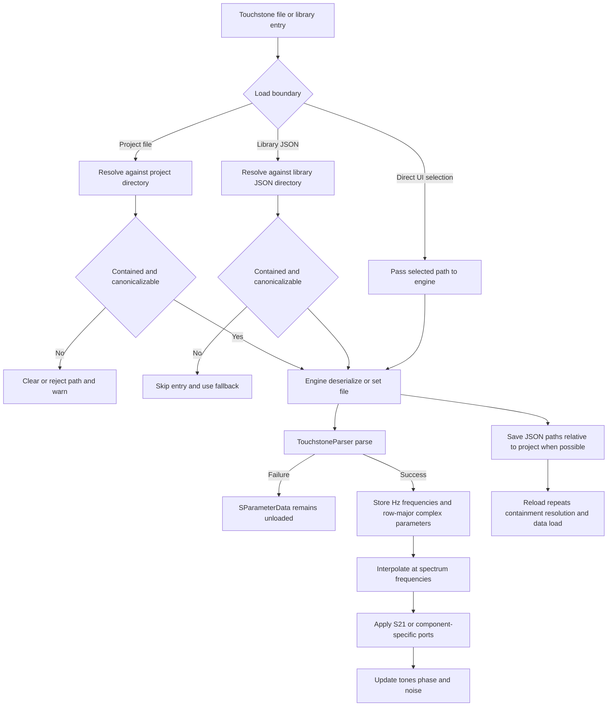

# S-Parameter System

The S-parameter integration turns Touchstone network data into complex frequency-dependent transmission for compatible components. The shared `touchstone/` layer parses and interpolates data; each component engine owns the mode-specific application of that data, including its noise and fallback behavior.

## End-to-end load path

*The flow shows the distinct project, library, and direct-selection boundaries and the failure points before engine application.*

## Touchstone parsing and representation

`TouchstoneParser::parse(filepath)` returns `std::nullopt` when the file cannot be opened, has no option line, has malformed point cardinality, exceeds safety limits, or fails frequency validation. It recognizes frequency units `Hz`, `kHz`, `MHz`, and `GHz`; network parameters `S`, `Y`, `Z`, `H`, and `G`; formats `DB`, `MA`, and `RI`; and the optional reference impedance. Frequencies are converted to Hz. Components use S-parameters; the other parameter kinds are represented by the parser but are not converted into another processing model.

The port count is inferred from the `.sNp` suffix (with a two-port default when inference is unavailable). Touchstone's two-port order is read as column-major and stored row-major, so a two-port parameter vector is `S11, S12, S21, S22`. The parser rejects NaN, infinity, negative, or non-increasing frequencies. It also refuses files over 256 MiB and stops buffering after 10,000,000 frequency points; these checks happen before or during accumulation rather than only after a potentially large allocation.

`SParameterData::load()` clears previous data before parsing. A failed load logs a warning and leaves the object unloaded. On success it owns the frequency vector and complex parameter matrix. `interpolate(freq_Hz, param_idx)` performs linear interpolation between adjacent points using `lower_bound`; frequencies below or above the measured range use the nearest endpoint. An empty/unloaded object or invalid parameter index returns the neutral complex value `{1.0, 0.0}`.

`applyToSpectrum()` applies the interpolated complex value to tones: magnitude changes power by `20*log10(|S|)` and phase by `arg(S)`. It scales input noise by `|S|²` and initializes added noise to zero. Component engines may use this helper or reproduce the same operation when their physical noise model needs additional terms.

## Component modes and engine ownership

Each compatible engine has an S-parameter toggle, a file path, and `SParameterData`. Loading a file enables the mode only when parsing succeeds; `update()` uses the component's normal model when S-parameter mode is disabled or data is not loaded.

- **Amplifier:** uses forward `S21` (`row * numPorts + column`, therefore `1 * N + 0`) for tone gain and phase and for input-noise scaling. Amplifier noise figure and nonlinear processing remain engine behavior rather than being inferred from the Touchstone file.
- **Ideal filter:** uses forward `S21` instead of the ideal passband decision; reverse isolation is not part of this one-input/one-output application.
- **Equalizer:** uses interpolated `S21` instead of its reference-gain/slope model and does not add equalizer noise.
- **Attenuator:** uses `S21` for tone magnitude and phase, then applies the passive model `noise_in * |S21|² + k*T*(1 - |S21|²)` at 290 K. Its manual mode remains flat attenuation.
- **Combiner:** consumes a three-port file with two input-to-output paths and applies the two relevant forward parameters independently, with a passive thermal residual. Its manual mode retains the fixed per-input Wilkinson loss.

The index convention is important when extending the system: row-major `S21` is `1 * numPorts + 0`. A three-port combiner additionally selects the input-1-to-output path according to its port mapping; the engine, not the parser, defines that physical mapping.

## Path resolution and sanitization

Path handling differs by ownership boundary. Canonicalization uses `std::filesystem::weakly_canonical` and compares path components, not string prefixes. A path containing a parent component is rejected before resolution.

### Project files

During `.rfsim` load, `resolveSparamParams()` handles both `sparam_filepath` and `sparam_path`. Relative paths are resolved against the project directory; absolute paths are accepted only if they remain within that directory. Traversal, outside-root, and unresolvable paths are rewritten to an empty string with a warning before engine deserialization. On save, absolute paths that remain inside the project directory are made project-relative, improving portability. A project therefore cannot cause the engine to load an arbitrary external S-parameter file through these fields.

### Component libraries and authoring copies

For a library JSON, `data_files` entries and S-parameter path-bearing parameters are resolved relative to the JSON file's directory. Contained subdirectories are allowed, but absolute paths outside that directory, parent traversal, and unresolvable paths are skipped or removed. If a library S-parameter cannot be loaded, instantiation logs the failure and the engine remains available for its normal fallback behavior; invalid definitions or deserialization failures roll back the partially created component.

When the component-authoring form copies a selected S-parameter beside a new library JSON, the destination name must be a plain filename: no slash, backslash, root, drive prefix, `.`, or `..`. Manufacturer and part-number directory segments are sanitized to alphanumeric characters, hyphen, underscore, and spaces, with safe fallbacks. Copy failure or an unsafe name stops the save instead of writing outside the chosen library root. Project authoring uses `./rf-sim-libraries`; global authoring uses `~/.rf-sim/libraries`.

These library-relative rules are separate from built-in data discovery. At startup the application searches user and project library roots, then prefers the installed executable-relative `<exe_dir>/component_data/library`; only when that is absent does it use the source-tree-relative `component_data/library` path. An exe-relative installed path is not treated as a project-relative or library-JSON-relative path.

## Persistence and failure behavior

Each S-parameter-capable engine serializes its mode and path (and, where present, the forward index). On deserialize, it immediately calls `SParameterData::load()` for the persisted path. The mode is restored only if the JSON requested S-parameter mode *and* the file loaded successfully, so a missing, rejected, or malformed file cannot leave an apparently active but data-less mode. A user can select another file through the component controls, which calls the engine setter and marks the engine dirty for recomputation.

The update path copies the input frequency grid when present, otherwise builds the default grid, transforms tones and phase, computes output noise, and uses generation/input caching to avoid repeating unchanged work in engines that implement it. An unloaded shared data object clears output state when used through `applyToSpectrum`; engines generally bypass their S-parameter branch and execute the component's ideal/manual model instead.

## Focused verification

`tests/test_touchstone.cpp` covers real two-port data, synthetic one- and two-port files, unit conversion, DB/MA decoding, row-major values, missing files, and missing option lines. `tests/test_path_containment.cpp` exercises project and library containment plus authoring-copy filename rejection and save behavior. The project round-trip test verifies that S-parameter mode and its data survive save/load by reloading the file rather than requiring a mode toggle. These tests are the most relevant safety net when changing parser limits, path roots, serialization keys, or component mappings.

## Source map

- `touchstone/src/touchstone_parser.cpp` and `touchstone/include/touchstone_parser.h`: format parsing, validation, limits, and matrix ordering.
- `touchstone/src/s_parameter_data.cpp` and `touchstone/include/s_parameter_data.h`: ownership, interpolation, and generic spectrum application.
- `amplifier/src/amplifier_engine.cpp`, `ideal_filter/src/ideal_filter_engine.cpp`, `equalizer/src/equalizer_engine.cpp`, `attenuator/src/attenuator_engine.cpp`, and `combiner/src/combiner_engine.cpp`: component mode branches and physical noise/fallback behavior.
- `app/src/project_serializer.cpp`: project load containment and save relativization.
- `app/src/component_library.cpp` and `app/src/app.cpp`: library resolution, component-authoring sanitization/copying, and built-in library roots.
- `tests/test_touchstone.cpp` and `tests/test_path_containment.cpp`: focused parser and containment regression tests.
