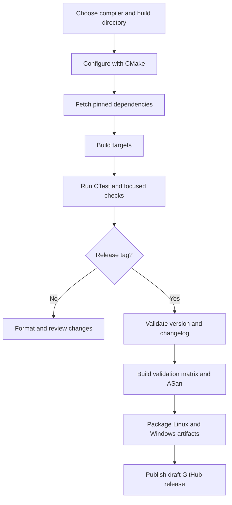

# Build & Operations

The project is a C++20 CMake build. The authoritative application version is the `project (RfSimulator VERSION ...)` value in `CMakeLists.txt` (currently `0.25.0`), not an older changelog entry. Build artifacts go to `build/bin`, libraries to `build/lib`, and FetchContent sources to `build/_deps`.

## Build lifecycle



This shows the repository's local build path and the tag-triggered release path; the release workflow requires every validation job to succeed before publication.

## Prerequisites and platform rules

- CMake 3.20 or newer, Ninja, Git, and a C++20 compiler are required. OpenGL development libraries and GLFW's platform dependencies are required on Linux/macOS.
- Windows supports **MinGW-w64 g++**, not MSVC `cl.exe`. The supported CI environment is MSYS2 `MINGW64`, with Git, GCC, CMake, Ninja, pkg-config, and Python installed.
- Linux release CI uses GCC 14 and also validates Clang 18 on minor/major tags. CI disables Wayland with `-DGLFW_BUILD_WAYLAND=OFF`; use that option on Linux when X11 compatibility is needed.
- Enable hooks once per clone if you want commit-time checks:

```bash
git config core.hooksPath .githooks
```

`clang-format-18` is required by the formatting script and hook. If it is unavailable, run `scripts/install-clang-format.sh`; it installs a cached copy that `scripts/format.sh` can find.

## Configure and build

Required first configuration (the compiler flags are especially important on Windows):

```bash
cmake -B build -G Ninja -DCMAKE_CXX_COMPILER=g++ -DCMAKE_C_COMPILER=gcc
cmake --build build
```

For an optimized build:

```bash
cmake -B build -G Ninja -DCMAKE_BUILD_TYPE=Release \
  -DCMAKE_CXX_COMPILER=g++ -DCMAKE_C_COMPILER=gcc
cmake --build build
```

The first configure may take about 60–90 seconds while dependencies are cloned. Subsequent builds reuse `build/_deps` and the CMake cache. `CMAKE_EXPORT_COMPILE_COMMANDS` is enabled by the root project, so `build/compile_commands.json` is available to clangd.

### When to reconfigure or clean

- Source edits normally need only `cmake --build build`.
- Re-run `cmake -B build` after adding or removing sources, targets, subdirectories, or CMake options.
- Delete `build/` and configure again when switching compilers or generators, after a broken/incompatible dependency cache, or when the cache contains stale platform options. On Unix:

```bash
rm -rf build
cmake -B build -G Ninja -DCMAKE_CXX_COMPILER=g++ -DCMAKE_C_COMPILER=gcc
cmake --build build
```

Do not clean merely because a normal source change was made; cleaning discards fetched sources and the configure cache.

## FetchContent and reproducibility

The root `CMakeLists.txt` fetches dependencies into the active build tree. The important immutable references are:

| Dependency | Repository | Reference |
|---|---|---|
| imgui | `ocornut/imgui` | `7e1b65d26d52e9dd199d889c148c72184de647b4` |
| implot | `epezent/implot` | `7eeb9168d2e5e6b14e266d8782ecf7e649dfc3a4` |
| GLFW | `glfw/glfw` | `92dcf4ce74f2e2554a98fea09be7c705c17daa5a` |
| Catch2 | `catchorg/Catch2` | `v3.4.0` |
| imgui_test_engine | `ocornut/imgui_test_engine` | `fdc1cb0930fa9bc2bef1d884bf2c10b570d29170` |
| imnodes | `Nelarius/imnodes` | `eb36902c892548ef94f88f51ad7e7c9c7058a71c` |
| portable-file-dialogs | `samhocevar/portable-file-dialogs` | `c12ea8c9a727f5320a2b4570aee863bbede2a204` |
| kissFFT | `mborgerding/kissfft` | `131.1.0` |
| nlohmann/json | `nlohmann/json` | `v3.11.3` |

`imgui`, `implot`, GLFW, `imgui_test_engine`, and `imnodes` use immutable commit pins; Catch2, kissFFT, and nlohmann/json use the listed tags. portable-file-dialogs and kissFFT are populated as source-only dependencies because their upstream build setup is not used here. Change pins only deliberately and reconfigure a clean build when validating such a change.

## Running the application

The executable is emitted as follows:

```text
build/bin/tiny-rf-simulator
build/bin/tiny-rf-simulator.exe   # Windows
```

Runtime assets are deliberately executable-relative for installed operation:

- `component_data/` and built-in `extensions/` are installed beside the executable and are preferred there; a build-tree run falls back to source-tree `component_data/library` and source `extensions`.
- `layout/` stores the default `rf_simulator_layout.ini` and named layouts under `<exe_dir>/layouts/`.
- tutorial completion is the existence of `<exe_dir>/.tutorial_completed`.
- application session state uses the shared `<exe_dir>/app.ini` (including app-level UI settings).
- extension discovery also considers `$HOME/.rf-sim/extensions` (or `%USERPROFILE%\\.rf-sim\\extensions`) and project-local `rf-sim-extensions`; source-tree built-ins win before executable-relative, global, and project-local duplicates. Project-shipped external tools remain trust-gated.

This means moving an installed executable without its adjacent `component_data` and `extensions` directories breaks the shipped-data lookup. It also means parallel app-level tests can contend for the same state files.

## Tests and isolation

Run the complete CTest registration with failure output:

```bash
ctest --test-dir build --output-on-failure
```

Useful focused commands (optional):

```bash
build/bin/tests [bench]
build/bin/tests [sparam]
build/bin/tests [filter]
build/bin/tests [edge]
ctest --test-dir build -R 'test_test_flow_widget|test_issue87_flow' --output-on-failure
```

The main `tests` executable contains the core Catch2 sources; many newer or platform-sensitive cases are standalone executables registered by `tests/CMakeLists.txt`. On MinGW-w64, the main binary has a verified registration ceiling: CI requires `build/bin/tests.exe --list-tests` to report at least 223 registered cases. Put new coverage in a standalone target when it could exceed that ceiling, rather than assuming a silently dropped `TEST_CASE` ran.

UI tests are optional locally and require a display:

```bash
build/bin/test_ui
xvfb-run --auto-servernum ctest --test-dir build --output-on-failure -E Benchmark
```

CTest can run discovered cases in parallel, but do not run two CTest invocations against the same build tree concurrently. App-level tests share executable-relative `app.ini`; layout and tutorial tests share `<exe_dir>/layouts` and `.tutorial_completed`; extension tests mutate the source `extensions/` root. Those tests are marked `RUN_SERIAL` where possible, but serialization applies only within one CTest invocation. Start with a clean `extensions/` directory. Scratch fixtures must be process-unique when adding tests because `ctest -jN` launches separate processes. `test_ui` is excluded from CI's headless Windows path; Linux CI uses Xvfb. Benchmarks are excluded from release CI with `-E "Benchmark"`.

## Format and local gates

The checked file set is shared by CI and the pre-commit hook through `scripts/format-dirs.sh`:

```bash
bash scripts/format.sh --check       # required before submitting
bash scripts/format.sh --check --all # optional full CI-scanned set
bash scripts/format.sh               # reformat changed files
```

Run the local release-equivalent gates before a PR or release preparation:

```bash
bash scripts/format.sh --check
cmake --build build
ctest --test-dir build --output-on-failure
```

## Install and package

The install tree places the executable and runtime payloads together:

```bash
cmake --install build --prefix /path/to/install
```

It installs `tiny-rf-simulator`, `component_data/`, and `extensions/` under `bin/`; `README.md`, `LICENSE`, and `openwiki/` go under `share/doc/rf-simulator` (excluding `.git` and `.last-update.json`). CPack is configured as `TGZ` on non-Windows and `ZIP` on Windows, with names based on `rf-simulator-<version>-<system>-<processor>`:

```bash
cpack --config build/CPackConfig.cmake
```

A package must retain the adjacent `bin/component_data` and `bin/extensions` payloads. The simple release-workflow archives are separate binary distributions: Linux packages the optimized executable as `rf-simulator-linux-x86_64.tar.gz`; Windows packages the executable plus MinGW runtime DLLs as `rf-simulator-windows-x86_64.zip`.

## CI and release operations

There is no pull-request workflow currently. `.github/workflows/release.yml` runs on every `v*` tag:

1. `classify-release` accepts semantic `X.Y.Z` tags. Patch tags (`Z > 0`) get Linux GCC 14 Debug strict validation; `vX.Y.0` and `vX.0.0` get Linux GCC Debug/Release, Linux Clang 18, and Windows MinGW-w64.
2. `validate-version` compares the tag to `CMakeLists.txt` and runs `scripts/release-notes.sh`, which requires a usable changelog section.
3. The format job runs `bash scripts/format.sh --check --all`; strict builds compile and test; Linux uses Xvfb and Windows excludes `test_ui`; Windows checks the 223-test registration floor.
4. Every tag also runs Linux AddressSanitizer and optimized Linux/Windows package builds. Package builds test the exact Release configuration that is shipped.
5. Only if all required jobs pass does the workflow create a **draft** GitHub release from the matching changelog section.

Prepare releases with the repository script. The changelog section must exist first:

```bash
bash scripts/release.sh X.Y.Z
bash scripts/release.sh X.Y.Z --dry-run
bash scripts/release.sh X.Y.Z --on-master
bash scripts/release.sh X.Y.Z --tag   # only after the version commit is on master
```

The default prepare mode requires clean `master` (apart from an uncommitted changelog edit), creates `release/vX.Y.Z`, bumps CMake, runs format/build/test gates, and commits. `--on-master` skips the release branch. Tag mode requires a clean master at the matching version, creates an annotated `vX.Y.Z` tag, and pushes it. `--skip-gates` is available for exceptional preparation but should be followed by the gates manually.

## Troubleshooting

| Symptom | Action |
|---|---|
| Windows configure/build fails with MSVC | Use an MSYS2 MinGW64 shell and `g++`; remove `build/` before switching. |
| FetchContent is slow or headers are missing | Let the first configure finish; inspect `build/_deps`; reconfigure or clean only if the dependency cache is incomplete. |
| Link errors after adding files | Add the source to its module `CMakeLists.txt`, then reconfigure. |
| Linux GLFW/Wayland configuration trouble | Reconfigure with `-DGLFW_BUILD_WAYLAND=OFF` and install the X11/OpenGL development packages. |
| UI test hangs or fails headlessly | Use `xvfb-run` on Linux; do not expect `test_ui` to run on Windows CI. |
| Tests disappear on MinGW | Check `build/bin/tests.exe --list-tests`; move new cases to a standalone target if the count is below the 223 floor. |
| Parallel tests fail around `app.ini`, layouts, tutorial, or extensions | Clean leftovers, run one CTest invocation, honor `RUN_SERIAL`, and never overlap separate CTest runs on one build tree. |
| DSP output becomes NaN | Trace zero or invalid frequency through logarithmic gain calculations; guard inputs before `log10`/square-root paths and add a zero-frequency regression test. |
| Installed app cannot find examples or extensions | Verify `bin/component_data` and `bin/extensions` are beside the executable, rather than relying on the source-tree fallback. |
