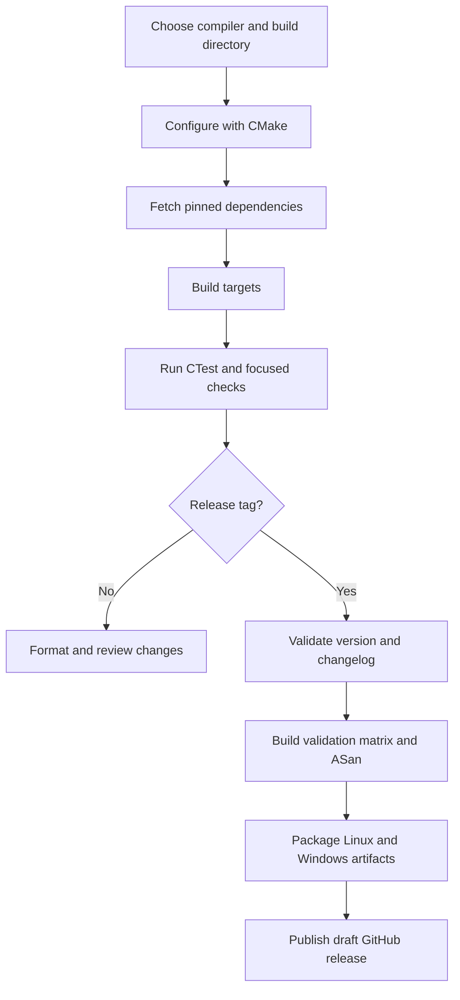

# Build & Operations

The project is a C++20 CMake build. The application version is the `project (RfSimulator VERSION ...)` value in `CMakeLists.txt` (currently `0.27.0`). Build artifacts go to `build/bin`, libraries to `build/lib`, and FetchContent sources to `build/_deps`.

## Build lifecycle


```mermaid
flowchart TD
    A["Choose compiler and build directory"] --> B["Configure with CMake"]
    B --> C["Fetch pinned dependencies"]
    C --> D["Build targets"]
    D --> E["Run CTest and focused checks"]
    E --> F{"Release tag?"}
    F -- "No" --> G["Format and review changes"]
    F -- "Yes" --> H["Validate version and changelog"]
    H --> I["Build validation matrix and ASan"]
    I --> J["Package Linux and Windows artifacts"]
    J --> K["Publish draft GitHub release"]
```

This shows the local build path and the tag-triggered release path; the release workflow requires every validation job to succeed before publication.

## Prerequisites and platform rules

- CMake 3.20 or newer, Ninja, Git, and a C++20 compiler are required. OpenGL development libraries and GLFW's platform dependencies are required on Linux/macOS.
- Windows supports **MinGW-w64 g++**, not MSVC `cl.exe`. The CI environment is MSYS2 `MINGW64`, with Git, GCC, CMake, Ninja, pkg-config, and Python installed.
- Linux release legs use GCC 14, and the minor/major matrix adds Clang 18; see [CI and release operations](#ci-and-release-operations). Linux legs configure with `-DGLFW_BUILD_WAYLAND=OFF`; use that option on Linux when X11 compatibility is needed.
- Enable hooks once per clone if you want commit-time checks:

```bash
git config core.hooksPath .githooks
```

`clang-format-18` is required by the formatting script and the pre-commit hook. If the system package manager does not provide it, `scripts/install-clang-format.sh` installs clang-format 18.1.8 into `$HOME/.cache/clang-format-18`, where `scripts/format.sh` and the hook look for it.

## Configure and build

Required first configuration (the compiler flags are especially important on Windows):

```bash
cmake -B build -G Ninja -DCMAKE_CXX_COMPILER=g++ -DCMAKE_C_COMPILER=gcc
cmake --build build
```

For an optimized build:

```bash
cmake -B build -G Ninja -DCMAKE_BUILD_TYPE=Release \
  -DCMAKE_CXX_COMPILER=g++ -DCMAKE_C_COMPILER=gcc
cmake --build build
```

Subsequent builds reuse `build/_deps` and the CMake cache. The root project enables `compile_commands.json` export, so `build/compile_commands.json` is available to clangd.

### When to reconfigure or clean

- Source edits normally need only `cmake --build build`.
- Re-run `cmake -B build` after adding or removing sources, targets, subdirectories, or CMake options.
- Delete `build/` and configure again when switching compilers or generators, or when the dependency cache is broken. On Unix:

```bash
rm -rf build
cmake -B build -G Ninja -DCMAKE_CXX_COMPILER=g++ -DCMAKE_C_COMPILER=gcc
cmake --build build
```

Do not clean merely because a normal source change was made; cleaning discards fetched sources and the configure cache.

## FetchContent and reproducibility

The root `CMakeLists.txt` fetches dependencies into the active build tree. The pinned references are:

| Dependency | Repository | Reference |
|---|---|---|
| imgui | `ocornut/imgui` | `7e1b65d26d52e9dd199d889c148c72184de647b4` |
| implot | `epezent/implot` | `7eeb9168d2e5e6b14e266d8782ecf7e649dfc3a4` |
| GLFW | `glfw/glfw` | `92dcf4ce74f2e2554a98fea09be7c705c17daa5a` |
| Catch2 | `catchorg/Catch2` | `v3.4.0` |
| imgui_test_engine | `ocornut/imgui_test_engine` | `fdc1cb0930fa9bc2bef1d884bf2c10b570d29170` |
| imnodes | `Nelarius/imnodes` | `eb36902c892548ef94f88f51ad7e7c9c7058a71c` |
| portable-file-dialogs | `samhocevar/portable-file-dialogs` | `c12ea8c9a727f5320a2b4570aee863bbede2a204` |
| kissFFT | `mborgerding/kissfft` | `131.1.0` |
| nlohmann/json | `nlohmann/json` | `v3.11.3` |

imgui, implot, GLFW, imgui_test_engine, imnodes, and portable-file-dialogs use commit pins; Catch2, kissFFT, and nlohmann/json use tags. imnodes, portable-file-dialogs, and kissFFT are fetched with `FetchContent_Populate`, so their upstream CMake files are not used. Change pins only deliberately and reconfigure a clean build when validating such a change.

## Running the application

The executable is emitted as follows:

```text
build/bin/tiny-rf-simulator
build/bin/tiny-rf-simulator.exe   # Windows
```

Runtime assets use executable-relative paths:

- `component_data/` and `extensions/` are installed beside the executable. Build-tree runs use source-tree fallbacks; component-data lookup prefers the installed executable-relative root when present.
- `LayoutManager` stores the default layout at `<exe_dir>/rf_simulator_layout.ini` and named layouts under `<exe_dir>/layouts`.
- Tutorial completion is stored at `<exe_dir>/.tutorial_completed`.
- `SessionState` persists window preferences to `<exe_dir>/app.ini` on Windows only; it is a no-op on non-Windows platforms. Project files separately store a subset of window flags.
- Extension discovery also considers user and project-local roots. Source-tree built-ins take precedence over executable-relative, global, and project-local duplicates; project-local external tools remain trust-gated.

Keep `component_data/` and `extensions/` beside the executable: the install tree and release packages place them under `bin/`. On Windows, app-level tests share `app.ini`; layout and tutorial tests share executable-relative files.

## Tests and isolation

Run the complete CTest registration with failure output:

```bash
ctest --test-dir build --output-on-failure
```

Focused commands:

```bash
build/bin/tests "[sparam]"
ctest --test-dir build -R 'test_test_flow_widget|test_issue87_flow' --output-on-failure
```

Catch2 accepts tag and name filters on the `tests` executable. The main `tests` executable contains the core Catch2 sources; many newer or platform-sensitive cases are standalone executables registered by `tests/CMakeLists.txt`. MinGW-w64 can silently drop `TEST_CASE`s beyond a compiler-specific registration ceiling, and the Windows release jobs require `tests.exe --list-tests` to report at least the `MINGW_TEST_CASE_FLOOR` (currently 223). Put new coverage in a standalone target rather than assuming a silently dropped `TEST_CASE` ran.

The `test_ui` target needs a display. On Linux, run it under `xvfb-run --auto-servernum`; CI does not run it on Windows.

CTest can run discovered cases in parallel, but do not run two CTest invocations against the same build tree concurrently. Some app-level tests share Windows `app.ini`, layout and tutorial tests share `<exe_dir>/layouts` and `.tutorial_completed`, and extension tests mutate the source `extensions/` root. Relevant targets use `RUN_SERIAL` within one CTest invocation, but that does not serialize separate CTest invocations. Benchmarks are excluded from release CI with `-E "Benchmark"`.

## Format and local gates

The checked file set is shared by CI and the pre-commit hook through `scripts/format-dirs.sh`:

```bash
bash scripts/format.sh --check       # required before submitting
bash scripts/format.sh --check --all # optional full CI-scanned set
bash scripts/format.sh               # reformat changed files
```

Run the local release-equivalent gates before a PR or release preparation:

```bash
bash scripts/format.sh --check
cmake --build build
ctest --test-dir build --output-on-failure
```

### Git hook gates

Enable the repository's local hooks once per clone:

```bash
git config core.hooksPath .githooks
```

The pre-commit hook checks staged C++ with clang-format 18 using the shared directory list in `scripts/format-dirs.sh`. The commit-msg hook enforces the `<type>[(scope)][!]: <summary>` subject format. The pre-push hook blocks non-fast-forward updates to existing remote refs. For an intentional one-off rewrite, use `RFSIM_ALLOW_FORCE_PUSH=1 git push <same arguments>`; `git push --no-verify` skips all hooks. Run `bash scripts/test-githooks.sh` after editing anything under `.githooks/`.

## Install and package

The install tree places the executables and runtime payloads together:

```bash
cmake --install build --prefix /path/to/install
```

The root and `agent/mcp` CMake files install `tiny-rf-simulator` and `rf-sim-mcp` into `bin/`, so they sit side by side in the install tree. `component_data/` and `extensions/` are installed under `bin/`, and documentation is installed under `share/doc/rf-simulator`. CPack generates `TGZ` packages off Windows and `ZIP` packages on Windows:

```bash
cpack --config build/CPackConfig.cmake
```

A package must retain `component_data/` and `extensions/` beside the executable (under `<prefix>/bin/` in the install tree). The release-workflow archives are described under [Release artifacts](#release-artifacts).

## CI and release operations

Pull requests run **no automated CI pipeline**. Run the local format, build, and test gates before requesting review. Automated validation starts only when a `v*` tag is pushed:

1. `classify-release` accepts only `X.Y.Z` tags. Patch tags (`Z > 0`) run one Linux GCC 14 Debug validation leg. Minor and major tags (`Z = 0`) run four legs: Linux GCC 14 Debug, Linux GCC 14 Release, Linux Clang 18 Debug, and Windows MinGW-w64 Debug.
2. `validate-version` requires the tag version to equal the `CMakeLists.txt` project version and runs `scripts/release-notes.sh` for the tag, failing when the matching changelog section is missing or empty.
3. The format job runs the clang-format 18 check and the sanitizer job runs a Debug AddressSanitizer build on every release tag. The strict-build matrix runs the leg list from step 1. The strict-build and package jobs run CTest with `Benchmark` excluded; Linux runs under `xvfb-run`, and Windows also excludes `test_ui` because it needs an interactive display. Windows checks the workflow-defined `MINGW_TEST_CASE_FLOOR` (currently 223).
4. The package job builds the optimized Release Linux and Windows package configurations, and those are the only binaries that ship. Debug is validation-only.
5. After all required jobs pass, the release job creates a **draft** GitHub release whose body is the matching changelog section.

### Release preparation

Prepare releases only after adding a changelog section for the version to `CHANGELOG.md`. The usual path prepares a `release/vX.Y.Z` branch for review, then tags the merged version on `master`:

```bash
# POSIX shells
bash scripts/release.sh X.Y.Z
bash scripts/release.sh X.Y.Z --dry-run
bash scripts/release.sh X.Y.Z --on-master
bash scripts/release.sh X.Y.Z --tag

# Windows (Git for Windows MSYS)
sh scripts/release.sh X.Y.Z
sh scripts/release.sh X.Y.Z --dry-run
sh scripts/release.sh X.Y.Z --on-master
sh scripts/release.sh X.Y.Z --tag
```

Prepare mode refuses a working tree with changes other than `CHANGELOG.md` and refuses a version not greater than the current one. It creates the release branch (unless `--on-master`, which commits the bump directly on master), bumps the `project (RfSimulator VERSION ...)` line in `CMakeLists.txt`, runs the format, build, and test gates unless `--skip-gates` is given, and commits `CMakeLists.txt` and `CHANGELOG.md`. Tag mode refuses unless `CMakeLists.txt` is at the requested version, the tree is clean, and HEAD is on `master`; it then creates an annotated tag and pushes it.

On Windows, run the release script as `sh scripts/release.sh …` from Git for Windows MSYS. Because its `sed -i` can normalize mixed line endings in `CMakeLists.txt`, verify `git diff HEAD~1 --stat -- CMakeLists.txt` shows only the expected two-line version change before pushing. If it does not, restore `CMakeLists.txt` from `HEAD~1`, reapply the version bump byte-preservingly, and amend the preparation commit.

### Release artifacts

- `rf-simulator-linux-x86_64.tar.gz` contains exactly two root-level members: `rf-simulator-linux` (copied from `tiny-rf-simulator`) and `rf-sim-mcp`. Do not place them in a directory inside the archive.
- `rf-simulator-windows-x86_64.zip` contains one `rf-simulator-windows/` folder with `tiny-rf-simulator.exe`, `rf-sim-mcp.exe`, and the MinGW runtime DLLs.

## Troubleshooting

| Symptom | Action |
|---|---|
| Windows configure/build fails with MSVC | Use an MSYS2 MinGW64 shell and `g++`; remove `build/` before switching. |
| FetchContent is slow or headers are missing | Let the first configure finish; inspect `build/_deps`; reconfigure or clean only if the dependency cache is incomplete. |
| Link errors after adding files | Add the source to its module `CMakeLists.txt`, then reconfigure. |
| Linux GLFW/Wayland configuration trouble | Reconfigure with `-DGLFW_BUILD_WAYLAND=OFF` and install the X11/OpenGL development packages. |
| UI test hangs or fails headlessly | Use `xvfb-run` on Linux; `test_ui` does not run on Windows CI. |
| Tests disappear on MinGW | Check `build/bin/tests.exe --list-tests`; move new cases to a standalone target if the count is below the workflow's `MINGW_TEST_CASE_FLOOR` (currently 223). |
| Parallel tests fail around shared app state or extensions | On Windows, app-level tests share `app.ini`; layouts and tutorial tests share executable-relative state and extension tests mutate the source `extensions/` root. Clean leftovers, run one CTest invocation, honor `RUN_SERIAL`, and never overlap separate CTest runs on one build tree. |
| Installed app cannot find examples or extensions | Verify the executable directory contains `component_data/` and `extensions/` (`<prefix>/bin/component_data/` and `<prefix>/bin/extensions/` for an install tree), rather than relying on the source-tree fallback. |
