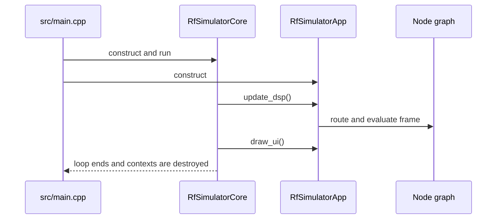

# RF Simulator — Quickstart

RF Simulator is a C++20 desktop RF signal-chain simulator. The application combines a node-graph editor with real-time spectrum, I/Q, power-meter, and network-analyzer views; components expose pure DSP engines and optional ImGui widgets.

**Current project version:** `0.25.0` (from `CMakeLists.txt`) · **Build:** CMake 3.20+ and Ninja · **UI:** GLFW, OpenGL, Dear ImGui, ImPlot, and imnodes · **Tests:** Catch2 v3.4.0 plus ImGui Test Engine.

## Build and run

Prerequisites are C++20-capable GCC/Clang, CMake, Ninja, OpenGL 2.1+, and Git (CMake `FetchContent` needs it). Windows builds use MinGW-w64; MSVC is not supported. Delete `build/` when changing compilers.

```bash
cmake -B build -G Ninja -DCMAKE_CXX_COMPILER=g++ -DCMAKE_C_COMPILER=gcc
cmake --build build

# Linux/macOS
build/bin/tiny-rf-simulator
# Windows
build/bin/tiny-rf-simulator.exe
```

The first configure/build downloads pinned dependencies into `build/_deps/<name>-src/`; build products go to `build/bin/`. Neither directory is source-tree runtime data.

Run the registered tests after building:

```bash
ctest --test-dir build --output-on-failure

# DSP benchmarks (use .exe on Windows)
build/bin/tests [bench]
```

For a clean contributor gate, also run `bash scripts/format.sh --check`. The release workflow is tag-driven rather than pull-request-driven; see [Build & Operations](operations/build-runbook.md).

## Runtime data and state

When running from a build tree, start the executable with the repository root as the working directory if you need source-tree examples. The built-in component library is loaded from `<executable>/component_data/library` when present (the install/package layout), otherwise from `component_data/library` relative to the current working directory. Extensions likewise use built-in, global, and project-local roots; the source-tree built-in `extensions/` directory is optional and the repository's fixtures are under `tests/fixtures/extensions/`.

Layout and first-run tutorial completion are executable-relative state. A project’s `.rfsim` path controls project-relative library/extension context; unsaved projects use the current working directory. Build outputs and fetched dependency sources remain under `build/` and are not the application’s persistent data store.

At startup `src/main.cpp` creates `RfSimulatorCore`, creates the imnodes context, constructs `RfSimulatorApp`, and gives the core loop a callback that updates DSP before drawing UI. The core owns the GLFW/ImGui/ImPlot lifecycle and shuts those contexts down after the loop.



This is the application bootstrap and per-frame callback order; graph evaluation details belong in [DSP Pipeline & Runtime Workflows](workflows/dsp-pipeline.md).

## Repository landmarks

| Area | Responsibility |
|---|---|
| `src/` and `core/` | Process entry point and GLFW/ImGui/ImPlot main-loop lifecycle |
| `app/` | `RfSimulatorApp`, component registry, project serializer, library browser, panels, extensions |
| `common/` and `node_graph/` | Shared `Spectrum`/engine contracts and graph topology/routing |
| Component modules | `signal_generator/`, `amplifier/`, `mixer/`, `ideal_filter/`, `equalizer/`, `attenuator/`, `splitter/`, `combiner/`, `rf_switch/`, `rf_switch_2to1/`, `coax/`, `adc/`, and `pfb_channelizer/` |
| Instruments | `spectrum_analyzer/`, `iq_plot/`, `power_meter/`, and `network_analyzer/` |
| `touchstone/` and `component_data/` | Touchstone parsing/interpolation and library/S-parameter data |
| `test_flow/` | GUI-free JSON test-flow loading, validation, parameter sweeps, and measurements |
| `tests/` and `test_engine/` | Catch2/standalone coverage and ImGui UI tests |

## Task routing

| Intent | Start here | Typical source/tests |
|---|---|---|
| Understand ownership, engines/widgets, persistence, registry, or extensions | [Architecture Overview](architecture/overview.md) | `app/`, `common/`, `node_graph/`; `test_project_file`, `test_extensions` |
| Change runtime DSP, routing, probes, caching, or project lifecycle | [DSP Pipeline & Runtime Workflows](workflows/dsp-pipeline.md) | `RfSimulatorApp::update_dsp`, `NodeGraphEngine`; node-graph and multi-output tests |
| Add or tune a component/instrument | [RF Components](domains/rf-components.md) | `<component>/*_engine.cpp`, registry, focused `test_<component>` executable |
| Change Touchstone or S-parameter behavior | [S-Parameter System](integrations/s-param-system.md) | `touchstone/`, `ProjectSerializer`, component library; `touchstone`, `*_sparam`, and containment tests |
| Author or execute JSON Test Flow sweeps | [Test Flow Authoring & Execution](workflows/test-flow.md) | `test_flow/`; flow validation/runner and authoring tests |
| Build, package, troubleshoot, or understand CI | [Build & Operations](operations/build-runbook.md) | `CMakeLists.txt`, `scripts/`, `.github/workflows/release.yml` |
| Choose coverage or add unit/UI/integration tests | [Testing Guide](testing/guidance.md) | `tests/CMakeLists.txt`, Catch2 tests, `test_engine/` |

The focused command pattern is:

```bash
ctest --test-dir build -R '<name-or-regex>' --output-on-failure
# Standalone targets can also be run directly:
build/bin/test_network_analyzer
build/bin/test_issue48_json_loader
```

`tests/CMakeLists.txt` is authoritative for which suites are in the aggregate `tests` binary versus standalone executables. New coverage may be deliberately standalone because MinGW-w64 can silently drop registrations beyond its test ceiling.

## Core invariants to remember

- Engines own DSP state and do not include UI headers; widgets own presentation. Signal routing is explicit through `NodeGraphEngine` and must preserve output-port identity for multi-output components.
- `Spectrum` noise is represented as PSD in W/Hz, and generation/dirty tracking lets engines skip unchanged work; see the architecture and DSP pages before changing evaluation order.
- Project and library JSON are untrusted inputs: malformed records are logged/skipped or fail in a bounded way, and S-parameter paths are contained by their project/library roots. Use the dedicated JSON-loader and path-containment suites when changing these boundaries.

For historical release notes, consult `CHANGELOG.md`; for planned work, consult `ROADMAP.md`.
