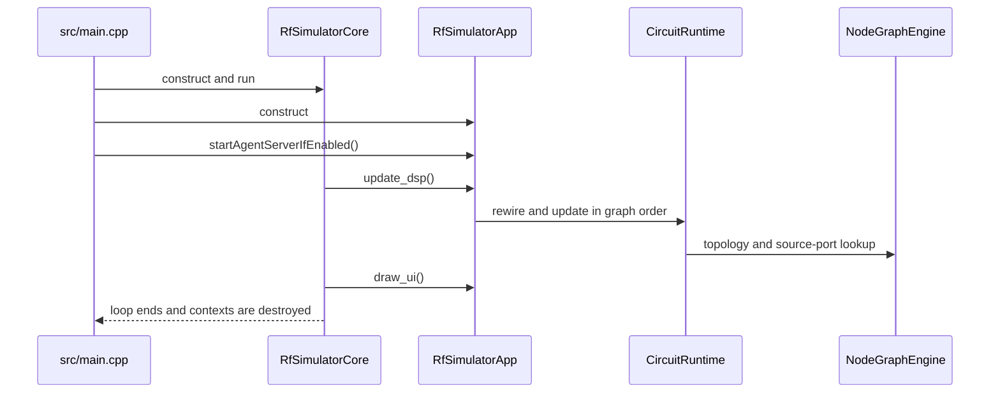

# RF Simulator — Quickstart

RF Simulator is a C++20 desktop RF signal-chain simulator. Build a graph of RF components, probe spectra, measure a receiver chain, or run repeatable Test Flow sweeps. The app separates DSP engines from their ImGui widgets and includes spectrum, I/Q, power-meter, Network Analyzer, and Receiver Requirements views. An opt-in agent server lets an MCP client read and edit the open circuit.

**Current project version:** `0.27.0` (from `CMakeLists.txt`) · **Build:** CMake 3.20+ and Ninja · **Windows compiler:** MinGW-w64 (MSVC is unsupported) · **Tests:** Catch2 v3.4.0 plus ImGui Test Engine.

## Build and run

Prerequisites are a C++20-capable GCC/Clang, CMake, Ninja, OpenGL 2.1+, and Git (CMake `FetchContent` needs it). Windows builds use MinGW-w64 g++ from an MSYS2 `MINGW64` shell; MSVC is not supported. Delete `build/` when changing compilers.

```bash
cmake -B build -G Ninja -DCMAKE_CXX_COMPILER=g++ -DCMAKE_C_COMPILER=gcc
cmake --build build

# Linux/macOS
build/bin/tiny-rf-simulator
# Windows
build/bin/tiny-rf-simulator.exe
```

The first configure/build downloads pinned dependencies into `build/_deps/<name>-src/`; build products go to `build/bin/`. Neither directory is source-tree runtime data.

Run the registered tests after building:

```bash
ctest --test-dir build --output-on-failure

# DSP benchmarks (use .exe on Windows)
build/bin/tests [bench]
```

Pull requests run no automated CI. Before opening one, run `bash scripts/format.sh --check`, build, and tests locally; release-tag CI runs the full validation and packaging gates. See [Build & Operations](operations/build-runbook.md) for the release process and Windows-specific release command.

## Runtime data and state

When running from a build tree, use the repository root as the working directory if you need source-tree examples. The built-in component library prefers `<exe_dir>/component_data/library` when installed, otherwise it falls back to `component_data/library` under the current working directory. Extensions use built-in, global, and project-local roots; the source-tree `extensions/` directory is optional and the repository's test fixtures are under `tests/fixtures/extensions/`.

Layout and tutorial-completion data are executable-relative. On Windows, `SessionState` also stores window visibility and per-PFB view preferences in `<exe_dir>/app.ini`; it is a no-op on non-Windows platforms. A project's `.rfsim` path controls project-relative library/extension context and project state. Build outputs and fetched dependency sources stay under `build/`.

At startup `src/main.cpp` creates `RfSimulatorCore`, the ImNodes context, and `RfSimulatorApp`, starts the agent server if it is enabled, and its callback updates DSP before drawing UI. `CircuitRuntime` owns graph/component execution, while the core owns the GLFW/ImGui/ImPlot loop and context teardown.


```mermaid
sequenceDiagram
    participant Main as src/main.cpp
    participant Core as RfSimulatorCore
    participant App as RfSimulatorApp
    participant Runtime as CircuitRuntime
    participant Graph as NodeGraphEngine
    Main->>Core: construct and run
    Main->>App: construct
    Main->>App: startAgentServerIfEnabled()
    Core->>App: update_dsp()
    App->>Runtime: rewire and update in graph order
    Runtime->>Graph: topology and source-port lookup
    Core->>App: draw_ui()
    Core-->>Main: loop ends and contexts are destroyed
```

This is the application bootstrap and per-frame callback order; graph evaluation details belong in [DSP Pipeline & Runtime Workflows](workflows/dsp-pipeline.md).

## Repository landmarks

| Area | Responsibility |
|---|---|
| `src/` and `core/` | Process entry point and GLFW/ImGui/ImPlot frame lifecycle |
| `app/` | `RfSimulatorApp`, `CircuitRuntime`, `EditorCommands`, project serializer, library browser, panels, extensions |
| `common/` and `node_graph/` | Shared `Spectrum`/engine contracts, topology, link policy, and input rewiring |
| Component modules | `signal_generator/`, `amplifier/`, `mixer/`, `ideal_filter/`, `equalizer/`, `attenuator/`, `splitter/`, `combiner/`, `rf_switch/`, `rf_switch_2to1/`, `coax/`, `adc/`, and `pfb_channelizer/` |
| Instruments | `spectrum_analyzer/`, `iq_plot/`, `power_meter/`, and `network_analyzer/`; Receiver Requirements lives in `app/` |
| `touchstone/` and `component_data/` | Touchstone parsing/interpolation and library/S-parameter data |
| `test_flow/` | GUI-free JSON flow schema, validation, parameter sweeps, metrics, and the shared run boundary used by the Test Flow panel and the `test_flow_run` agent tool |
| `agent/` | UI-free agent subsystem: `protocol/` (framing, endpoint files, tokens, errors, tool catalog), `api/` (`simulator::agent_api` tools and `AgentServer`), and `mcp/` (the `rf-sim-mcp` stdio bridge) |
| `tests/` and `test_engine/` | Catch2/standalone coverage and ImGui UI tests |

## Task routing

| Intent | Start here | Typical source/tests |
|---|---|---|
| Understand ownership, engines/widgets, project state, or extensions | [Architecture Overview](architecture/overview.md) | `app/`, `common/`, `node_graph/`; project and extension tests |
| Change runtime DSP, routing, probes, caching, ADC/PFB flow, or project lifecycle | [DSP Pipeline & Runtime Workflows](workflows/dsp-pipeline.md) | `CircuitRuntime`, `NodeGraphEngine`, `rewireComponentInputs()`; topology and multi-output tests |
| Add or tune a component/instrument | [RF Components](domains/rf-components.md) | `<component>/*_engine.cpp`, component registry, focused `test_<component>` target |
| Change Touchstone or S-parameter behavior | [S-Parameter System](integrations/s-param-system.md) | `touchstone/`, `ProjectSerializer`, component library; parser, `*_sparam`, and containment tests |
| Author or execute JSON Test Flow sweeps, from the panel or `test_flow_run` | [Test Flow Workflow](workflows/test-flow.md) | `test_flow/`, `TestFlowWidget`, `agent/api/src/tool_test_flow.cpp`; harness, boundary, widget, and agent-tool tests |
| Connect an MCP client to a running simulator | [Agent Connection runbook](operations/agent-connection.md) | `agent/mcp/`, `agent/protocol/src/agent_endpoint.cpp`, `app/src/agent_panel_widget.cpp` |
| Add or change an agent tool | [Agent Tool-Call Lifecycle](workflows/agent-tool-calls.md) | `agent/api/src/`, `agent/protocol/src/agent_catalog.cpp`, `tests/test_agent_api.cpp` |
| Change Network Analyzer, receiver requirements, or measurement chains | [Measurement Chains](domains/measurement-chains.md) · [Testing Guide](testing/guidance.md) | `network_analyzer/`, `app/src/receiver_*`, `tests/test_network_analyzer.cpp`, receiver requirement and measurement tests |
| Build, package, troubleshoot, or understand tag CI | [Build & Operations](operations/build-runbook.md) | `CMakeLists.txt`, scripts, hooks, `.github/workflows/release.yml` |
| Choose coverage or add unit/UI/integration tests | [Testing Guide](testing/guidance.md) | `tests/CMakeLists.txt`, Catch2 targets, `test_engine/` |

The focused command pattern is:

```bash
ctest --test-dir build -R '<name-or-regex>' --output-on-failure
# Standalone targets can also be run directly:
build/bin/test_network_analyzer
build/bin/test_issue48_json_loader
```

`tests/CMakeLists.txt` is authoritative for which suites are in the aggregate `tests` binary versus standalone executables. New coverage may be deliberately standalone because MinGW-w64 can silently drop registrations beyond its test ceiling.

## Core invariants to remember

- Engines own DSP state and do not include UI headers; widgets own presentation. `CircuitRuntime` validates edits, keeps input pointers rewired, and updates engines in topological order.
- Signal routing must preserve output-port identity for multi-output components. The PFB is connected downstream of an RF ADC only; direct RF-chain-to-PFB links are rejected.
- `Spectrum` noise is PSD in W/Hz, and generation/dirty tracking lets engines skip unchanged work. Ordinary analyzer SNR is RBW-based; active PFB hover SNR uses channel-integrated noise, independent of analyzer RBW.
- Project and library JSON are untrusted inputs: malformed records are isolated or rejected, and S-parameter paths are contained by their owning roots. Use the JSON-loader and path-containment tests when changing these boundaries.

For historical release notes, consult `CHANGELOG.md`; for planned work, consult `ROADMAP.md`.
