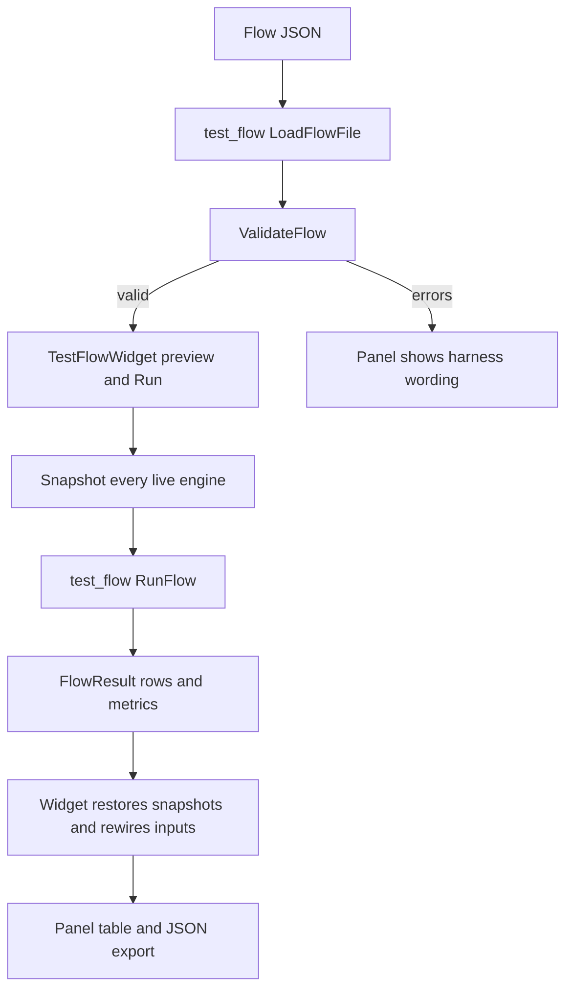

# Testing Guide

The repository has two test harnesses with different ownership boundaries:

- **Catch2 v3** tests DSP engines, serialization, graph behavior, application integration, security boundaries, and the Test Flow library. The main `tests` target is supplemented by standalone Catch2 executables.
- **imgui_test_engine** drives the application UI through `test_ui`. It verifies visible windows, menus, gestures, and panel interactions; it is not a substitute for testing the model or engine behind a panel.

CTest discovers the main Catch2 cases and standalone targets from `tests/CMakeLists.txt`. Rebuild before running tests so CMake discovery and executables reflect the current registration.

## Test-flow ownership

A Test Flow is a JSON specification, not a second circuit. `test_flow` is a GUI-free static library: it loads and validates a flow, resolves condition paths against component `serialize()` snapshots, executes the cartesian product of condition values, and captures registered metrics from output ports. The app-owned `TestFlowWidget` supplies the live components and graph, protects the UI from oversized sweeps, snapshots and restores the whole circuit, and renders or exports the result.



*The harness owns flow semantics and measurements; the panel owns live-circuit lifecycle, UI limits, presentation, and restoration.*

Flow conditions address the target engine's `serialize()` keys, using dot-separated keys and optional zero-based array indices such as `tones[0].power_dBm`; inspector labels are not valid substitutes. Component ids are positional engine ids and can silently refer to another component after deletion or reorder, so flows must be revalidated after circuit edits. Built-in metrics are `power_dBm`, `peak_power_dBm`, `peak_freq_Hz`, and `noise_floor_dBm_per_Hz`; unavailable measurements become invalid/`NaN` in the model and JSON `null` in results.

`ValidateFlow()` exhaustively checks every candidate value and measurement reference in the same order and wording used by `RunFlow()`. It resolves each condition slot once, then checks numeric type, finiteness, integral-ness, and range without mutating the circuit. The widget refuses a sweep above its `kMaxRunRows` budget before execution. On execution it snapshots every component, runs against the live engines, restores every snapshot independently, and rewires graph inputs. A restore failure is more serious than an ordinary run failure: it clears the result, latches the panel, and requires a circuit reload; successful restoration leaves component serialization, links, and the dirty flag unchanged.

## Running the suite

```bash
cmake --build build
ctest --test-dir build --output-on-failure

# Main Catch2 binary and tag filters
build/bin/tests
build/bin/tests [sparam]
build/bin/tests [edge]
build/bin/tests [bench]

# Focused Test Flow harness and widget model
ctest --test-dir build -R 'test_issue87_flow|test_test_flow_widget' --output-on-failure

# UI tests (a display server is required)
build/bin/test_ui
# Headless Linux
xvfb-run --auto-servernum build/bin/test_ui
```

`test_ui` registers all ImGui cases without an argv filter, so a panel-menu case cannot be selected like a Catch2 case. Run the whole target for UI behavior. The Test Flow model and harness remain filterable through `test_test_flow_widget` and `test_issue87_flow`.

## Current Catch2 inventory

### Main `tests` target

`tests/CMakeLists.txt` currently compiles these sources into `tests` (with `test_session_state.cpp` additionally on Windows):

`test_main.cpp`, `test_node_graph_engine.cpp`, `test_touchstone.cpp`, `test_adc.cpp`, `test_pfb.cpp`, `test_bench_dsp.cpp`, `test_bench_groups.cpp`, `test_ideal_filter.cpp`, `test_component_registry.cpp`, `test_component_library.cpp`, `test_coax_cable_presets.cpp`, `test_coax_cable_engine.cpp`, `test_group.cpp`, `test_project_file.cpp`, `test_amplifier_sparam.cpp`, `test_ideal_filter_sparam.cpp`, `test_equalizer.cpp`, `test_iq_plot.cpp`, `test_nonlinear_p1db.cpp`, `test_amplifier_p1db.cpp`, and `test_layout_manager.cpp`.

These cover core DSP and caching, node topology and probes, Touchstone formats and errors, ADC/DDC behavior, PFB routing and noise, ideal filters and S-parameter modes, component registry/library instantiation, coax/presets, groups, project round trips, amplifier and nonlinear/P1dB behavior, equalizer and IQ plotting, layout paths, and benchmarks. `test_project_file.cpp` is the broad application serialization integration point: it covers links, groups, parameter values, S-parameter and Network Analyzer state, stale-probe clearing, invalid JSON, and new-project behavior.

### Standalone Catch2 targets

Each name below is an independently registered CTest target. The source is the same-named `tests/test_*.cpp` file unless noted otherwise.

- `test_attenuator`, `test_combiner`, `test_rf_switch`, and `test_rf_switch_2to1`: engine behavior, routing, noise, clamping, serialization, hover summaries, and orientation-specific multi-output behavior.
- `test_rf_switch_project`: SPDT project type lookup, serialization, and restoration of a link on the second switch output.
- `test_network_analyzer`: isolated-chain stimulus, gain/NF, non-perturbing probes, path ambiguity/disconnection, mixer translation, clamping, serialization, widget drawing, and probe points.
- `test_power_meter` and `test_power_meter_app`: engine and app integration.
- `test_component_authoring`, `test_component_dispatch`, `test_issue79_component_validation`: registry descriptors, authoring validation/round trips, menu dispatch, all registered component types, legacy type strings, load/upsert rejection, deserialize rollback, and path containment.
- `test_extensions`, `test_issue45_extension_trust`, `test_issue80_extension_hardening`, and `test_issue130_extension_menu_labels`: manifest parsing/discovery, trust persistence and fail-closed approval, duplicate shadowing, workspace isolation and containment, result limits, and unique menu labels.
- `test_issue37_pfb_input_removal`, `test_issue70_pfb_reconnect`, `test_issue42_multi_output`, `test_issue78_multi_output`, and `test_pfb_sampling_ratio`: dangling-input cleanup, reconnect behavior, correct OUT2 routing/probing and round trips, pin reporting, and sampling-ratio/output-grid/noise contracts.
- `test_signal_domain`, `test_signal_generator_noise`, `test_adc_configuration`, `test_pfb_filter_design`, `test_pfb_calculator`, and `test_issue117_numeric_correctness`: cross-engine signal-domain propagation, source-versus-added noise, ADC configuration, filter design/calculator selection, and numeric regressions including signed-frequency, stale-noise, dirty propagation, combiner validation, and S-parameter latching.
- `test_path_containment`: project/library S-parameter containment, Touchstone size and point limits, and safe component-authoring data-file names/copy destinations.
- `test_issue48_json_loader`: malformed project/library JSON is isolated: valid siblings survive, wrong-shaped sections are rejected, malformed probes/groups are skipped, integer bounds are enforced, component rollback occurs, and scanning continues after malformed files.
- `test_tutorial_state`: marker persistence, catalog addressing, inactive-before-start, and bounded navigation.
- `test_issue87_flow`: flow loading/validation, type-preserving condition writes, authoring helpers, metric math, JSON encoding, atomic flow-file writes, rollback, and shared link policy.
- `test_issue77_save_failure` and `test_issue113_project_load`: failed saves preserve dirty state/path and atomicity; failed loads clear unsafe save targets, reject malformed state shapes, and preserve the original file on save failure.
- `test_issue116_collapsed_groups`: first-frame collapsed-group placement, links through both group boundaries, and rejection of duplicate-input and cyclic links.
- `test_spectrum_jitter`, `test_spectrum_analyzer_snr`, and `test_node_hover_snr`: stable tone peaks despite display noise, analyzer SNR guards/read-only behavior, and node-hover first-output SNR/data fallback.
- `test_test_flow_widget`: the app panel's snapshot/restore boundary, ordinary and latched failures, reload recovery, validation and row limits, authoring controls, preview, export, and bounded rendering.

This inventory is intentionally derived from current CMake registration rather than a historical executable count. New targets must be registered with `add_standalone_test`; otherwise CTest will not run them.

## Isolation and temporary state

Parallel CTest is useful but not universally safe. Scratch files must be under `temp_directory_path()` and include `test_temp_paths::processTag()` plus a per-process counter. A static counter alone collides because `catch_discover_tests` launches separate processes; random names are not a sufficient correctness guarantee.

The following shared resources require care:

- `test_extensions` and `test_issue45_extension_trust` both mutate the source-tree `extensions/` root, so CMake marks them `RUN_SERIAL`. Start with a clean root; an interrupted test can leave a manifest behind. `RUN_SERIAL` only coordinates one CTest invocation, not two concurrent invocations against the same build tree.
- App-level executables share exe-relative `app.ini`; `LayoutManager` shares `layouts`, and `TutorialState` shares `.tutorial_completed`. `test_ui` and `test_test_flow_widget` are `RUN_SERIAL`; avoid a second CTest run against the same build tree. Tests that construct `RfSimulatorApp` must create ImGui, ImPlot, and ImNodes contexts first.
- The UI target needs a real display. Linux CI supplies Xvfb; Windows release CI excludes `test_ui`. The Linux release job runs CTest under `xvfb-run`, while the ASan job excludes benchmarks and UI. Windows also checks that `build/bin/tests.exe --list-tests` stays above the verified registration floor; new Windows-required cases belong in standalone targets rather than after the main binary's MinGW-w64 registration ceiling.

## Choosing coverage for a change

Pair the smallest test that exercises the changed ownership boundary with an integration/regression test when state crosses boundaries:

| Change | First focused coverage |
|---|---|
| DSP engine math, noise, phase, filtering, dirty flags | engine test or `test_issue117_numeric_correctness`; cover nominal, zero/negative/non-finite input, clamping, and clean-vs-dirty updates |
| Serialization, project load/save, component registry or library | `test_project_file`, `test_component_dispatch`, `test_issue48_json_loader`, `test_issue79_component_validation`, or issue #77/#113; assert round trips, malformed input, rollback, and dirty/path invariants |
| Graph topology, links, probes, groups, multi-output ports | node/group tests plus issue #37/#42/#70/#78/#116; assert both pointer cleanup and persisted/reported port indices, not only rendered lines |
| Extensions, external tools, paths, or trust | `test_extensions` plus the focused #45/#80/#130/path-containment targets; use unique temp roots and test refusal as well as success |
| Test Flow grammar, metrics, authoring, or execution | `test_issue87_flow`; include invalid references, every sweep value, metric-unavailable results, atomic writes, and restore/rollback behavior |
| Test Flow panel, preview, export, or state lifecycle | `test_test_flow_widget`; add a UI case only for visible interaction, and run `test_ui` for menu/window wiring |
| UI display, menus, gestures, layout, tutorial, or tooltips | `test_engine/ui_tests.cpp` through `test_ui`, with model/data assertions in a standalone Catch2 test where ImGui text is not queryable |

Do not put ImGui/GLFW dependencies into pure engine tests. Do not duplicate harness validation rules in the panel: call `ValidateFlow()` and preserve its wording. For new coverage, prefer a standalone target because MinGW-w64 can silently drop registrations appended beyond the main `tests` executable's ceiling; verify the target appears in CTest and run it directly when platform discovery is suspect.

## CI and local verification

Release CI builds with CMake/Ninja, runs Linux tests under Xvfb excluding benchmarks, runs Windows tests excluding `test_ui`, and runs an ASan CTest pass excluding benchmarks and UI. The Windows job explicitly counts registered cases with `tests.exe --list-tests`; this catches silent registration loss rather than trusting source counts.

Before submitting a change:

```bash
cmake --build build
ctest --test-dir build --output-on-failure
ctest --test-dir build -j8 --output-on-failure   # only with clean extensions/ and one CTest invocation
ctest --test-dir build -R 'test_issue87_flow|test_test_flow_widget' --output-on-failure
```

For a new test: add the source/target to `tests/CMakeLists.txt`, use stable process-unique temporary paths, keep app fixtures behind the ImGui context fixture, choose descriptive tags, and confirm CTest discovery. For engine, serialization, graph, extension/path, or UI changes, the focused tests should fail before the fix and pass after it; that is the regression signal that matters more than a stale total count.
