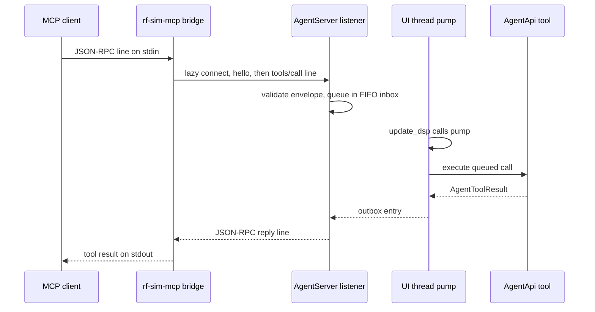

# Agent Tool-Call Lifecycle

A `tools/call` crosses two processes and one thread hand-off. The MCP bridge (`rf-sim-mcp`) frames and relays the request, the GUI's `AgentServer` queues it, and the UI thread executes it inside the frame loop. The reply travels the same path back. Each stage has its own failure reply, so the reply's code identifies the layer to inspect.

## Path at a glance

## 1. Stdio framing and protocol era

- The bridge reads stdin one byte at a time on a reader thread. A completed line becomes a `Line` event. A line over the cap becomes an `Oversized` event, and its remaining bytes are discarded through the next newline.
- `AgentLineReader` strips one trailing CR before the LF. The 1 MiB cap (`kAgentMaxLineBytes`, `1 << 20`) applies to the line without that CR.
- An oversized stdio line gets one JSON-RPC `Invalid Request` (-32600) reply with a null id. The line is not parsed.
- `McpSession` accepts protocol `2026-07-28` per request, carried in the `io.modelcontextprotocol/protocolVersion` `_meta` key. Other modern versions return -32022. Requests without modern `_meta` need a prior `initialize`, otherwise they return -32600. `initialize` selects 2025-06-18 or 2025-11-25 and defaults to 2025-11-25.

## 2. GuiLink relay

- `GuiLink::call` first checks the argument JSON depth. When no channel is open it connects: it reads the endpoint file, opens a loopback connection (`connect`, 3 s), and sends `hello` with the bridge token, protocol, and client identity (`hello`, 5 s). It keeps the link only when the returned GUI token matches the endpoint file and the catalog version equals the bridge's.
- The request must be written and its reply read within the 120 s `call` deadline. A transport failure, or a JSON-RPC error reply, drops the channel, so the next call reconnects.
- When the GUI cannot be reached, the result is `SimulatorUnavailable` with a fixed message that asks the user to open RF Simulator and turn on the Agent Server in View > Agent.

## 3. GUI listener and session

- `AgentListener` accepts loopback peers only. `AgentServer` admits one authenticated client. A second connection receives a JSON-RPC `BUSY` error ("another agent is connected") and is closed. A session that has not completed `hello` within `hello_timeout` (5 s) is closed.
- A `hello` with a different catalog version gets `VERSION_MISMATCH`. A matching `hello` gets the GUI token and the current epoch.
- The listener thread only frames sockets and validates envelopes. It queues calls under a mutex. `pump()` on the UI thread is the only place that checks dialog state and invokes the executor (see [agent/AGENTS.md](../../agent/AGENTS.md)).

## 4. UI-thread pump

- `RFSimulatorApp::update_dsp()` calls `AgentServer::pump()` before the circuit-runtime update, so queued calls execute on the UI thread during the frame loop.
- Calls run in FIFO order. Before each call the pump checks dialog state. At least one call completes per pump unless the head call is parked; after that the pump stops once `pump_budget` (8 ms) has elapsed.
- While a dialog is open, the head call parks and the pump stops, so later calls wait behind it. The park clock starts when the pump first sees the dialog and resets whenever it sees none. The head call receives `BUSY` ("RF Simulator is showing a dialog; ask the user to close it, then retry") once the dialog has stayed open longer than `park_timeout` (30 s).
- Exceptions from the dialog-state query or the executor become `INTERNAL` results. Completion handlers run after the pump releases its lock.

## 5. Dispatch and tool errors

- `AgentApi::execute` routes by tool name through an if-chain of ten branches. An unknown name returns `InvalidArgument` with the current epoch.
- `AgentArgumentError` and other exceptions are caught and returned as error results. An unexpected exception becomes `INTERNAL` ("internal error in <tool>; see the RF Simulator log").

## 6. Result envelope and epochs

- A failed call returns `is_error: true` and `structured = {epoch, error: {code, message, hint?, op_index?, details?}}`. `hint`, `op_index`, and `details` appear only when set. `epoch` is null when no epoch is known.
- `circuit_edit` and `receiver_measure` require the epoch from the last circuit read. A stale epoch returns `STALE_EPOCH`; its `details` hold `epoch`, `cause` when a project replacement was recorded, and `undone` after a revert.
- `receiver_measure` checks its epoch before any other argument, so a stale call reports `STALE_EPOCH` even when its other arguments are invalid.

## 7. circuit_edit and checkpoints

- `circuit_edit` requires between 1 and 64 ops and an epoch equal to the current epoch. It opens an `AppAgentHost` checkpoint before the first op.
- The finish step discards the checkpoint when nothing was applied. Otherwise it commits the checkpoint with a summary and places any added components. An error whose `details.reason` is `RESTORE_FAILED` commits even an empty checkpoint.
- Ops name new components with call-local `ref` values. On the first failing op the call stops, returns that op's `op_index`, and reports the applied prefix in `structured.applied`; the prefix stays committed. A success returns `epoch`, `revision`, `applied`, and `refs`.
- `AppAgentHost` keeps the newest 20 committed checkpoints. `removeCheckpointsFrom(id)` drops checkpoints at or after `id` and returns their summaries oldest-first. The API keeps those summaries from a revert (`noteProjectReplaced`) and reports them in the next stale `circuit_edit` details.

## 8. Read-only measurement tools

- `receiver_measure` runs one bounded update of its API-owned `ReceiverPerformanceMeasurementEngine` per call and returns `in_progress`. Callers repeat the call while `in_progress` is true. See [measurement chains](../domains/measurement-chains.md).
- `receiver_measure` and `data_file_read` begin no checkpoint, call no `EditorCommands`, and write no file.
- Non-finite request numbers are rejected as `InvalidArgument` with a path. Series output encodes each point through `agentNumber`, so the NaN the engine uses for an unavailable point becomes JSON `null`.
- `data_file_read` reports `magnitude_dB` through `agentNumber`, so a zero-magnitude sample (log of zero) is `null`. `max_points` defaults to 201 within 2 to 401. See [S-parameter system](../integrations/s-param-system.md).

## 9. Reply limits

- Each reply line is capped at 1 MiB and written with a 5 s timeout. The cap applies to the full serialized JSON-RPC reply, including the id and the duplicated `text` field.
- A tool result over the cap is replaced by `INTERNAL` ("Agent tool result exceeds the 1 MiB protocol limit") carrying the current epoch. If that fallback is also over the cap, the connection closes (contract in [agent/AGENTS.md](../../agent/AGENTS.md)); `flushOutbox` honours the `close_connection` flag.

## Failure map

| Reply | Stage | Usual cause | Inspect |
|---|---|---|---|
| `SimulatorUnavailable` | GuiLink connect | Endpoint file missing, or connect refused within 3 s | `gui_link.cpp` `connect()` |
| `VERSION_MISMATCH` | hello | Bridge and GUI catalog versions differ | `agent_server.cpp` hello handling |
| JSON-RPC `BUSY`, "another agent is connected" | listener | A second client while one is authenticated | `agent_server.cpp` session handling |
| `BUSY`, dialog message | pump | A dialog stayed open longer than 30 s with a queued call | `agent_server.cpp` `pump()` |
| `STALE_EPOCH` | tool | Caller's epoch predates a replacement or revert | `details.cause`, `details.undone` |
| JSON-RPC -32600 | stdio | Oversized stdin line, or a request before `initialize` | `mcp_session.cpp` |
| `INTERNAL`, 1 MiB message | reply | Tool result over the reply cap | `agent_server.cpp` bounded reply |

## Verification

- Standalone targets: `test_agent_api`, `test_agent_server`, `test_mcp_bridge`, and `test_agent_app`, registered in `tests/CMakeLists.txt`. Run one focused target with `ctest --test-dir build -R '^test_mcp_bridge$' --output-on-failure`. Scope per file is in [tests/AGENTS.md](../../tests/AGENTS.md).
- Real-client interoperability, minimized-window behavior, and server-restart persistence remain manual acceptance steps (see [agent/AGENTS.md](../../agent/AGENTS.md)).

## Related

- [Agent interface architecture](../architecture/agent-interface.md)
- [Connecting an agent](../operations/agent-connection.md)
- [Testing guide](../testing/guidance.md)
- [DSP pipeline](dsp-pipeline.md)
- [Test Flow](test-flow.md)
