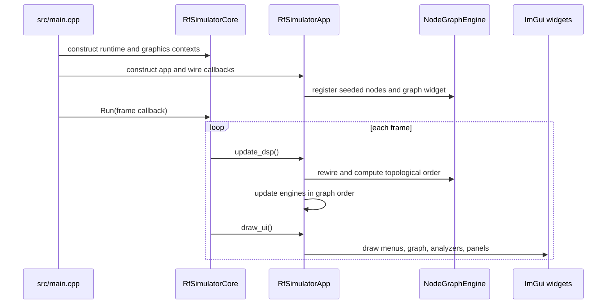
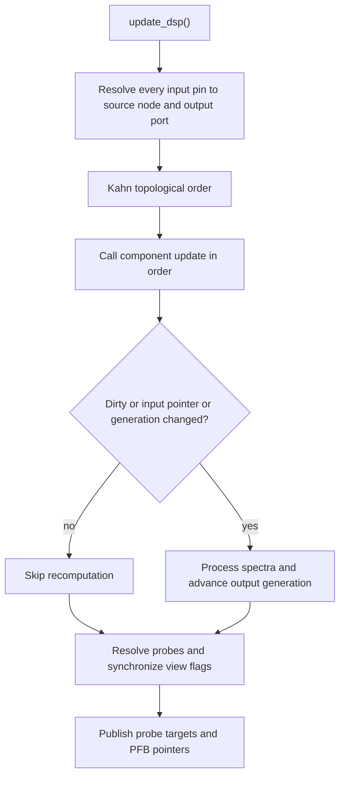
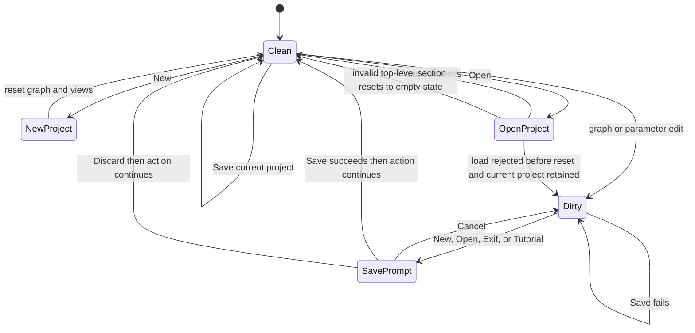

# DSP Pipeline & Runtime Workflows

The application has two complementary loops: `RfSimulatorCore::Run` drives one application update and one UI draw per frame, while the graph engine owns topology and component engines own signal state. Project serialization is the boundary for durable graph, instrument, probe, group, and window state.

## Bootstrap and frame boundary

`src/main.cpp` creates the core runtime and ImGui/ImPlot/GLFW/OpenGL context, creates the ImNodes context, constructs `RfSimulatorApp`, and enters `core.Run`. The app constructor wires the graph widget callbacks, registers all component types, seeds a Signal Generator and Amplifier, constructs the analyzer and inspector widgets, restores session window state, and schedules the first-run tutorial marker check. The callback arrangement matters: graph edits and parameter changes call `markDirty()`, and node removal rewires raw signal pointers immediately rather than waiting for the next frame.

*Bootstrap and per-frame ownership: the core schedules the app; the app coordinates graph, engines, and widgets.*

## Per-frame DSP execution

`RfSimulatorApp::update_dsp()` performs four meaningful phases:

1. **Resolve links into inputs.** `rewireComponentInputs` visits each component input pin, asks `NodeGraphEngine::getSourceForInput` for a `SignalSource`, validates the source component and port policy, and stores either a pointer to the selected `Spectrum` or `nullptr`. This is intentionally zero-copy, but it means graph removal must clear or replace pointers before widgets can dereference them.
2. **Order the graph.** `topologicalOrder()` computes in-degree from graph links and runs Kahn's algorithm. A normal acyclic graph therefore updates upstream components first. If a cycle is present, the function logs a warning and appends nodes that could not be ordered; this is a defensive fallback, not a valid feedback-loop execution model.
3. **Update engines.** Components are looked up by graph node ID and called with `update(0.0)`. Engines use dirty state plus cached input pointer/generation state to skip unchanged work. When recomputation is required they transform their inputs, write their output spectra, and output generations change. Multi-input engines keep a pointer/generation pair per input rather than using the single-input helper.
4. **Publish probes and analyzer targets.** Probed pins resolve to `(SignalNode*, output_index)`. The app updates labels, analyzer targets, and each node's `view_enabled`; PFB engine pointers are then refreshed into the spectrum analyzer and inspector. The analyzer can therefore display a selected output port rather than implicitly port zero.

*The per-frame flow combines topology, cache invalidation, and analyzer publication without copying spectra.*

### Multi-output ports, probes, and graph safety

A link stores pin IDs, but source resolution searches the source node's output-pin vector and preserves its index. Thus splitter/PFB `OUT2` binds `outputs[1]`, and a probe on that port reaches the same indexed spectrum in the analyzer. Up to four distinct probe pins are accepted; removing a node removes probes attached to its pins. The regression suite asserts both `Splitter OUT2 -> Combiner IN1` pointer identity and PFB/splitter probe indices (`tests/test_issue42_multi_output.cpp`).

The graph widget rejects a second link into an occupied input and rejects a candidate edge that would close a cycle (`canAddLink`). These checks keep the normal runtime DAG invariant. Node removal strips links and probe pins, removes the node from groups, drops groups with fewer than two members, and rebuilds surviving group boundary pins. The app then calls `rewireInputs()` synchronously before rebuilding PFB views, preventing a same-frame use-after-free in widgets that inspect `SignalNode::inputs`.

### Groups and collapsed subcircuits

Groups are graph presentation and boundary metadata around member node IDs, not a separate DSP scheduler. Their membership, name, collapsed state, and component-index membership are serialized. Removing a member updates membership and removes undersized groups; boundary pins are rebuilt for remaining groups. On load, node positions are captured before collapsed members disappear from the rendered ImNodes pool so a collapsed group can still render its members' layout data.

## Analyzer workflows

The Spectrum Analyzer consumes the resolved probe targets and combines spectra from nodes whose `view_enabled` flag is true. Probe labels append `OUT2`, `OUT3`, and so on for nonzero output indices. The Network Analyzer is a singleton instrument rather than a graph component: while its panel is visible, `draw_ui()` updates the engine before drawing it. The engine finds the unique Point A to Point B path in the real graph, but performs its measurement through a private scratch graph and clone registry. The scratch pass is RAII-owned and discarded after measurement, so the real component registry and graph are not mutated. `tests/test_network_analyzer.cpp` exercises the injected host/scratch boundary and configured stimulus behavior.

Other frame UI follows the DSP update: menu bar, node editor, spectrum analyzer, optional Network Analyzer and Power Meter, per-PFB IQ/grid views, properties, generator widgets, log, help, and tutorial. Visibility flags are session state; project window flags are separately serialized as project state.

## Project lifecycle and unsaved changes

`markDirty()` is called for node movement, link changes, component add/remove/duplicate, inspector changes, Network Analyzer and calculator parameter edits, and library insertion. New, Open, Exit, and Tutorial actions check this flag. If dirty, the app records a `PendingAction` and shows the unsaved dialog; only the chosen save/discard/cancel outcome proceeds. A clean New resets the serializer and dependent views, clears the project path and dirty flag, and revalidates test-flow state. Save updates the file only after the serializer reports success.

*Project actions preserve the current project on recoverable validation failure and gate destructive actions on unsaved state.*

### Save format and failure semantics

`ProjectSerializer::save()` writes component types, serialized parameters, positions, library part numbers, links as component-index/port pairs, probes, Network Analyzer sweep and Point A/B state, groups, window flags, and the next component ID. S-parameter paths are made project-relative for portability. It writes to `<path>.tmp`, flushes and closes it, then atomically renames it over the target. Open/write/flush/close/rename failure returns `false`, removes the temporary file, and leaves the prior target intact; this is covered by the save-failure regression (`tests/test_issue77_save_failure.cpp`).

### Open, validation, and rollback

Load rejects unreadable, oversized, malformed-JSON, non-object-root, and wrong-shaped top-level sections. A wrong-shaped top-level section resets to the empty state and returns failure because no coherent project can be recovered. Conversely, invalid optional singleton scalar fields such as a window flag or graph counter are rejected before reset, preserving the live project and its path.

After reset, components are created in saved order. Each component record is shape-checked before typed access; unknown or malformed records are skipped while a saved-index-to-node map retains `-1`, so later valid siblings and their links/probes do not shift. If construction or deserialization throws after registration, the partially created component is removed and PFB view state is rebuilt. Links, probes, Network Analyzer points, and groups are restored only when their component/port references remain valid; malformed siblings are logged and skipped. S-parameter paths are resolved relative to the project directory and paths escaping that containment root are neutralized. The issue-48 loader suite and `tests/test_issue113_project_load.cpp` cover malformed-record isolation and load rollback/preservation behavior.

## Session state versus project state

`SessionState` persists UI preferences such as window geometry, visibility flags, and PFB channel selections through `app.ini` on Windows (and is a no-op on other platforms). Project files persist the graph and project-owned instrument/window flags. This separation lets a new project reset circuit state without confusing transient UI preferences with serialized graph content.

## Focused regression tests

- `tests/test_issue42_multi_output.cpp`: indexed multi-output routing and indexed probe publication.
- `tests/test_issue37_pfb_input_removal.cpp`: safe immediate rewiring after removal.
- `tests/test_node_graph_engine.cpp`, `tests/test_group.cpp`, and `tests/test_issue116_collapsed_groups.cpp`: topology, cycle/link policy, group membership, and collapsed layout behavior.
- `tests/test_issue77_save_failure.cpp`: failed atomic save does not truncate the prior file.
- `tests/test_issue48_json_loader.cpp` and `tests/test_issue113_project_load.cpp`: malformed-record isolation, rollback, and preservation of the live project on pre-reset validation failures.
- `tests/test_network_analyzer.cpp`: scratch isolation and analyzer measurement semantics.
