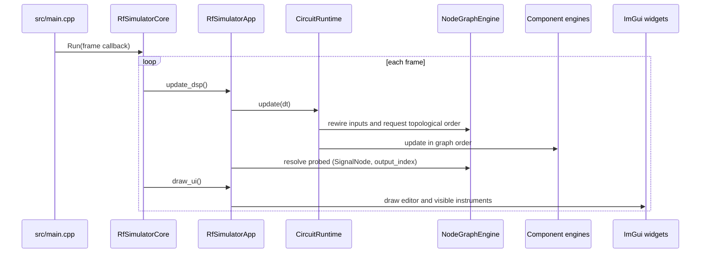
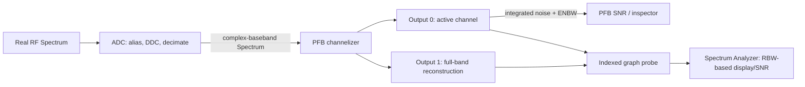

# DSP Pipeline & Runtime Workflows

The simulator has a per-frame signal loop and a separate project-edit lifecycle. `RfSimulatorCore` owns the platform/frame loop; `RfSimulatorApp` composes instruments and widgets; `CircuitRuntime` owns the live graph and engines; and `NodeGraphEngine` stores topology. The app delegates signal evaluation to the runtime before drawing views.

## Bootstrap and ownership boundaries

`src/main.cpp` creates `RfSimulatorCore`, the ImNodes context, and `RfSimulatorApp`, starts the agent server if it is enabled, then runs the core loop with a callback that calls `update_dsp()` before `draw_ui()`. App construction routes widget edit requests through `EditorCommands` and creates the inspector, spectrum analyzer, and Network Analyzer widgets.

`CircuitRuntime` owns `NodeGraphEngine`, `ComponentRegistry`, `ViewManager`, the live component ID counter, and the project epoch. `GraphEditorActions` owns app-side probe/group mutations. `EditorCommands` is the user-edit gateway: accepted edits apply view/group-boundary side effects and advance the project revision; rejected edits change neither revision nor state. Parameter, node-position, and instrument edits that bypass a command explicitly mark the revision modified.

```mermaid
sequenceDiagram
    participant Main as src/main.cpp
    participant Core as RfSimulatorCore
    participant App as RfSimulatorApp
    participant Runtime as CircuitRuntime
    participant Graph as NodeGraphEngine
    participant Engines as Component engines
    participant UI as ImGui widgets
    Main->>Core: Run(frame callback)
    loop each frame
        Core->>App: update_dsp()
        App->>Runtime: update(dt)
        Runtime->>Graph: rewire inputs and request topological order
        Runtime->>Engines: update in graph order
        App->>Graph: resolve probed (SignalNode, output_index)
        Core->>App: draw_ui()
        App->>UI: draw editor and visible instruments
    end
```

*The runtime computes live spectra; the app publishes view targets only after that update finishes.*

## Link policy, rewiring, and component updates

`NodeGraphEngine` owns node, pin, link, probe, and group records, but no RF physics or ImGui interaction. `CircuitRuntime::connect()` first resolves each pin to a live component and verifies port ownership, then applies both `graphLinkAllowed()` and `NodeGraphEngine::canAddLink()` before committing. The graph's structural check rejects occupied input pins and directed cycles. Low-level `addLink()` remains permissive; application commands and project restoration go through the runtime.

`graphLinkAllowed()` enforces the PFB physical boundary: a PFB input accepts only ADC output 0 into PFB input 0. A direct RF-chain-to-PFB link is rejected at connection time by `CircuitRuntime::connect()`, and a saved link that fails the same policy is skipped with a warning when the project is restored.

`rewireComponentInputs()` is the shared zero-copy binding pass. For every component input port it resolves the source `SignalNode` and output index, verifies physical policy and output bounds, and binds `node().inputs[k]` to the selected owned `Spectrum`, or to `nullptr` when the connection is absent or invalid. `CircuitRuntime::update()` rewires before evaluating `topologicalOrder()` and calling each component's `update()`. `connect()`, `disconnect()`, and `removeComponent()` also rewire synchronously, so no caller sees stale input pointers; after removal, `EditorCommands` synchronizes component-bound views before the caller can draw again.

`topologicalOrder()` uses Kahn's algorithm over graph links whose pins resolve to nodes. Runtime connection checks keep ordinary edits acyclic and single-source. If low-level or corrupted state still contains a cycle, the orderer logs a warning and appends nodes it could not order; that is a defensive fallback, not a feedback-loop simulator.

## Spectrum, noise convention, and dirty propagation

`SignalNode` contains `const Spectrum*` input slots and owned output `Spectrum` values. A spectrum carries frequency bins, discrete tones, phase, `fs_Hz`, `is_complex_baseband`, and a generation counter. Its noise arrays are power spectral densities in W/Hz: `noise_W` is the input noise density, `noise_added_W` is the density a component adds, and `noise_total_W` is their per-bin sum. Consumers read `noise_total_W`.

`bumpGeneration()` increments the generation counter whenever an engine publishes new output, which is how downstream caches detect upstream changes. Engine dirty checks skip recomputation while the dirty flag, the input pointer, and the input generation are all unchanged. `ComponentEngineBase::beginUpdate()` is the standard single-input prologue that performs this check; multi-input engines such as the combiner and the 2:1 RF switch keep a pointer/generation pair for every input. Parameter setters set the dirty flag, so a changed parameter recomputes even when the input is unchanged.

Real-domain tones are stored at full engine power. The Spectrum Analyzer expands them into conjugate-symmetric half-power display entries; complex-baseband spectra are already signed and render without expansion. The ADC changes that domain flag and sample rate at the RF/digital boundary.

## Component IDs and the project epoch

- Component IDs come from a monotonic counter, `m_next_component_id`, that starts at 100. `removeComponent()` does not rewind it, so a live session never reuses the ID of a removed component.
- Saving writes the counter as `graph_state.next_component_id`. Loading validates the field as a non-negative integer and restores the larger of the saved and current counter values, so IDs consumed while rebuilding a project are not handed out again.
- `clearComponentsAndResetIds()` resets the component counter and the graph ID counters, then increments the project epoch. The project load path calls it before restoring a project.
- The epoch is the agent's stale-call guard. `AgentApi::epoch()` reads the runtime's epoch. `circuit_edit` and `receiver_measure` reject a caller epoch that differs from it with `STALE_EPOCH`. `RfSimulatorApp` calls `AgentApi::noteProjectReplaced()` on New, Tutorial, Open, and checkpoint revert; that clears or reports the agent's checkpoints for the next stale call.
- UI-side guards are different: destructive actions check the dirty revision, and a circuit reload clears the Test Flow panel's latch and stale result.

## ADC and PFB channelization

The ADC consumes the real RF spectrum at input sample rate `Fs`. It expands real tones into conjugate images, aliases `f_in - f_NCO` modulo `Fs`, drops tones outside the decimated complex passband, and coherently combines tones that land at the same output frequency. Its output rate is `Fs/D`. Decimation is `1`, `2`, `4`, or `8`: `setDecimation()` clamps to 1–8 and snaps to the nearest supported value. The NCO is a normalized `Fs` fraction clamped to ±0.5, so the mixer frequency is `fraction × Fs`. Legacy ADC state without those keys loads decimation 2 and NCO +0.25×Fs. ADC noise is remapped from the single-sided RF grid and configured NSD is added. The result is a complex-baseband `Spectrum`.

The PFB is physically downstream of that ADC output only. Its output 0 is the active channel; output 1 is the reconstructed full-band view. With `M` channels and input rate `Fs`, the channel spacing is `Fs/M` and the channel output rate is `ratio * Fs/M`. The sampling ratio defaults to 1x (critical sampling) and is clamped to 1 or 2 on set and on load. A persisted 2x ratio doubles usable channel bandwidth and output rate without moving channel centers. The active channel's tone weights and noise weights use the same prototype response.

```mermaid
flowchart LR
    RF["Real RF Spectrum"] --> ADC["ADC: alias, DDC, decimate"]
    ADC -->|complex-baseband Spectrum| PFB["PFB channelizer"]
    PFB --> CH["Output 0: active channel"]
    PFB --> FULL["Output 1: full-band reconstruction"]
    CH -->|integrated noise + ENBW| Hover["PFB SNR / inspector"]
    FULL --> Probe["Indexed graph probe"]
    CH --> Probe
    Probe --> Analyzer["Spectrum Analyzer: RBW-based display/SNR"]
```

For each active channel, the engine integrates the current input-grid noise density through `|H|² * bin_width`, and computes effective ENBW from the corresponding response-weighted widths. The inspector reports that channel noise in dBm and effective ENBW. PFB node-hover SNR compares the strongest finite active-channel tone with this integrated channel noise, independent of analyzer RBW. Ordinary component hover SNR and analyzer traces use the Spectrum Analyzer's RBW-based noise measurement.

## Probes and analyzer workflows

`NodeGraphEngine::getSourceForInput()` and `probedSignalNodes()` preserve an output index. `RfSimulatorApp::update_dsp()` turns each probed pin into a `(SignalNode*, output_index)` target, labels nonzero ports as `OUT2` and above, updates `view_enabled`, and refreshes PFB references in the Spectrum Analyzer and inspector. Splitter/PFB output 1 therefore remains distinct through wiring, project save/load, and probe display.

The Spectrum Analyzer separates tone impulses from noise power, applies RBW to each, then applies VBW and trace mode. Optional display jitter is cosmetic on the noise floor only; deterministic tone peaks remain stable. Its strongest-tone SNR uses the current RBW-filtered noise and is read-only with respect to render caches/history.

The Network Analyzer is a singleton instrument, not a graph node. `findMeasurementChainPath()` collects every component on a forward path between the exact output pins of Point A and Point B, including a switched filter bank whose branches rejoin at an RF SPDT 2:1 switch. Unsupported topologies yield no path: a member input fed from outside the chain is rejected, and Point B must be the final component of the chain. `IsolatedChainRunner` prepares the path on private scratch clones and wires them by input pointer. Its run injects a synthetic tone comb and reads Point B's response from the last clone. The live graph and live component state are not modified by the measurement.

## Graph groups and collapsed views

Groups are visual graph metadata, not a second DSP scheduler. `NodeGraphEngine` stores group membership and collapsed state, while `GraphEditorActions` rebuilds derived boundary pins after topology changes. Node removal also removes its links and probes, updates membership, drops undersized groups, and rebuilds surviving boundaries.

Collapsed group members leave the ImNodes pool while hidden. The widget keeps pan-independent grid positions and computes each collapsed block's centroid from them. `ProjectSerializer` captures every loaded node's grid position after restoring component positions and before collapsed members can disappear from the widget pool. Links between different collapsed groups are drawn through both groups' synthesized boundary pins.

## Dirty state and destructive project actions

Project dirtiness is revision-derived in `EditorCommands`, not a separate app boolean: `isDirty()` compares the current revision with the clean revision recorded by `markClean()`. Accepted component, topology, or group edits advance the revision; rejected commands and selection/probe-only changes retain their defined non-edit semantics. Widget parameter, node-position, and instrument edits call `markModified()`. A successful save, load, or New records the clean revision.

New, Open, Exit, and Tutorial check `isDirty()`. If dirty, the app stores the pending action and opens the Save/Discard/Cancel dialog. Save proceeds only after the revision becomes clean; Discard runs the pending action, and Cancel clears it. Failed saves leave the project dirty, while load validation distinguishes unusable top-level sections (reset to empty) from guarded scalar failures that preserve the open project.

## Project persistence and recovery

`ProjectSerializer` saves component type/parameters, positions, links and probes as component-index/port references, Network Analyzer endpoints and sweep state, groups, a subset of window flags, graph counters, and Receiver Requirements configuration. It writes a sibling `.tmp` file, checks write/flush/close, and renames it over the target only on success. A failed save leaves the old target intact.

Load checks file/JSON and top-level section shapes before restoration. A wrong-shaped project section resets to an empty project and returns failure. Malformed guarded fields such as window flags or the component counter are rejected before reset, and the live project is left untouched. Valid components are created in saved order and mapped by original saved index. Bad siblings are skipped with `-1` mappings, and components that throw after registration are removed. Links, probes, analyzer points, and groups restore only through still-valid mappings. Restored links pass the same `CircuitRuntime::connect()` policy as live edits. Groups are then created and collapsed through the editor actions, and their boundary pins are rebuilt once topology and membership exist.

Session and project state remain distinct. `SessionState` persists window visibility and per-PFB view flags to `app.ini` on Windows and is a no-op on other platforms. The `.rfsim` file persists a subset of project window flags and graph state. `LayoutManager` owns the exe-relative default and named ImGui layouts, and `TutorialState` owns its exe-relative completion marker.

## Focused tests

- `tests/test_circuit_runtime.cpp`: link validation, ADC-only PFB wiring, zero-copy chain update, and synchronous disconnect/removal rewiring.
- `tests/test_issue42_multi_output.cpp` and `tests/test_issue78_multi_output.cpp`: indexed output wiring and output-port persistence.
- `tests/test_issue37_pfb_input_removal.cpp` and `tests/test_issue70_pfb_reconnect.cpp`: immediate dangling-pointer prevention and ADC-only reconnect/project-load policy.
- `tests/test_pfb_sampling_ratio.cpp`, `tests/test_pfb_filter_design.cpp`, and `tests/test_node_hover_snr.cpp`: channel centers/rates, integrated ENBW/noise, and RBW-independent PFB hover SNR.
- `tests/test_network_analyzer.cpp`: isolated-chain stimulus, exact ports, singly-fed switch support, rejected paths (ambiguity or disconnection), cloned runs, and live-state isolation.
- `tests/test_issue77_save_failure.cpp`, `tests/test_issue113_project_load.cpp`, `tests/test_issue48_json_loader.cpp`, and `tests/test_issue116_collapsed_groups.cpp`: atomic save, load validation/rollback, indexed restoration, and collapsed layout recovery.
