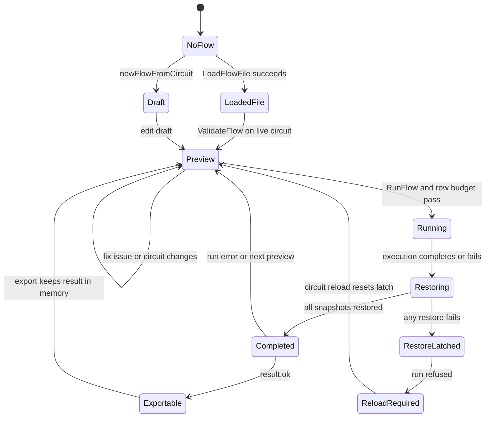
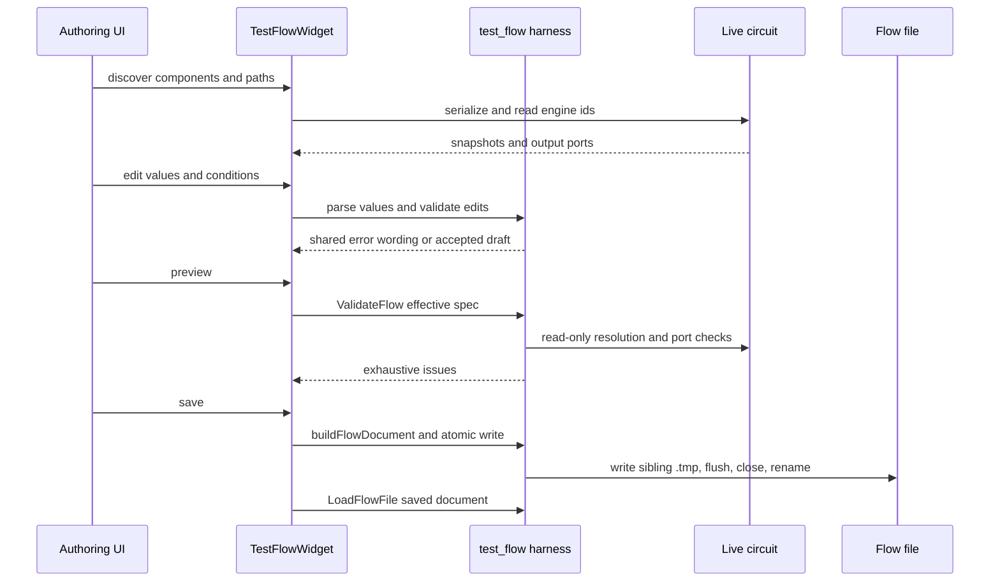

# Test Flow Authoring & Execution

A test flow is a repeatable parameter sweep over the live signal circuit. The GUI panel is an authoring and orchestration client; the `test_flow` library owns the document shape, path discovery, value grammar, validation, execution, and diagnostic wording. Keeping those responsibilities in the harness prevents an ImGui-only interpretation of a flow from diverging from what the loader and runner accept.

## Contract and addressing

A flow file is a JSON object with:

- required `version`, currently `1`;
- optional string `name` (when absent, the file stem is used);
- optional `conditions` array; each item is `{ "component": id, "path": key, "values": [numbers...] }`;
- required non-empty `measure` array; each item is `{ "component": id, "port": integer, "metric": name }`.

`component` is the `IComponentEngine::id()`, not a graph-node id. Resolution deliberately scans the live engines and compares `id()`. IDs are positional and volatile: clean save/load preserves saved order, but deleting or reordering a component can shift later IDs and silently bind an old flow to a different engine. A flow should therefore be revalidated whenever the circuit changes; it is not a stable portable identifier scheme.

`port` is a zero-based output-port index. Built-in metrics are `power_dBm` (total power), `peak_power_dBm`, `peak_freq_Hz`, and `noise_floor_dBm_per_Hz`. The loader rejects malformed shape, wrong field types, empty measurements or value lists, unknown metrics, duplicate condition targets, and duplicate measurements. A failed load resets the parsed spec, so partial conditions never escape through `FlowLoadResult`.

### Condition paths are serialization paths

A condition path addresses keys in the target engine's `serialize()` JSON snapshot, not inspector labels. Paths are dot-separated keys with optional zero-based array indices, for example `gain_dB` or `tones[0].power_dBm`. `describeConditionPaths(snapshot)` recursively lists scalar leaves in sorted key order: containers are descended into, empty containers produce no entries, and non-numeric leaves remain visible as `numeric == false` so the author can distinguish “exists but cannot be swept” from “missing”.

The harness resolves a path once and then checks every candidate value arithmetically. Signed integer slots require finite integral values within the supported signed range; unsigned slots require finite, non-negative integral values and remain unsigned; floating slots accept finite values. Boolean, string, null, object, and array slots are not sweepable. Applying a value preserves the JSON type of the existing slot. This same resolution and acceptance logic is used by authoring, pre-flight validation, and execution.

## Harness lifecycle

`LoadFlowFile()` only parses and validates the file's JSON contract; it does not touch the circuit. `ValidateFlow(spec, components)` is the live-circuit pre-flight: it checks every condition component and path, every value in every sweep, then every measurement component, port, and metric. It is read-only, exhaustive, and emits issues in the order that `RunFlow()` checks them. Consequently, a panel verdict cannot say a flow is runnable when the harness will refuse it.

`RunFlow()` repeats that pass before producing a row. It rejects cyclic graphs, freezes one baseline snapshot per targeted component, and runs the Cartesian product of condition values. The last condition varies fastest. Each row records its applied condition values and all measurement samples. With no conditions there is one measurement pass, not zero rows. A fatal issue produces `ok == false` and zero rows; component deserialization failures are reported as `DeserializeFailed` with rollback details.



This state machine separates a flow's file/draft lifecycle from the circuit's state: execution temporarily mutates live engines, but the app boundary restores them and rewires inputs before classifying the result.

## Panel workflow: file truth versus draft truth

The panel keeps a loaded `FlowSpec` and an optional in-tool draft. `spec()` is the single effective-spec accessor: the draft wins while present; otherwise the successfully loaded file is authoritative. Preview, run, and save all consume that same accessor. A first edit copies the loaded spec (or an empty spec) into the draft. `newFlowFromCircuit()` seeds a new draft with a measurement on the first component having an output and selects the first discoverable numeric serialization path and its current value, but does not invent a sweep.

The authoring form obtains component IDs from the live registry and paths from `describeConditionPaths()` on each engine's own snapshot. It uses `parseConditionValues()` for text such as `-30, -20 -10` or `0;1;2`: separators may be commas, semicolons, or whitespace, but every token must be a complete finite number and the list cannot be empty. `formatConditionValues()` is the shortest round-trip representation. Add/update operations refuse unknown IDs, unresolved or non-numeric paths, invalid values, empty lists, and duplicate `(component, path)` targets, retaining the draft on refusal.

Loading or reloading discards a draft and clears the previous result; the status explicitly says that unsaved edits were discarded because the file is the truth again. Saving writes the effective draft through `buildFlowDocument()` and `writeFlowFile()`, then loads it back, making the verified file and panel state identical. The document builder writes version 1, optional non-empty name, conditions only when present, and always `measure`; it copies IDs and paths verbatim rather than guessing them.



The diagram shows that the panel calls the harness rather than reimplementing JSON shape, path applicability, or value grammar.

## Run boundary, restoration, and circuit reload

The app panel's `run()` imposes the UI safety boundary around the shared runner:

1. Refuse when no spec is loaded/authorable, when the restoration latch is set, or when the Cartesian product exceeds `TestFlowWidget::kMaxRunRows` (10,000). The harness itself has no row ceiling and runs synchronously, so callers must impose an appropriate ceiling.
2. Snapshot every live engine's `serialize()` result before execution. If snapshotting fails, no run begins.
3. Call `RunFlow()` on the real engines. It applies each row from frozen targeted baselines, rewires using the shared `rewireComponentInputs()` pass, updates in graph topological order, and captures metrics.
4. Independently deserialize every saved snapshot, even if another restoration fails, then rewire inputs again. A restoration failure clears the result, reports all details, and latches the panel: later runs are refused until the circuit is reloaded.
5. On successful restoration, preserve an ordinary flow error as the diagnostic; on successful execution and restoration, store the result and report completion.

This run boundary is intentionally session-only. The panel does not mark the project dirty: its snapshots, draft, selected path, preview, status, restoration latch, and result are UI/session state. The circuit's serialized component state is transiently changed for rows and restored afterward; the project file is not rewritten. `resetAfterCircuitReload()` clears the latch, result, and status after the app reloads/replaces the circuit, while retaining the selected flow and draft so preview can revalidate them against the replacement engines. A changed ID or port therefore disables Run instead of silently discarding author work.

## Results, N/A, and export

A `MetricSample` has a value, unit, and `valid` flag. Metrics that cannot measure their input return `NaN`; execution treats that as a normal invalid sample, not a fatal run error. The panel renders it as `N/A`, and `FlowResult::toJson()` encodes non-finite values as JSON `null` while retaining `valid` to distinguish an unavailable measurement from a valid numeric result. A successful run can therefore contain N/A cells and still be exportable.

Export is available only after a successful run and writes the in-memory result as pretty JSON plus a trailing newline. A failed export reports the path/write/close error but does not discard the result, allowing a retry. Flow-file authoring uses a stronger atomic write: `writeFlowFile()` writes pretty JSON and newline to sibling `<path>.tmp`, flushes and closes successfully, then renames over the target; failures remove the temporary file and leave the existing hand-authored flow byte-identical. Result export is a direct truncating output and should be retried to another path after an error.

## Focused tests and extension points

Run the harness and authoring coverage with:

```text
ctest --test-dir build -R test_issue87_flow --output-on-failure
```

The focused tests cover metric computation and invalid spectra, exhaustive validation and path/type rules, Cartesian rows and rollback, JSON null/valid result encoding, parsing/formatting, document round trips, and atomic-write behavior. Widget tests exercise file/draft truth, discovery, shared validation wording, row ceilings, snapshot restoration, dirty-flag neutrality, the restoration latch and circuit-reload recovery, N/A rendering, and export retry behavior.

To add a metric, implement a function returning `NaN` when not computable and register one `MetricDefinition`. To add a condition capability, extend the path grammar and patching rules in `flow_params`. To add authoring behavior, keep the UI-free helper in `flow_author` or `flow_params` and let the widget drive it; do not add a second document or validation implementation to the panel.
