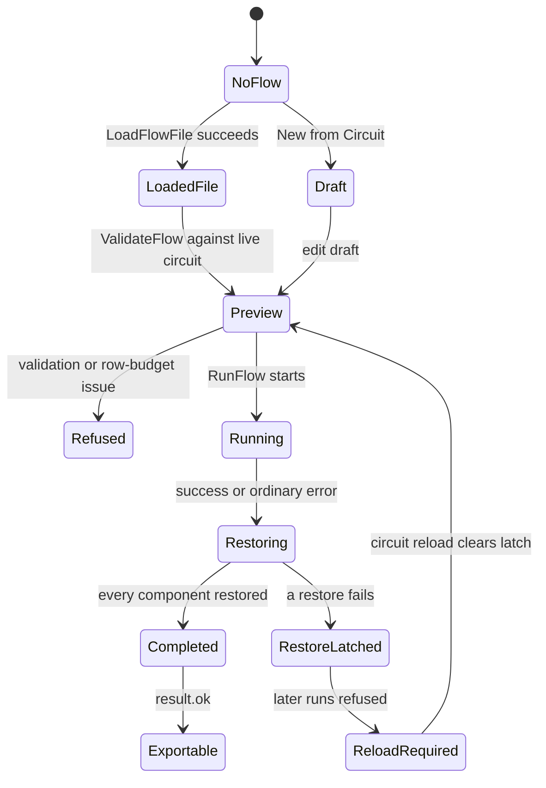

# Test Flow Workflow

A Test Flow is a repeatable parameter sweep over the live RF circuit. The app-owned panel is an authoring and orchestration client; the GUI-free `test_flow` library owns the file schema, condition paths, value rules, validation, execution, metrics, and error wording. Keeping the contract in the library lets the same behavior run in Catch2 tests without ImGui.

## File contract and addressing

A flow file is a JSON object with:

- required `version`, currently `1`;
- optional string `name` (when absent, it defaults to the file stem);
- optional `conditions` array; each item is `{ "component": id, "path": key, "values": [numbers...] }`;
- required non-empty `measure` array; each item is `{ "component": id, "port": integer, "metric": name }`.

`component` is `IComponentEngine::id()`, not a graph-node ID. The runner and panel resolve it by scanning live engines. `CircuitRuntime` allocates IDs monotonically, so removing a component does not renumber surviving live engines. A project load resets the counter and recreates components in saved order: deleting or reordering components before a save/load can make old IDs shift, disappear, or bind to a different engine. Revalidate flows after circuit changes; flow IDs are not stable portable identifiers.

`port` is a zero-based output-port index. Built-in metrics are `power_dBm`, `peak_power_dBm`, `peak_freq_Hz`, and `noise_floor_dBm_per_Hz`. The loader rejects malformed records, wrong field types, empty value or measurement lists, unknown metrics, duplicate `(component, path)` targets, and duplicate `(component, port, metric)` readings. A failed load resets the parsed `FlowSpec`; partially parsed conditions never escape in `FlowLoadResult`.

## Condition paths and value rules

A condition path addresses a key in the target engine's `serialize()` JSON, not an inspector label. Paths use dot-separated object keys and optional zero-based array indices, such as `gain_dB` or `tones[0].power_dBm`.

`describeConditionPaths(snapshot)` recursively lists scalar leaves in stable sorted-key order. It descends into objects/arrays rather than offering containers; empty containers yield no path. Non-numeric leaves are included as non-sweepable hints, so the author can distinguish a missing key from a key that exists but cannot be swept.

The harness resolves a path once and checks all candidate values against its existing JSON type:

- signed integer slots require finite integral values in range and stay signed;
- unsigned slots require finite, non-negative integral values and stay unsigned;
- floating slots accept finite values;
- boolean, string, null, object, and array slots are not sweepable.

`parseConditionValues()` accepts comma, semicolon, or whitespace separators, but rejects a token that is not a complete finite number and rejects an empty list. `formatConditionValues()` uses shortest round-trip formatting. `applyConditionValue()`, `resolveConditionSlot()`, and `conditionSlotAccepts()` keep authoring, validation, and execution on the same path/type rules.

## Harness lifecycle

`LoadFlowFile()` parses and validates JSON structure without reading or changing a circuit. `ValidateFlow(spec, components)` is the live-circuit preflight: it checks every condition component and every value for its path, then each measurement component, output port, and metric. It is read-only and returns errors in the order and wording that `RunFlow()` uses. The panel can therefore disable Run without inventing its own verdict.

`RunFlow()` repeats that same preflight before producing rows, then rejects cyclic graph topology. It freezes one serialized baseline per targeted component. Each row starts from those baselines, applies that row's condition values, rewires inputs through the shared `rewireComponentInputs()` pass, updates engines in graph topological order, and records every requested metric. It executes the Cartesian product of condition values; the last condition varies fastest. With no conditions it produces one measurement row. The GUI-free harness has no row limit.

<!-- openwiki: mermaid parse failed and this diagram was converted to a text fence so it does not break rendering. Fix the diagram source and restore the mermaid fence. Parser error: Heuristic: a semicolon inside a label breaks rendering; rephrase the label. -->
```text
flowchart TD
    File["Flow JSON"] --> Load["LoadFlowFile"]
    Load -->|valid spec| Preflight["ValidateFlow against live engine ids and serialized keys"]
    Load -->|invalid file| Error["FlowLoadResult error; spec reset"]
    Preflight -->|issues| Refused["RunFlow fails before rows"]
    Preflight -->|no issues| Cycle["Check graph ordering for cycles"]
    Cycle -->|cycle| Refused
    Cycle -->|acyclic| Baseline["Freeze targeted component baselines"]
    Baseline --> Rows["Cartesian sweep: restore baseline, patch values"]
    Rows --> Rewire["Shared graph input rewiring"]
    Rewire --> Update["Update engines in topological order"]
    Update --> Capture["Capture metrics into FlowRows"]
```

Fatal validation, cycle, or deserialization errors produce `ok == false` and zero result rows. If a component deserialization fails during execution, the harness attempts to restore the targeted baselines and includes rollback failure details in its error.

## Panel authoring and preview

`TestFlowWidget` holds either a loaded file or an in-tool draft. The draft is the effective spec while it exists; preview, run, and save all consume that same accessor. `New from Circuit` creates a draft with a measurement on the first component with an output port and pre-fills the authoring form with the first sweepable serialized key and its current value. The sweep remains the author's choice.

The authoring form discovers component IDs from the registry and paths from each engine's own `serialize()` snapshot. It commits conditions and measurements only after asking the harness to validate candidates. It also rejects duplicate targets/readings that the loader rejects but `ValidateFlow()` does not. A refused authoring edit does not materialize or change a draft.

Preview resolves component IDs and output ports against the live circuit, shows a bounded set of values and useful numeric path hints, and displays the harness's own errors. Its predicted row count is the saturating product of all condition-value counts. `saveFlow()` requires a measurement and a valid preflight, writes through `buildFlowDocument()` and `writeFlowFile()`, then loads the saved file back so the panel holds exactly the document on disk.

Loading or reloading a file discards an in-tool draft and clears previous result rows; the panel reports that unsaved edits were discarded. A hand-edited flow can be reloaded without changing its selected path.

## Run boundary, restoration, and reload

The panel runs flows synchronously on the UI thread, so it refuses a Cartesian sweep above `TestFlowWidget::kMaxRunRows` (10,000) before taking snapshots. This is a UI safety limit; the reusable `RunFlow()` harness has no cap.

Before execution, the widget snapshots `serialize()` state for every live engine. It refuses to run if the snapshot pass fails. `RunFlow()` temporarily deserializes sweep values into the live components, but the widget always attempts to restore each snapshot independently afterward and rewires graph inputs. The flow harness takes a const graph and does not change topology. Successful restoration leaves component serialization, graph links, and project revision unchanged.

An ordinary flow error remains available as the result diagnostic if restoration succeeded. A snapshot/restore exception is a separate failure: it clears the result, keeps restoration details in status, and latches the panel so later runs are refused until a circuit reload. `resetAfterCircuitReload()` clears the latch, result, and status but retains the selected flow and draft; preview revalidates those references against the new circuit instead of silently discarding author work.


```mermaid
stateDiagram-v2
    [*] --> NoFlow
    NoFlow --> LoadedFile: LoadFlowFile succeeds
    NoFlow --> Draft: New from Circuit
    LoadedFile --> Preview: ValidateFlow against live circuit
    Draft --> Preview: edit draft
    Preview --> Refused: validation or row-budget issue
    Preview --> Running: RunFlow starts
    Running --> Restoring: success or ordinary error
    Restoring --> Completed: every component restored
    Restoring --> RestoreLatched: a restore fails
    RestoreLatched --> ReloadRequired: later runs refused
    ReloadRequired --> Preview: circuit reload clears latch
    Completed --> Exportable: result.ok
```

## Results and export

Each `MetricSample` carries a value, unit, and `valid` flag. Unmeasurable metrics return `NaN`; that is an invalid sample, not a fatal run error. Well-formed silent measurements may return negative infinity and remain valid. The panel displays invalid/non-finite values as `N/A`; `FlowResult::toJson()` encodes non-finite values as JSON `null` while preserving `valid`.

Export requires a successful run and writes the in-memory result as pretty JSON with a trailing newline. Export failure reports the write/close problem but preserves the result for retry. Flow-file authoring uses an atomic sibling `.tmp` write and rename; result export is a direct output and should be retried to another path after failure.

The panel does not mark the project dirty. Runs restore the live engines, and the project file does not store the flow selection, draft, preview, result, or restoration latch.

## Focused tests

Run both the GUI-free harness and app panel contracts:

```bash
cmake --build build
ctest --test-dir build -R 'test_issue87_flow|test_test_flow_widget' --output-on-failure
```

`test_issue87_flow` covers loader errors, path/type/value validation, metric math, Cartesian rows, rollback, result JSON, authoring discovery, value grammar, and atomic flow-file writes. `test_test_flow_widget` covers panel preview and run limits, no-condition and multi-condition row counts, snapshot/restore and unchanged project revision, ordinary and latched failures, reload recovery, authoring/draft behavior, and export. Both are standalone CTest targets in `tests/CMakeLists.txt`; the widget target is `RUN_SERIAL` because app-level tests share executable-relative session state on Windows.
