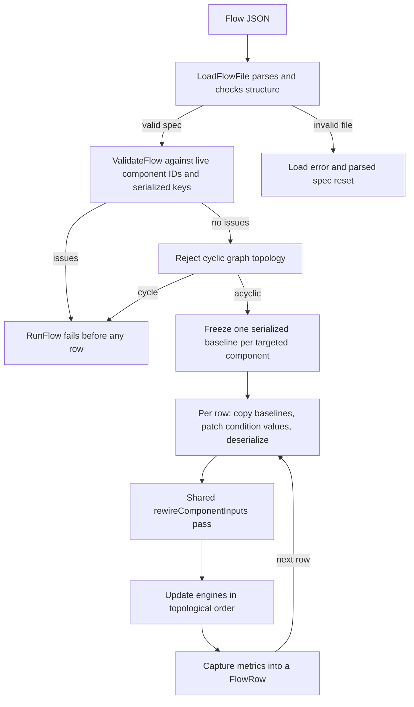
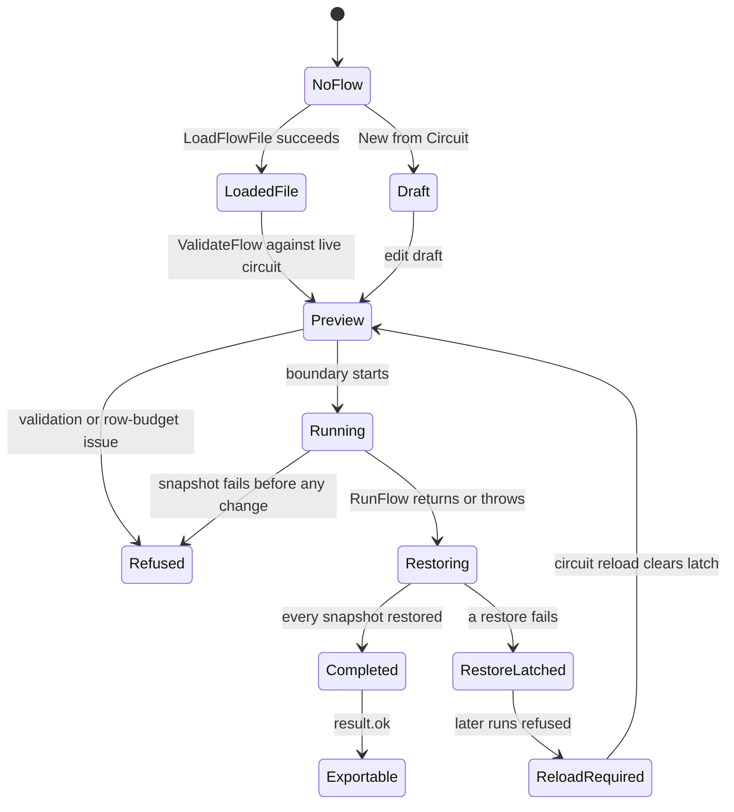

# Test Flow Workflow

A Test Flow is a repeatable parameter sweep over the live RF circuit. The app-owned panel and the `test_flow_run` agent tool are clients of the GUI-free `test_flow` library, which owns the file schema, condition paths, value rules, validation, execution, metrics, and error wording. Keeping the contract in the library lets the same behavior run in Catch2 tests without ImGui.

## File contract and addressing

A flow file is a JSON object with:

- required `version`, currently `1`;
- optional string `name` (when absent, it defaults to the file stem);
- optional `conditions` array; each item is `{ "component": id, "path": key, "values": [numbers...] }`;
- required non-empty `measure` array; each item is `{ "component": id, "port": integer, "metric": name }`.

`component` is `IComponentEngine::id()`, not a graph-node ID. The runner and panel resolve it by scanning live engines. `CircuitRuntime` allocates IDs monotonically, so removing a component does not renumber surviving live engines. A project load resets the counter to 100, creates the saved components in file order, and then raises the counter to the saved `next_component_id` if that is higher. Deleting or reordering components before a save can therefore make an old ID shift, disappear, or bind to a different engine after reload. Revalidate flows after circuit changes; flow IDs are not stable portable identifiers.

`port` is a zero-based output-port index. Built-in metrics are `power_dBm`, `peak_power_dBm`, `peak_freq_Hz`, and `noise_floor_dBm_per_Hz`. The loader rejects malformed records, wrong field types, empty value or measurement lists, unknown metrics, duplicate `(component, path)` targets, and duplicate `(component, port, metric)` readings. A failed load resets the parsed `FlowSpec`; partially parsed conditions never escape in `FlowLoadResult`.

## Condition paths and value rules

A condition path addresses a key in the target engine's `serialize()` JSON, not an inspector label. Paths use dot-separated object keys and optional zero-based array indices, such as `gain_dB` or `tones[0].power_dBm`.

`describeConditionPaths(snapshot)` recursively lists scalar leaves in stable sorted-key order. It descends into objects/arrays rather than offering containers; empty containers yield no path. Non-numeric leaves are included as non-sweepable hints, so the author can distinguish a missing key from a key that exists but cannot be swept.

The harness resolves a path once and checks all candidate values against its existing JSON type:

- signed integer slots require finite integral values in range and stay signed;
- unsigned slots require finite, non-negative integral values and stay unsigned;
- floating slots accept finite values;
- boolean, string, null, object, and array slots are not sweepable.

`parseConditionValues()` accepts comma, semicolon, or whitespace separators, but rejects a token that is not a complete finite number and rejects an empty list. `formatConditionValues()` uses shortest round-trip formatting. `applyConditionValue()`, `resolveConditionSlot()`, and `conditionSlotAccepts()` keep authoring, validation, and execution on the same path/type rules.

## Harness lifecycle

`LoadFlowFile()` parses and validates JSON structure without reading or changing a circuit. `ValidateFlow(spec, components)` is the live-circuit preflight: it checks every condition component and every value for its path, then each measurement component, output port, and metric. It is read-only and returns errors in the order and wording that `RunFlow()` uses. The panel can therefore disable Run without inventing its own verdict.

`RunFlow()` repeats that same preflight before producing rows, then rejects cyclic graph topology. It freezes one serialized baseline per targeted component. Each row starts from copies of those baselines, applies that row's condition values, deserializes the targeted engines, rewires inputs through the shared `rewireComponentInputs()` pass, updates engines in graph topological order, and records every requested metric. It executes the Cartesian product of condition values; the last condition varies fastest. With no conditions it produces one measurement row. The harness itself has no row limit.


```mermaid
flowchart TD
    File["Flow JSON"] --> Load["LoadFlowFile parses and checks structure"]
    Load -->|valid spec| Preflight["ValidateFlow against live component IDs and serialized keys"]
    Load -->|invalid file| LoadError["Load error and parsed spec reset"]
    Preflight -->|issues| Refused["RunFlow fails before any row"]
    Preflight -->|no issues| Cycle["Reject cyclic graph topology"]
    Cycle -->|cycle| Refused
    Cycle -->|acyclic| Baseline["Freeze one serialized baseline per targeted component"]
    Baseline --> Rows["Per row: copy baselines, patch condition values, deserialize"]
    Rows --> Rewire["Shared rewireComponentInputs pass"]
    Rewire --> Update["Update engines in topological order"]
    Update --> Capture["Capture metrics into a FlowRow"]
    Capture -->|next row| Rows
```

Fatal validation, cycle, or deserialization errors produce `ok == false` and zero result rows. `RunFlow()` rolls the targeted baselines back only when a deserialization fails inside the row loop, then returns the failure with any rollback error appended. After a successful sweep it restores nothing, so the live engines keep the last row's swept values until the run boundary restores them.

## Run boundary and restoration

Both callers run flows through `RunFlowWithinBoundary()` in `test_flow/src/flow_boundary.cpp`. The panel's `TestFlowWidget::run()` calls it directly. The agent tool calls it through an `AgentApi` seam that defaults to it and that `AgentApi::setFlowRunBoundary()` replaces in tests. The boundary wraps one `RunFlow()` call and performs these steps in order:

1. Snapshot every non-null live engine with `serialize()`, keyed by component ID. If a snapshot throws, it returns `SnapshotFailed` before anything runs.
2. Run `RunFlow()` once. An exception is recorded as `ExecutionFailed`, and restoration still runs.
3. Restore each snapshot once, after the last row, by looking up its component ID. A missing component is reported as no longer present. A failed restore is recorded, and later restores still run.
4. Rewire inputs through `rewireComponentInputs()` in every case.
5. If any restore failed, return `RestoreFailed` and discard the run's result, even when the run itself succeeded. Otherwise return `Completed`, which carries the run's `FlowResult` (an ordinary validation error is kept there), or `ExecutionFailed`.

Restoration happens once per run, not once per row. Inside a sweep, `RunFlow()` changes the live engines row by row, and only step 3 returns them to their snapshots.

Panel behavior lives in `TestFlowWidget::run()`. A Cartesian sweep above `TestFlowWidget::kMaxRunRows` (10,000) is refused before any snapshot, because the sweep runs synchronously on the UI thread; the reusable `RunFlow()` harness has no cap. A snapshot failure refuses the run and does not latch. A restore failure clears the result, stores the failure notice in the status, and latches the panel: later runs are refused with the same notice until `resetAfterCircuitReload()` runs after a circuit reload. That reset clears the latch, result, and status but retains the selected flow and draft, and preview revalidates those references against the new circuit instead of silently discarding author work. An ordinary flow error stays as the result diagnostic when restoration succeeded. The panel never marks the project dirty.

## Agent tool: `test_flow_run`

`test_flow_run` takes `epoch` (required), `conditions` (optional), and `measure` (required). Its checks run in this order:

1. **Epoch.** `epoch` must equal the current agent epoch. A mismatch returns the stale-epoch error (`STALE_EPOCH`) before any condition or measurement is parsed, and nothing runs.
2. **Latch.** While the agent's flow latch is set, a matching call returns `INTERNAL` with the latch message and the hint `reload the project before running flows again`, without parsing or running anything. `AgentApi::noteProjectReplaced()` clears the latch, and the app calls it when a project is replaced.
3. **Shape.** `conditions` holds at most 4 entries, each with `component`, `path`, and `values`, where `values` is a non-empty array of finite numbers. `measure` holds 1 to 8 entries, each with `component`, `port`, and `metric`. Unknown fields are rejected as `INVALID_ARGUMENT`.
4. **Duplicates.** Two conditions that sweep the same component and path, or two measurements that read the same metric on the same component and port, return `INVALID_ARGUMENT` at the later entry.
5. **Row budget.** The row count is the saturating product of the value counts. Above 1,000 rows the call returns `INVALID_ARGUMENT` with `requested` and `limit` details, before any snapshot is taken.
6. **Run.** The call runs through the boundary and maps the outcome:
   - `SnapshotFailed`: `INTERNAL` with "cannot snapshot the circuit"; no latch.
   - `ExecutionFailed`: `INTERNAL` with "flow execution failed"; no latch.
   - `RestoreFailed`: the message is latched, the project is marked modified, and the call returns `INTERNAL` with the latch hint. Unlike the panel, the agent path marks the project dirty.
   - `Completed` with `ok == false`: the flow error maps by code. A missing component or port maps to `NOT_FOUND`; an inapplicable path maps to `ParamRejected` (serialized as `PARAM_REJECTED`); metric, duplicate, shape, and type errors map to `INVALID_ARGUMENT`; cyclic graphs and deserialization failures map to `INTERNAL`.
   - `Completed` with `ok == true`: the reply below.
7. **Reply.** `{epoch, row_count, rows}`. Each row holds `conditions` (`component`, `path`, `value`) and `metrics` (`component`, `port`, `name`, `value`, `unit`, `valid`). A non-finite `value` is encoded as JSON `null`, and `valid` is false only for NaN samples. A completed run does not mark the project modified.

The `[test_flow_run]` cases in `tests/test_agent_api.cpp` cover the epoch, duplicate, row-budget, error-mapping, and latch behavior above; the latch case injects a `RestoreFailed` outcome through `setFlowRunBoundary()`.


```mermaid
stateDiagram-v2
    [*] --> NoFlow
    NoFlow --> LoadedFile: LoadFlowFile succeeds
    NoFlow --> Draft: New from Circuit
    LoadedFile --> Preview: ValidateFlow against live circuit
    Draft --> Preview: edit draft
    Preview --> Refused: validation or row-budget issue
    Preview --> Running: boundary starts
    Running --> Refused: snapshot fails before any change
    Running --> Restoring: RunFlow returns or throws
    Restoring --> Completed: every snapshot restored
    Restoring --> RestoreLatched: a restore fails
    RestoreLatched --> ReloadRequired: later runs refused
    ReloadRequired --> Preview: circuit reload clears latch
    Completed --> Exportable: result.ok
```

## Results and export

Each `MetricSample` carries a value, unit, and `valid` flag. Unmeasurable metrics return `NaN`; that is an invalid sample, not a fatal run error. Well-formed silent measurements may return negative infinity and remain valid. The panel displays invalid/non-finite values as `N/A`; `FlowResult::toJson()` encodes non-finite values as JSON `null` while preserving `valid`.

Export requires a successful run and writes the in-memory result as pretty JSON with a trailing newline. Export failure reports the write/close problem but preserves the result for retry. Flow-file authoring uses an atomic sibling `.tmp` write and rename; result export is a direct output and should be retried to another path after failure.

The panel does not mark the project dirty. Runs restore the live engines, and the project file does not store the flow selection, draft, preview, result, or restoration latch.

## Focused tests

Run the GUI-free harness, boundary, panel, and agent-tool contracts:

```bash
cmake --build build
ctest --test-dir build -R 'test_issue87_flow|test_flow_boundary|test_test_flow_widget|test_agent_api' --output-on-failure
```

- `test_issue87_flow` covers loader errors, path/type/value validation, metric math, Cartesian rows, rollback, result JSON, authoring discovery, value grammar, and atomic flow-file writes.
- `test_flow_boundary` covers a no-condition run that leaves the circuit as it was, a restore failure that is reported while later engines are still restored, an execution failure that still restores, and a snapshot failure that refuses the run before anything executes.
- `test_test_flow_widget` covers panel preview and run limits, no-condition and multi-condition row counts, snapshot/restore and unchanged project revision, ordinary and latched failures, reload recovery, authoring/draft behavior, and export. It is marked `RUN_SERIAL` in `tests/CMakeLists.txt`.
- `test_agent_api` runs the `[test_flow_run]` cases: an unchanged project after a sweep, duplicate rejection, the 1,000-row refusal, `STALE_EPOCH` without running, error-code mapping, the latch until project replacement, a 1,000-row reply within the reply cap, the zero-condition single row, and the one-measurement minimum.

## Related pages

- [Agent tool-call lifecycle](agent-tool-calls.md)
- [Agent interface architecture](../architecture/agent-interface.md)
- [RF components](../domains/rf-components.md)
- [Testing guidance](../testing/guidance.md)
